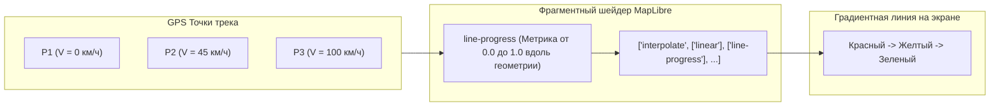

# Градиентная окраска трека по скорости и высоте (MapLibre Expressions)

> [!info] Навигация
> Родительский раздел: [[GPS & Tracking MOC]]

## Зачем нужна аналитическая окраска трека

Монотонная синяя или черная линия трека на карте информативна лишь с точки зрения геометрии перемещения. Однако для глубокого анализа телеметрии (в фитнес-сервисах вроде Strava, в расследованиях инцидентов ДТП, при контроле расхода топлива или анализе высотного профиля дрона) критически важно видеть динамические параметры прямо на линии маршрута:
- **Окраска по скорости (Speed Heatmap):** Зеленый цвет — свободная трасса ($80-110\text{ км/ч}$), желтый — городской поток ($40-60\text{ км/ч}$), красный — глухая пробка или стоянка ($0-10\text{ км/ч}$).
- **Окраска по высоте (Elevation Profile):** Цветовая шкала высоты над уровнем моря от равнины до горных перевалов.
- **Окраска по градиенту уклона (Slope / Grade):** Красный при крутом подъеме в гору $>12\%$, синий на спусках.

В современных движках векторных карт (MapLibre GL JS / Mapbox GL JS) эта задача решается аппаратно на GPU через свойство `line-gradient` и встроенный язык **MapLibre Expressions**.



---

## Механизм `line-gradient` и `line-progress`

Для работы аппаратного градиента в MapLibre необходимо соблюдение двух условий:
1. В источнике данных `GeoJSONSource` обязательно должен быть включен флаг:
   ```typescript
   lineMetrics: true
   ```
   Этот флаг заставляет движок рассчитать для каждой вершины нормализованную дистанцию вдоль полилинии от $0.0$ (начало трека) до $1.0$ (конец трека).
2. В стиле слоя `line` используется выражение с ключевым словом `line-progress`:

```typescript
map.addSource('speed-track-source', {
  type: 'geojson',
  lineMetrics: true, // КРИТИЧЕСКИ ВАЖНО ДЛЯ РАБОТЫ line-gradient
  data: myTrackGeoJson
});

map.addLayer({
  id: 'speed-track-layer',
  type: 'line',
  source: 'speed-track-source',
  layout: {
    'line-join': 'round',
    'line-cap': 'round'
  },
  paint: {
    'line-width': 5,
    'line-gradient': [
      'interpolate',
      ['linear'],
      ['line-progress'],
      0.0, '#ef4444', // Красный (начало)
      0.5, '#eab308', // Желтый (середина)
      1.0, '#22c55e'  // Зеленый (финиш)
    ]
  }
});
```

---

## Генератор динамического градиента по реальной скорости

Поскольку свойство `line-progress` оперирует абстрактной шкалой от $0.0$ до $1.0$, чтобы окрасить линию в соответствии с физической скоростью каждого отрезка, фронтенд должен выполнить предрасчет:
1. Вычислить кумулятивную длину каждого сегмента трека (по формуле Хаверсина / Turf.js).
2. Нормализовать расстояния точек в интервал $[0, 1]$.
3. Сопоставить каждой точке ее цвет в зависимости от скорости.
4. Динамически сгенерировать MapLibre Expression.

### TypeScript: Утилита построения градиента по скорости

```typescript
import length from '@turf/length';
import distance from '@turf/distance';
import { point, lineString } from '@turf/helpers';

export interface TrackPointTelemetry {
  coords: [number, number]; // [lng, lat]
  speedKmh: number;
}

// Цветовая палитра скоростных зон
export function getColorForSpeed(speedKmh: number): string {
  if (speedKmh <= 10) return '#ef4444'; // Красный (пробка / остановка)
  if (speedKmh <= 40) return '#f97316'; // Оранжевый (медленное движение)
  if (speedKmh <= 60) return '#eab308'; // Желтый (городской режим)
  if (speedKmh <= 90) return '#84cc16'; // Салатовый (загородная трасса)
  return '#22c55e';                    // Зеленый (магистраль >90 км/ч)
}

/**
 * Создает скомпилированное выражение 'line-gradient' для MapLibre
 */
export function buildSpeedGradientExpression(points: TrackPointTelemetry[]): any[] {
  if (points.length < 2) {
    return ['interpolate', ['linear'], ['line-progress'], 0, '#2563eb', 1, '#2563eb'];
  }

  // 1. Расчет кумулятивных расстояний для всех точек
  const totalPoints = points.length;
  const distances: number[] = [0];
  let cumulativeDistance = 0;

  for (let i = 1; i < totalPoints; i++) {
    const pPrev = point(points[i - 1].coords);
    const pCurr = point(points[i].coords);
    const segDist = distance(pPrev, pCurr, { units: 'kilometers' });
    cumulativeDistance += segDist;
    distances.push(cumulativeDistance);
  }

  if (cumulativeDistance === 0) {
    return ['interpolate', ['linear'], ['line-progress'], 0, '#2563eb', 1, '#2563eb'];
  }

  // 2. Формирование пар [progress, color]
  const expression: any[] = ['interpolate', ['linear'], ['line-progress']];

  // Для предотвращения перегрузки GLSL-шейдера берем выборку точек (Downsampling до ~100 стопов)
  const step = Math.max(1, Math.floor(totalPoints / 100));

  for (let i = 0; i < totalPoints; i += step) {
    const progress = Number((distances[i] / cumulativeDistance).toFixed(4));
    const color = getColorForSpeed(points[i].speedKmh);
    expression.push(progress, color);
  }

  // Обязательно гарантируем конечный стоп 1.0
  const lastPoint = points[totalPoints - 1];
  expression.push(1.0, getColorForSpeed(lastPoint.speedKmh));

  return expression;
}
```

---

## Альтернатива: Разбиение на отдельные сегменты (Segment-based styling)

Если вам требуется резкая смена цвета без плавных градиентных переходов между точками (например, дискретные статусы: «движение», «парковка», «эвакуация»), применяется разбиение полилинии на коллекцию отдельных `Feature<LineString>`:

```typescript
export function buildSegmentedFeatureCollection(points: TrackPointTelemetry[]): GeoJSON.FeatureCollection {
  const features: GeoJSON.Feature[] = [];

  for (let i = 0; i < points.length - 1; i++) {
    const p1 = points[i];
    const p2 = points[i + 1];
    const avgSpeed = (p1.speedKmh + p2.speedKmh) / 2;

    features.push({
      type: 'Feature',
      geometry: {
        type: 'LineString',
        coordinates: [p1.coords, p2.coords]
      },
      properties: {
        speed: avgSpeed,
        color: getColorForSpeed(avgSpeed)
      }
    });
  }

  return {
    type: 'FeatureCollection',
    features
  };
}
```

В слое MapLibre цвет задается элементарным выражением от свойства фичи:
```typescript
paint: {
  'line-color': ['get', 'color'],
  'line-width': 4
}
```

---

## Сравнение подходов

| Параметр | GPU `line-gradient` (`lineMetrics`) | Сегментированный GeoJSON (`LineString` на сегмент) |
| :--- | :--- | :--- |
| **Количество фичей в памяти** | 1 фича на весь трек | $N - 1$ фичей (по фиче на каждый отрезок) |
| **Сглаживание переходов** | Плавное аппаратное интерполирование цветов на GPU | Резкие дискретные стыки между сегментами |
| **Интерактивность (Hover / Click)** | Клик возвращает весь трек целиком | Клик возвращает конкретный секундный сегмент |
| **Поддержка динамического стриминга** | Требует пересчета длин стопов при росте | Легко дописывать новый сегмент в конец |

> [!important] Ограничение шейдеров WebGL
> Не создавайте в выражении `interpolate` более $150-200$ контрольных точек (`stops`). Это может превысить лимит инструкций фрагментного шейдера на слабых видеокартах мобильных телефонов и привести к сбою рендеринга слоя. Всегда применяйте сэмплирование (downsampling).
