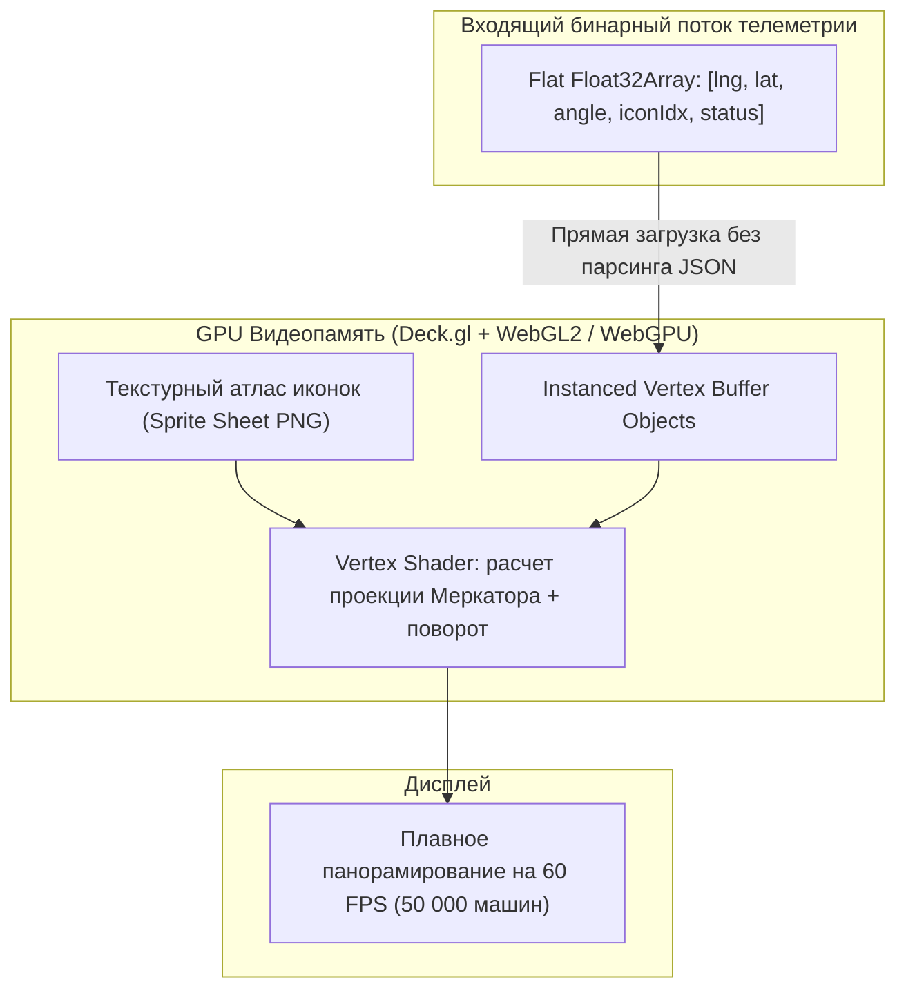

# Рендеринг флота (10k+ объектов) с Deck.gl IconLayer

> [!info] Навигация
> Родительский раздел: [[GPS & Tracking MOC]]

## Границы стандартных движков при отображении флота

В задачах глобальной телематики (федеральный агрегатор такси, каршеринг мегаполиса, отслеживание всех грузовых судов в океане или коммерческой авиации) фронтенд должен отображать **от $10\,000$ до $100\,000$ подвижных объектов** одновременно.

При попытке использовать стандартные средства веб-карт возникают аппаратные барьеры:
- **DOM Markers (Leaflet / MapLibre Marker):** Крашатся уже при $1\,500 - 2\,000$ элементах из-за переполнения дерева DOM и блокировки Layout Engine браузера.
- **MapLibre Symbol Layer (GeoJSON):** Начинает ощутимо терять FPS при $15\,000 - 20\,000$ объектах из-за затрат на сериализацию GeoJSON и пересчет буферов на CPU перед передачей в WebGL.

Индустриальным решением для высоконагруженных задач Big Data Tracking является библиотека **Deck.gl** (созданная в Uber) и ее специализированный слой **`IconLayer`**.



---

## Архитектура GPU Instancing и Текстурного Атласа

В `IconLayer` используется концепция **Hardware Instancing**:
1. **Единый геометрический примитив:** В память видеокарты загружается один-единственный прямоугольник (Quad), состоящий всего из 2 треугольников (4 вершины).
2. **Текстурный атлас (Sprite Sheet):** Все возможные варианты иконок (легковой автомобиль, грузовик, самолет, статус тревоги, авария) упакованы в одно PNG-изображение со JSON-дескриптором координат вырезки (UV Mapping).
3. **Прямые типизированные массивы:** Deck.gl не итерирует объекты JavaScript вида `{ lat: ..., lng: ... }`. Ему передается плоский типизированный массив, откуда шейдер напрямую вычитывает атрибуты: позицию, угол поворота, масштаб и цвет.

---

## Продакшн-код: Deck.gl IconLayer поверх MapLibre GL JS

```typescript
import maplibregl from 'maplibre-gl';
import { Deck } from '@deck.gl/core';
import { IconLayer } from '@deck.gl/layers';
import { MapboxOverlay } from '@deck.gl/mapbox';

export interface FleetVehicleData {
  id: number;
  lng: number;
  lat: number;
  bearing: number;
  type: 'sedan' | 'truck' | 'bike';
  status: 'online' | 'warning' | 'offline';
}

// Конфигурация спрайтового атласа иконок
const ICON_MAPPING = {
  sedan: { x: 0, y: 0, width: 64, height: 64, mask: true },
  truck: { x: 64, y: 0, width: 64, height: 64, mask: true },
  bike: { x: 128, y: 0, width: 64, height: 64, mask: true }
};

export class DeckFleetVisualization {
  private overlay: MapboxOverlay;
  private currentVehicles: FleetVehicleData[] = [];

  constructor(private readonly map: maplibregl.Map) {
    // 1. Создание монтируемого оверлея Deck.gl
    this.overlay = new MapboxOverlay({
      interleaved: false, // Deck.gl рисуется в отдельном верхнем Canvas поверх карты
      layers: []
    });

    // 2. Добавление оверлея в элементы управления MapLibre
    this.map.addControl(this.overlay as unknown as maplibregl.IControl);
  }

  /**
   * Обновление отображаемого флота (до 50 000 объектов)
   */
  public updateFleet(vehicles: FleetVehicleData[]): void {
    this.currentVehicles = vehicles;

    const layer = new IconLayer<FleetVehicleData>({
      id: 'fleet-icon-layer',
      data: this.currentVehicles,
      pickable: true, // Включение аппаратного GPU-пикинга для кликов и тултипов

      // Источник текстурного атласа
      iconAtlas: '/assets/fleet-icons-atlas.png',
      iconMapping: ICON_MAPPING,
      getIcon: (d) => d.type,

      // Пространственные координаты
      getPosition: (d) => [d.lng, d.lat],

      // Размер иконки на экране (в пикселях)
      getSize: 28,
      sizeUnits: 'pixels',
      sizeMinPixels: 14,
      sizeMaxPixels: 48,

      // Аппаратный поворот иконки по курсу (в градусах против часовой стрелки)
      getAngle: (d) => -d.bearing,

      // Динамическая окраска по статусу через шейдер маски
      getColor: (d) => {
        if (d.status === 'warning') return [239, 68, 68, 255]; // Красный
        if (d.status === 'online') return [34, 197, 94, 255];  // Зеленый
        return [156, 163, 175, 255];                          // Серый оффлайн
      },

      // Обработка наведения курсора без просадки FPS
      onHover: (info) => {
        if (info.object) {
          this.showTooltip(info.x, info.y, info.object);
        } else {
          this.hideTooltip();
        }
      },

      // Плавная интерполяция перемещений силами GPU
      transitions: {
        getPosition: {
          duration: 2000,
          easing: (t: number) => t // Линейное движение
        },
        getAngle: {
          duration: 1000
        }
      },

      // Предотвращение лишних пересчетов буферов
      updateTriggers: {
        getColor: [this.currentVehicles.map((v) => v.status).join(',')]
      }
    });

    this.overlay.setProps({
      layers: [layer]
    });
  }

  private showTooltip(x: number, y: number, vehicle: FleetVehicleData): void {
    // Вывод легковесного HTML-тултипа по экранным координатам
  }

  private hideTooltip(): void {
    // Скрытие тултипа
  }

  public destroy(): void {
    this.map.removeControl(this.overlay as unknown as maplibregl.IControl);
  }
}
```

---

## Экстремальная оптимизация: Binary Mode (Zero-Copy Transfer)

Если объектов более $30\,000$, даже создание массива объектов `{ id, lng, lat, ... }` в JavaScript создает ощутимое давление на сборщик мусора (GC).
Deck.gl позволяет передавать данные в виде **Binary Attributes**:

```typescript
const count = 50000;
const positions = new Float32Array(count * 2); // [lng, lat, lng, lat, ...]
const angles = new Float32Array(count);        // [angle, angle, ...]
const colors = new Uint8Array(count * 4);      // [r, g, b, a, ...]

const binaryLayer = new IconLayer({
  id: 'ultra-fleet-layer',
  data: {
    length: count,
    attributes: {
      getPosition: { value: positions, size: 2 },
      getAngle: { value: angles, size: 1 },
      getColor: { value: colors, size: 4 }
    }
  },
  iconAtlas: '/assets/fleet-icons-atlas.png',
  iconMapping: ICON_MAPPING,
  getIcon: () => 'sedan'
});
```
При таком подходе данные копируются из Web Worker в видеопамять практически со скоростью шины памяти (Zero-copy), не вызывая ни одного такта сборки мусора.

---

## Сравнительная матрица производительности

| Стек рендеринга | Лимит объектов при 60 FPS | Загрузка CPU | Потребление RAM |
| :--- | :--- | :--- | :--- |
| **DOM Markers (MapLibre Marker)** | $\approx 500 - 1\,500$ | $100\%$ (забивает DOM) | Катастрофическое |
| **MapLibre GeoJSON Symbol Layer** | $\approx 10\,000 - 20\,000$ | $40-60\%$ (Worker JSON) | Умеренное |
| **Deck.gl IconLayer (JSON Objects)** | $\approx 40\,000 - 60\,000$ | $15-20\%$ | Низкое |
| **Deck.gl Binary Attributes (VBO)** | $> 200\,000$ объектов | $< 5\%$ | Минимальное |

> [!tip] GPU Picking тултипов
> В Deck.gl обработка событий мыши (`onHover`, `onClick`) реализована через **Color-based Off-screen Framebuffer Picking**: в скрытый буфер рендерится миниатюрная копия экрана, где каждому объекту присвоен уникальный RGB-цвет (его ID). Чтение пикселя под курсором выполняется за микросекунды без геометрических пересечений на CPU.
