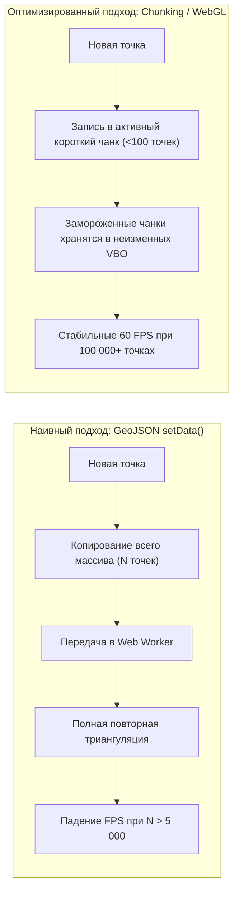
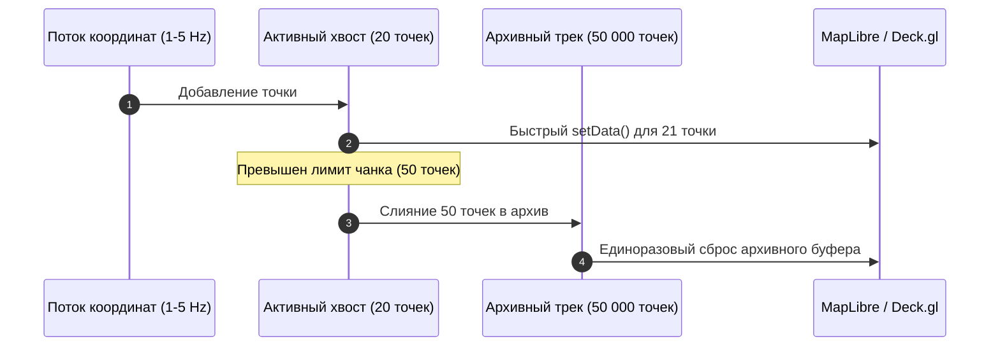

# Стриминг и отрисовка растущего трека (GeoJSON updates vs WebGL)

> [!info] Навигация
> Родительский раздел: [[GPS & Tracking MOC]]

## Проблема растущей линии трека (Growing Breadcrumb Trail)

Во многих задачах мониторинга (запись пробежки в фитнес-трекере, диспетчеризация движения курьера за день, полет дрона) требуется не просто отображать текущее положение маркера, но и тянуть за ним непрерывную линию уже пройденного пути (**«хвост» / breadcrumbs**).

Наивный подход заключается в постоянном добавлении точки в массив `coordinates` существующего GeoJSON `LineString` и вызове метода:
```typescript
geojsonSource.setData(updatedGeoJson);
```

### Почему наивный подход ломает производительность при длительном трекинге:
1. **O(N) Сериализация и копирование памяти:** При каждом добавлении точки браузер сериализует весь массив из $10\,000 - 50\,000$ точек, передает его через Web Worker в WebGL-движок MapLibre и заново парсит.
2. **Пересчет геометрии полигонов линии (Line Tessellation):** Чтобы нарисовать толстую линию заданной ширины со скругленными углами (`line-join: round`, `line-cap: round`), движок карты заново триангулирует в память GPU весь массив точек, создавая тысячи новых треугольников.
3. **Падение FPS:** После 30–60 минут непрерывной записи трека частота кадров карты падает с $60\text{ FPS}$ до $15-20\text{ FPS}$.



---

## Архитектурные паттерны отрисовки

### 1. Паттерн Chunked GeoJSON (Сегментирование трека)
Вместо одной гигантской линии трек разбивается на два независимых слоя:
- **Архивный слой (Historical Static Layer):** Содержит основную часть пройденного пути (например, 99% точек). Этот GeoJSON статический и вообще не обновляется в цикле рендера.
- **Активный слой (Active Head Layer):** Содержит только последние 20–50 точек движения. Метод `setData()` вызывается только для этого крошечного сегмента.
- При накоплении в активном слое более 100 точек они «схлопываются» и один раз дописываются в архивный слой.



### TypeScript реализация: Chunked Track Controller

```typescript
import maplibregl from 'maplibre-gl';
import type { Feature, LineString } from 'geojson';

export class ChunkedTrackRenderer {
  private staticTrackCoords: [number, number][] = [];
  private activeHeadCoords: [number, number][] = [];
  private readonly maxHeadSize: number = 50;

  constructor(
    private readonly map: maplibregl.Map,
    private readonly staticSourceId: string = 'track-static-source',
    private readonly headSourceId: string = 'track-head-source'
  ) {
    this.initLayers();
  }

  private initLayers(): void {
    // Архивный слой
    this.map.addSource(this.staticSourceId, {
      type: 'geojson',
      data: { type: 'Feature', geometry: { type: 'LineString', coordinates: [] }, properties: {} }
    });
    this.map.addLayer({
      id: 'track-static-line',
      type: 'line',
      source: this.staticSourceId,
      paint: { 'line-color': '#2563eb', 'line-width': 4, 'line-opacity': 0.8 }
    });

    // Активный растущий слой
    this.map.addSource(this.headSourceId, {
      type: 'geojson',
      data: { type: 'Feature', geometry: { type: 'LineString', coordinates: [] }, properties: {} }
    });
    this.map.addLayer({
      id: 'track-head-line',
      type: 'line',
      source: this.headSourceId,
      paint: { 'line-color': '#3b82f6', 'line-width': 4 }
    });
  }

  public appendCoord(coord: [number, number]): void {
    this.activeHeadCoords.push(coord);

    if (this.activeHeadCoords.length >= this.maxHeadSize) {
      // Сброс активного сегмента в архив
      this.staticTrackCoords.push(...this.activeHeadCoords);
      // Оставляем последнюю точку для непрерывности линии
      const lastPoint = this.activeHeadCoords[this.activeHeadCoords.length - 1];
      this.activeHeadCoords = [lastPoint];

      this.flushStatic();
    }

    this.flushHead();
  }

  private flushHead(): void {
    const src = this.map.getSource(this.headSourceId) as maplibregl.GeoJSONSource;
    if (src) {
      src.setData({
        type: 'Feature',
        geometry: { type: 'LineString', coordinates: this.activeHeadCoords },
        properties: {}
      });
    }
  }

  private flushStatic(): void {
    const src = this.map.getSource(this.staticSourceId) as maplibregl.GeoJSONSource;
    if (src) {
      src.setData({
        type: 'Feature',
        geometry: { type: 'LineString', coordinates: this.staticTrackCoords },
        properties: {}
      });
    }
  }
}
```

---

## 2. Прямой WebGL / WebGPU рендеринг через Deck.gl PathLayer

Когда длина трека достигает сотен тысяч точек или одновременно отслеживается 1 000 движущихся линий, GeoJSON полностью исчерпывает свои возможности. 

В этом случае используется **Deck.gl `PathLayer`**, принимающий типизированные бинарные буферы (`Float32Array`) без накладных расходов на создание объектов:

```typescript
import { PathLayer } from '@deck.gl/layers';
import { MapboxOverlay } from '@deck.gl/mapbox';

export function createFastDeckTrackLayer(pointsArray: Float32Array): PathLayer {
  return new PathLayer({
    id: 'streaming-fleet-tracks',
    data: {
      length: 1, // Один составной полилинейный путь
      startIndices: [0],
      attributes: {
        getPath: { value: pointsArray, size: 2 } // [lng0, lat0, lng1, lat1, ...]
      }
    },
    getColor: [37, 99, 235, 255],
    getWidth: 4,
    widthUnits: 'pixels',
    widthMinPixels: 2,
    capRounded: true,
    jointRounded: true,
    _subLayerProps: {
      // Аппаратная оптимизация передачи VBO буфера без глубокого сравнения
    }
  });
}
```

---

## Сравнение производительности подходов

| Метод | Лимит точек без дропа 60 FPS | Нагрузка на CPU | Использование RAM |
| :--- | :--- | :--- | :--- |
| **Одиночный GeoJSON `setData()`** | $\sim 2\,000$ точек | Высокая ($80-100\%$ ядра) | Высокая (частые всплески GC) |
| **Chunked GeoJSON (Архив + Голова)** | $\sim 50\,000$ точек | Низкая ($10-15\%$) | Умеренная |
| **Deck.gl Binary PathLayer** | $> 1\,000\,000$ точек | Минимальная ($< 5\%$) | Минимальная (прямой бинарный VBO) |

> [!tip] Обрезка хвоста по времени или дистанции (FIFO Rolling Buffer)
> В системах мониторинга такси и курьеров диспетчеру редко нужен весь суточный маршрут. Используйте кольцевой буфер (Rolling Window), сохраняющий только последние $N$ минут или $K$ километров движения. Это гарантирует константный расход памяти $O(1)$ при бесконечно долгой работе вкладки.
