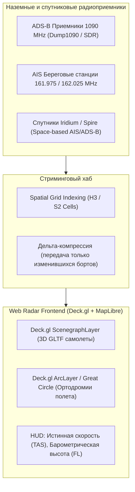

# Авиационный и морской радар (ADS-B и AIS на Frontend)

> [!info] Навигация
> Родительский раздел: [[GPS & Tracking MOC]]

## Мир глобального трекинга: Радары Flightradar24 и MarineTraffic

В глобальных сервисах мониторинга воздушного и морского пространства фронтенд решает экстремальные инженерные задачи:
- **Авиация (ADS-B):** В каждый момент времени в небе находится от $10\,000$ до $20\,000$ коммерческих и частных бортов, перемещающихся на скоростях до $950\text{ км/ч}$ на эшелонах до $12\,000\text{ метров}$.
- **Морской флот (AIS):** В мировом океане одновременно отслеживается более $150\,000$ танкеров, сухогрузов, паромов и яхт.

Пользовательский интерфейс подобных сервисов (Flightradar24, FlightAware, MarineTraffic, VesselFinder) должен плавно визуализировать эту армаду объектов в браузере без зависаний, с возможностью 3D-наклона, клика по любому самолету и отображения прогноза снижения по глиссаде.



---

## 1. Авиационный протокол ADS-B (Automatic Dependent Surveillance-Broadcast)

ADS-B — система наблюдения, при которой воздушное судно непрерывно транслирует свои навигационные параметры в открытый радиоэфир на частоте **1090 МГц** (Mode-S Extended Squitter).

### Ключевые параметры борта:
- **ICAO24 (Hex-код):** Уникальный 24-битный адрес самолета (например, `4CA821`).
- **Callsign (Позывной рейса):** Например, `AFL2144`, `DLH401`.
- **Barometric Altitude / Flight Level (FL):** Эшелон полета (в сотнях футов относительно стандартного давления 1013.25 гПа, например FL350 = 35 000 футов).
- **Geometric Altitude:** Истинная высота по GPS относительно эллипсоида WGS-84.
- **Ground Speed (GS):** Путевая скорость в узлах относительно земли.
- **True Airspeed (TAS):** Истинная воздушная скорость.
- **Vertical Rate (Climb/Descent):** Скорость набора или снижения в футах в минуту (fpm).
- **Squawk Code:** 4-значный восьмеричный код транспондера (7700 — аварийная ситуация, 7600 — отказ радиосвязи, 7500 — захват судна).

---

## 2. Морской протокол AIS (Automatic Identification System)

AIS использует УКВ-радиоволны морского диапазона (VHF). Передает пакеты в формате предложений **NMEA-0183 (`!AIVDM`)**, закодированные 6-битным ASCII (Six-bit ASCII armored).

### Ключевые параметры судна:
- **MMSI (Maritime Mobile Service Identity):** Уникальный 9-значный номер судна.
- **IMO Number:** Постоянный международный регистрационный номер судна.
- **Ship Type:** Тип судна (Cargo, Tanker, Passenger, Tug, Fishing).
- **Navigational Status:** Под мотором на ходу (0), на якоре (1), лишен возможности управляться (2), ограничен в маневренности (3), на мели (5).
- **SOG (Speed Over Ground):** Скорость относительно грунта (в десятых долях узла).
- **COG (Course Over Ground):** Курс относительно грунта ($0.1^\circ$).
- **Draft:** Текущая осадка судна в метрах.

---

## Архитектура Web-Радара: Deck.gl ScenegraphLayer и 3D Модели

Для реалистичной визуализации авиалайнеров под углом наклона камеры в MapLibre используется **`ScenegraphLayer`** из экосистемы Deck.gl, позволяющий рендерить тысячи 3D-моделей в формате glTF/GLB с аппаратным расчетом теней и света:

```typescript
import { ScenegraphLayer } from '@deck.gl/mesh-layers';
import { MapboxOverlay } from '@deck.gl/mapbox';

export interface AircraftTelemetry {
  icao: string;
  callsign: string;
  lng: number;
  lat: number;
  altitudeMeters: number;
  heading: number;
  pitch: number;
  roll: number;
  squawk: string;
}

export function createAircraftRadarLayer(aircraftList: AircraftTelemetry[]): ScenegraphLayer {
  return new ScenegraphLayer({
    id: 'aircraft-3d-radar',
    data: aircraftList,
    pickable: true,
    sizeScale: 15,
    scenegraph: 'https://raw.githubusercontent.com/visgl/deck.gl-data/master/examples/scenegraph-layer/airplane.glb',

    // Позиция: [lng, lat, altitude] (Высота поднимает модель над землей в 3D пространстве)
    getPosition: (d: AircraftTelemetry) => [d.lng, d.lat, d.altitudeMeters],

    // Ориентация самолета в пространстве (Курс, Тангаж, Крен)
    getOrientation: (d: AircraftTelemetry) => [d.pitch, 360 - d.heading, d.roll],

    // Подсветка борта: если код аварии 7700 — ярко-красный аварийный цвет
    getColor: (d: AircraftTelemetry) => {
      if (d.squawk === '7700') return [239, 68, 68, 255]; // SOS Emergency
      return [255, 255, 255, 255];
    },

    _subLayerProps: {
      'scenegraph': {
        // Оптимизация инстансинга материалов на GPU
      }
    }
  });
}
```

---

## Ортодромические дуги маршрутов (Great Circle Arcs)

Самолеты на трансконтинентальных рейсах не летают по прямым линиям карты Меркатора — они следуют по дуге большого круга (**ортодромии**). 
Для отрисовки траектории рейса используется **Deck.gl `ArcLayer`**:

```typescript
import { ArcLayer } from '@deck.gl/layers';

export function createFlightPathArc(flight: {
  origin: [number, number];
  destination: [number, number];
  currentPos: [number, number];
}): ArcLayer {
  return new ArcLayer({
    id: 'flight-great-circle',
    data: [flight],
    getSourcePosition: (d) => d.origin,
    getTargetPosition: (d) => d.destination,
    getSourceColor: [59, 130, 246, 200], // Синий (Вылет)
    getTargetColor: [16, 185, 129, 200], // Зеленый (Прилет)
    getWidth: 3,
    greatCircle: true // Автоматический расчет геодезической дуги с учетом кривизны Земли!
  });
}
```

---

## Специфика морской визуализации (AIS Marine Radar)

| Задача | Решение на Frontend |
| :--- | :--- |
| **Отображение габаритов судна** | В масштабе зума $\ge 15$ вместо точки рендерится реальный контур корпуса судна по метрикам длины, ширины и смещения антенны (`A`, `B`, `C`, `D` из статического сообщения AIS Message 5). |
| **Вектор упреждения (Speed Vector)** | От носа судна откладывается пунктирная линия курса длиной $V \times t$ (например, где будет судно через 10 минут) для оценки опасности сближения (CPA — Closest Point of Approach). |
| **Слепые зоны океана** | Если судно находится вне зоны береговых вышек, статус обновляется со спутников с пометкой *«Satellite AIS»* и сниженной частотой обновления (раз в 15–30 минут). |

> [!tip] Пагинация по гео-ячейкам (Uber H3 Spatial Grid)
> При отображении глобального радара сервер никогда не шлет 150 000 судов одним пакетом. Карта запрашивает данные только для видимых ячеек сетки **H3 (Uber Hexagonal Hierarchical Spatial Index)** текущего уровня зума, динамически подгружая детализацию при приближении к портам.
