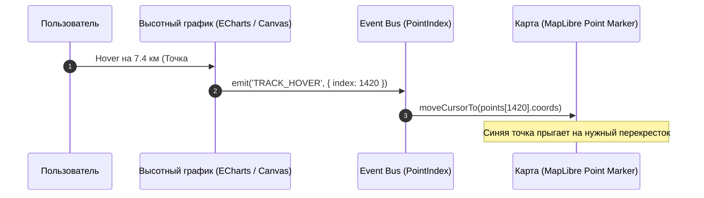

# Спорт и фитнес (Strava стиль — темп, высотный профиль, аналитика)

> [!info] Навигация
> Родительский раздел: [[GPS & Tracking MOC]]

## Специфика трекинга в спортивных приложениях

В фитнес-сервисах (Strava, Garmin Connect, Nike Run Club, Komoot) требования к обработке GPS-данных принципиально отличаются от трекинга автотранспорта:
- **Низкие скорости перемещения:** Бегун движется со скоростью $8-15\text{ км/ч}$, пешеход — $4-6\text{ км/ч}$. На таких скоростях инструментальный GPS-шум ($2-5\text{ метров}$) сопоставим с пройденным за секунду расстоянием. Без специальной фильтрации стоящий бегун «пробегает» лишние километры.
- **Понятие темпа (Pace) вместо скорости:** Бегуны мыслят не километрами в час, а временем преодоления одного километра — **минуты на километр (мин/км)**.
- **Высота и барометрический профиль (Elevation Gain):** Набор высоты критичен для велогонщиков и трейлраннеров. Сырая GPS-высота из-за геометрии спутников содержит огромную погрешность ($\pm 15-30\text{ м}$), требующую барометрической калибровки или DEM-фильтрации.
- **Интерактивная связка «Карта — График»:** При наведении мыши на профиль высоты на графике маркер на карте мгновенно перемещается в соответствующую географическую точку.

```mermaid
flowchart LR
    subgraph Watch ["Спортивные часы (Garmin / Apple Watch)"]
        Sensors["GPS + Барометр + Пульсометр (HR) + Каденс"]
        FitFile["Запись в формате .FIT / .GPX / .TCX"]
    end

    subgraph Analytics ["Аналитический конвейер"]
        OutlierFilter["Фильтрация шума стоянки (Auto-pause)"]
        PaceCalc["Расчет скользящего темпа (Moving Pace)"]
        ElevationFilter["Сглаживание набора высоты (Elevation Gain)"]
        Splits["Нарезка километровых отсечек (Splits 1k)"]
    end

    subgraph FrontendUI ["Интерфейс тренировки"]
        MapTrack["Карта с градиентом темпа"]
        ProfileChart["Высотный профиль с визиром"]
        SplitTable["Таблица темпа по километрам"]
    end

    Watch --> FitFile --> OutlierFilter --> PaceCalc --> ElevationFilter --> Splits
    Splits --> FrontendUI
```



---

## Математика расчета темпа (Pace) и скользящего окна

Темп измеряется в секундах на километр:
$$\text{Pace}_{\text{sec/km}} = \frac{\Delta t_{\text{seconds}}}{\Delta d_{\text{kilometers}}}$$

Для преобразования в строковый формат `ММ:СС/км`:
$$\text{Minutes} = \lfloor \text{Pace} / 60 \rfloor, \quad \text{Seconds} = \text{Pace} \pmod{60}$$

### Проблема мгновенного темпа (Instant Pace)
Если считать темп между двумя соседними секундами, малейший скачок координаты вызовет хаотические прыжки от `2:30/км` до `15:00/км`. В продакшне всегда используется **скользящее среднее (Rolling Window Moving Average)** за последние 10–15 секунд или 50 метров.

```typescript
export function formatPace(paceSecPerKm: number): string {
  if (!isFinite(paceSecPerKm) || paceSecPerKm <= 0 || paceSecPerKm > 1800) {
    return '--:--';
  }
  const mins = Math.floor(paceSecPerKm / 60);
  const secs = Math.round(paceSecPerKm % 60);
  return `${mins}:${secs.toString().padStart(2, '0')} /км`;
}

export function calculateMovingPace(
  points: Array<{ time: number; distanceKm: number }>,
  windowSec: number = 15
): number[] {
  const paces: number[] = [];

  for (let i = 0; i < points.length; i++) {
    const currentTime = points[i].time;
    const windowStartTime = currentTime - windowSec * 1000;

    // Ищем точку начала скользящего временного окна
    let startIdx = i;
    while (startIdx > 0 && points[startIdx - 1].time >= windowStartTime) {
      startIdx--;
    }

    const timeDeltaSec = (points[i].time - points[startIdx].time) / 1000;
    const distDeltaKm = points[i].distanceKm - points[startIdx].distanceKm;

    if (distDeltaKm > 0.005 && timeDeltaSec > 3) {
      paces.push(timeDeltaSec / distDeltaKm);
    } else {
      paces.push(paces.length > 0 ? paces[paces.length - 1] : 0);
    }
  }

  return paces;
}
```

---

## Высотный профиль и сглаживание общего набора высоты (Elevation Gain)

Если сложить все положительные разности сырых высот GPS $(\sum \max(0, h_{i+1} - h_i))$, то из-за высокочастотного шума плоская 10-километровая набережная превратится в «восхождение на Эверест» с набором высоты в 800 метров.

Для получения достоверного набора высоты (Cumulative Elevation Gain) применяется:
1. **Порог гистерезиса (Threshold Clamping):** Подъем засчитывается только если превысил порог $2-3\text{ метра}$.
2. **Фильтр скользящего среднего или Савицкого — Голея:** Устраняет пилообразный шум.

```typescript
export function calculateTrueElevationGain(
  altitudes: number[],
  noiseThresholdMeters: number = 2.5
): { totalGain: number; totalLoss: number; smoothedAltitudes: number[] } {
  if (altitudes.length < 2) {
    return { totalGain: 0, totalLoss: 0, smoothedAltitudes: altitudes };
  }

  // 1. Сглаживание скользящим окном по 5 точкам
  const smoothed: number[] = [];
  const halfWindow = 2;

  for (let i = 0; i < altitudes.length; i++) {
    let sum = 0;
    let count = 0;
    for (let j = Math.max(0, i - halfWindow); j <= Math.min(altitudes.length - 1, i + halfWindow); j++) {
      sum += altitudes[j];
      count++;
    }
    smoothed.push(sum / count);
  }

  // 2. Интегрирование с гистерезисным фильтром
  let totalGain = 0;
  let totalLoss = 0;
  let referenceAlt = smoothed[0];

  for (let i = 1; i < smoothed.length; i++) {
    const diff = smoothed[i] - referenceAlt;

    if (Math.abs(diff) >= noiseThresholdMeters) {
      if (diff > 0) {
        totalGain += diff;
      } else {
        totalLoss += Math.abs(diff);
      }
      referenceAlt = smoothed[i];
    }
  }

  return {
    totalGain: Math.round(totalGain),
    totalLoss: Math.round(totalLoss),
    smoothedAltitudes: smoothed
  };
}
```

---

## Синхронизация «Карта $\leftrightarrow$ График высоты» (Bi-directional Hover)

Ключевой UX-паттерн спортивных сервисов:
- Пользователь ведет мышью по графику высоты $\rightarrow$ маркер бегуна скользит по карте.
- Пользователь ведет курсором по линии трека на карте $\rightarrow$ на графике загорается вертикальная линия визира и всплывает плашка с текущим пульсом, темпом и набором высоты.



### Пример реализации обработчика связки:

```typescript
export class ActivityMapChartLinker {
  private hoverMarker: maplibregl.Marker;

  constructor(
    private readonly map: maplibregl.Map,
    private readonly trackPoints: Array<{ lng: number; lat: number; ele: number; pace: string }>
  ) {
    const el = document.createElement('div');
    el.className = 'strava-hover-target-point';
    el.style.width = '16px';
    el.style.height = '16px';
    el.style.borderRadius = '50%';
    el.style.backgroundColor = '#fc5200'; // Strava Orange
    el.style.border = '3px solid white';
    el.style.boxShadow = '0 0 8px rgba(0,0,0,0.5)';

    this.hoverMarker = new maplibregl.Marker({ element: el });
  }

  // Вызывается из события 'updateAxisPointer' библиотеки ECharts или Chart.js
  public onChartHover(pointIndex: number): void {
    const pt = this.trackPoints[pointIndex];
    if (!pt) return;

    this.hoverMarker.setLngLat([pt.lng, pt.lat]);
    if (!this.hoverMarker.getElement().parentElement) {
      this.hoverMarker.addTo(this.map);
    }
  }

  public onChartLeave(): void {
    this.hoverMarker.remove();
  }
}
```

> [!tip] Автопауза при остановках (Auto-Pause Threshold)
> При темпе медленнее `25:00 /км` или скорости $<1.5\text{ км/ч}$ беговой алгоритм должен переходить в режим **Паузы**. В расчет среднего темпа тренировки («Moving Time») эти периоды не включаются, иначе длительный перерыв на светофоре или у фонтанчика с водой испортит статистику забега.
