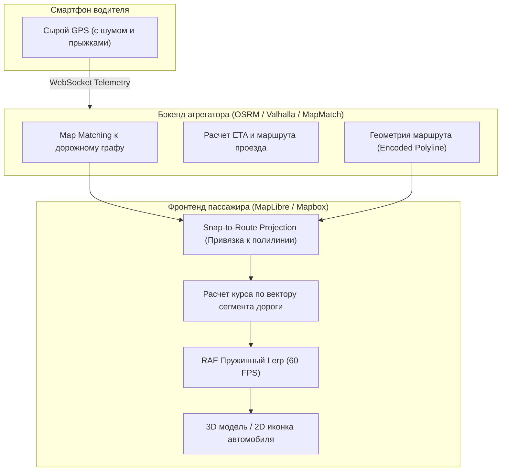
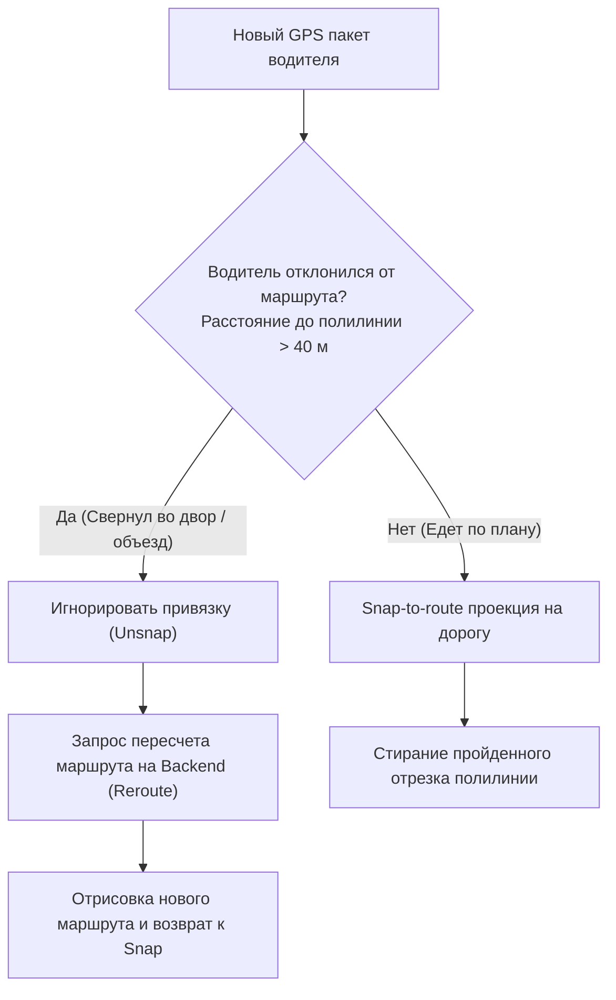

# Такси и доставка (Uber и Яндекс стиль движения машинки)

> [!info] Навигация
> Родительский раздел: [[GPS & Tracking MOC]]

## Как устроена анимация такси в Яндекс Go и Uber

Каждый пользователь сервисов вызова такси или курьерской доставки видел, как плавно и реалистично движется желтая машинка на экране смартфона:
- Она никогда не «срезает» углы через дома и газоны.
- Она плавно вписывается в повороты улиц, поворачиваясь носом точно по направлению дороги.
- Даже если водитель стоит в пробке с плохим приемом GPS, машинка не дрожит на месте.
- Она непрерывно «догоняет» целевой маршрут, даже если сигнал запаздывает на 3–5 секунд.

Этот эффект достигается не простым перемещением маркера, а сложным синергетическим пайплайном: **Map Matching + Path Projection + Snap-to-Route + RAF Interpolation**.



---

## Архитектурные столпы Uber-стиля анимации

### 1. Привязка к маршруту (Snap-to-Route Projection)
Вместо того чтобы двигать машинку по сырым координатам GPS-приемника, фронтенд проецирует сырую точку $P_{\text{raw}}$ на ближайший отрезок построенного полилинейного маршрута следования (Route Geometry). Машинка перемещается **строго по полилинии дороги**:

$$P_{\text{snapped}} = \operatorname{projectPointOnLine}(P_{\text{raw}}, \text{RouteGeometry})$$

### 2. Курс по графу дорог вместо шумящего компаса
Угол поворота иконки берется не из сырого магнитного компаса телефона водителя, а **вычисляется по направлению самого сегмента дорожной сетки**, по которому в данный момент едет автомобиль. Это на 100% исключает вращение машинки поперек проезжей части.

### 3. Опережающая проекция (Lookahead Extrapolation)
Поскольку пакеты доходят до пассажира с сетевой задержкой $\approx 1-3\text{ секунды}$, клиентский рендерер прогнозирует положение машины вперед вдоль линии маршрута со скоростью потока, минимизируя видимое отставание.

---

## Продакшн-код: Движок перемещения машинки по маршруту (TypeScript + Turf.js)

```typescript
import maplibregl from 'maplibre-gl';
import nearestPointOnLine from '@turf/nearest-point-on-line';
import lineSlice from '@turf/line-slice';
import length from '@turf/length';
import { lineString, point } from '@turf/helpers';
import { lerpCoord, LngLat } from '../08 Frontend — Анимация и интерполяция движения/Dead Reckoning и интерполяция на клиенте (Linear, Spline, Lerp)';
import { lerpAngle, calculateBearing } from '../08 Frontend — Анимация и интерполяция движения/Сглаживание курсора и угла поворота (Bearing) без переворотов через 360 градусов';

export class UberStyleVehicleController {
  private routeGeoJson: GeoJSON.Feature<GeoJSON.LineString>;
  private carMarker: maplibregl.Marker;

  // Текущее отрисованное состояние (на экране прямо сейчас)
  private currentPos: LngLat;
  private currentBearing: number = 0;

  // Целевое состояние, к которому стремится маркер
  private targetPos: LngLat;
  private targetBearing: number = 0;

  private isAnimating = false;
  private rafId: number | null = null;

  constructor(
    private readonly map: maplibregl.Map,
    routeCoordinates: [number, number][],
    initialCoords: [number, number]
  ) {
    this.routeGeoJson = lineString(routeCoordinates);
    this.currentPos = { lng: initialCoords[0], lat: initialCoords[1] };
    this.targetPos = { ...this.currentPos };

    // Создание DOM-элемента машинки
    const el = document.createElement('div');
    el.className = 'taxi-vehicle-marker';
    el.style.width = '36px';
    el.style.height = '36px';
    el.style.backgroundImage = 'url("/assets/yellow-taxi-top.png")';
    el.style.backgroundSize = 'contain';
    el.style.willChange = 'transform';

    this.carMarker = new maplibregl.Marker({ element: el, rotationAlignment: 'map' })
      .setLngLat(initialCoords)
      .addTo(this.map);

    this.startLoop();
  }

  /**
   * Прием нового сырого GPS пакета от водителя
   */
  public onDriverGpsUpdate(rawLng: number, rawLat: number, rawSpeedKmh: number): void {
    const rawPoint = point([rawLng, rawLat]);

    // 1. Проекция на маршрут (Snap-to-route)
    const snapped = nearestPointOnLine(this.routeGeoJson, rawPoint);
    const snappedCoords = snapped.geometry.coordinates as [number, number];

    // 2. Определение направления сегмента дороги в точке проекции
    const snappedIndex = snapped.properties.index ?? 0;
    const coords = this.routeGeoJson.geometry.coordinates;
    const nextIndex = Math.min(coords.length - 1, snappedIndex + 1);

    const segmentBearing = calculateBearing(
      coords[snappedIndex][0],
      coords[snappedIndex][1],
      coords[nextIndex][0],
      coords[nextIndex][1]
    );

    // Устанавливаем целевые координаты
    this.targetPos = { lng: snappedCoords[0], lat: snappedCoords[1] };
    this.targetBearing = segmentBearing;

    // 3. Динамическая подрезка пройденной части маршрута (Remaining Route Line)
    this.updateRemainingRoute(snappedCoords);
  }

  // Обновление линии маршрута: пройденная часть стирается, остается только путь до пассажира
  private updateRemainingRoute(currentCoords: [number, number]): void {
    try {
      const endCoords = this.routeGeoJson.geometry.coordinates[
        this.routeGeoJson.geometry.coordinates.length - 1
      ] as [number, number];

      const remainingSlice = lineSlice(
        point(currentCoords),
        point(endCoords),
        this.routeGeoJson
      );

      const src = this.map.getSource('route-source') as maplibregl.GeoJSONSource;
      if (src) {
        src.setData(remainingSlice);
      }
    } catch (e) {
      // Игнорируем краевые эффекты в конечной точке маршрута
    }
  }

  private startLoop(): void {
    this.isAnimating = true;

    const tick = () => {
      if (!this.isAnimating) return;

      // Плавная пружинная релаксация к цели (LERP factor = 0.08 за кадр ~ 60 FPS)
      this.currentPos = lerpCoord(this.currentPos, this.targetPos, 0.08);
      this.currentBearing = lerpAngle(this.currentBearing, this.targetBearing, 0.12);

      this.carMarker.setLngLat([this.currentPos.lng, this.currentPos.lat]);
      this.carMarker.setRotation(this.currentBearing);

      this.rafId = requestAnimationFrame(tick);
    };

    this.rafId = requestAnimationFrame(tick);
  }

  public destroy(): void {
    this.isAnimating = false;
    if (this.rafId !== null) cancelAnimationFrame(this.rafId);
    this.carMarker.remove();
  }
}
```

---

## Особенности обработки краевых ситуаций (Edge Cases)



> [!important] Порог отвязки (Unsnap Threshold)
> Если водитель решил объехать ремонт дороги по параллельному переулку, жесткий принудительный Snap начнет «тащить» машинку по старой дороге, где ее физически нет. При дистанции от сырой координаты до линии маршрута $>30-50\text{ метров}$ контроллер должен немедленно отключать Snap-режим и запрашивать бэкенд о перестроении маршрута (**Rerouting**).
