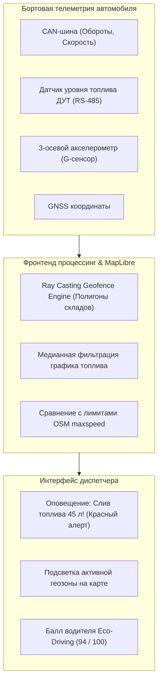
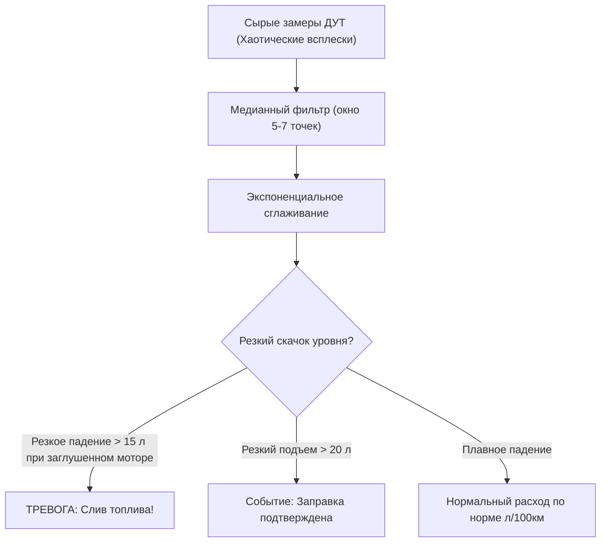

# Телематический дашборд флота (Geofencing, превышение скорости, сливы топлива)

> [!info] Навигация
> Родительский раздел: [[GPS & Tracking MOC]]

## Задачи промышленного телематического дашборда

В коммерческом автопарке (логистические перевозки, спецтехника, дистрибуция ритейла) экран диспетчера — это ситуационный центр контроля затрат и безопасности. Ключевые бизнес-метрики:
1. **Геозоны (Geofencing):** Контроль въезда/выезда с территории складов, карьеров, клиентских баз и соблюдение запретных зон.
2. **Безопасное вождение (Eco Driving / Speeding):** Детекция превышений скорости, опасных ускорений, резких торможений и боковых заносов.
3. **Контроль топлива (Fuel Monitoring):** Сравнение показаний цифровых датчиков ДУТ в баке с расходом по норме для выявления фактов **слива топлива** или заправок «мимо чека».



---

## 1. Геозоны на клиенте: Алгоритм Ray Casting (Point-in-Polygon)

Для проверки в реальном времени, находится ли автомобиль внутри произвольного полигона геозоны (база, охраняемая стоянка), применяется классический топологический алгоритм **Ray Casting (метод пересечения луча)**: из точки выпускается горизонтальный луч в бесконечность; если количество пересечений с ребрами полигона нечетное — точка внутри.

```typescript
export type GeoPoint = [number, number]; // [lng, lat]

/**
 * Высокоскоростная проверка попадания точки в полигон без тяжелых библиотек
 */
export function isPointInsidePolygon(point: GeoPoint, ring: GeoPoint[]): boolean {
  const [x, y] = point;
  let inside = false;

  for (let i = 0, j = ring.length - 1; i < ring.length; j = i++) {
    const xi = ring[i][0], yi = ring[i][1];
    const xj = ring[j][0], yj = ring[j][1];

    const intersect = ((yi > y) !== (yj > y)) &&
      (x < ((xj - xi) * (y - yi)) / (yj - yi) + xi);

    if (intersect) inside = !inside;
  }

  return inside;
}
```

### Пространственная оптимизация (Bounding Box Pre-check):
Перед запуском цикла проверки вершин полигона всегда выполняется предварительный тест на пересечение с охватывающим прямоугольником (**AABB - Axis-Aligned Bounding Box**). Это ускоряет проверку 1000 геозон на $95\%$.

---

## 2. Детекция сливов и заправок топлива (Датчики ДУТ)

Сырой график уровня топлива в баке грузовика полон шума из-за колебания жидкости при разгоне, торможении и езде по кочкам («болтанка» в баке может достигать $\pm 20\text{ литров}$).



### Алгоритм медианной фильтрации и детекции аномалий:

```typescript
export interface FuelReading {
  timestamp: number;
  liters: number;
  isEngineOn: boolean;
}

export interface FuelIncident {
  type: 'DRAIN' | 'REFUEL';
  timestamp: number;
  deltaLiters: number;
}

export class FuelAnalyticsEngine {
  public static detectIncidents(
    rawReadings: FuelReading[],
    minDrainVolumeLiters: number = 15.0,
    minRefuelVolumeLiters: number = 20.0
  ): FuelIncident[] {
    if (rawReadings.length < 5) return [];

    // 1. Медианная фильтрация для устранения колебаний жидкости
    const smoothed = rawReadings.map((reading, i, arr) => {
      const window = arr
        .slice(Math.max(0, i - 2), Math.min(arr.length, i + 3))
        .map((r) => r.liters)
        .sort((a, b) => a - b);
      const medianLiters = window[Math.floor(window.length / 2)];
      return { ...reading, liters: medianLiters };
    });

    const incidents: FuelIncident[] = [];

    // 2. Детекция крутых перепадов между интервалами 2-3 минуты
    for (let i = 1; i < smoothed.length; i++) {
      const delta = smoothed[i].liters - smoothed[i - 1].liters;

      if (delta <= -minDrainVolumeLiters) {
        incidents.push({
          type: 'DRAIN',
          timestamp: smoothed[i].timestamp,
          deltaLiters: Math.abs(delta)
        });
      } else if (delta >= minRefuelVolumeLiters) {
        incidents.push({
          type: 'REFUEL',
          timestamp: smoothed[i].timestamp,
          deltaLiters: delta
        });
      }
    }

    return incidents;
  }
}
```

---

## 3. Контроль превышения скорости (Speeding Audit)

Превышение скорости оценивается не по абстрактным числам, а относительно **разрешенной скорости на конкретном участке дороги** (тег `maxspeed` в OpenStreetMap / дорожном графе).

```typescript
export interface SpeedViolation {
  vehicleId: string;
  actualSpeedKmh: number;
  allowedSpeedKmh: number;
  overSpeedDelta: number;
  location: [number, number];
  timestamp: number;
}

export function auditSpeedEvent(
  vehicleId: string,
  actualSpeed: number,
  roadMaxSpeed: number,
  coords: [number, number]
): SpeedViolation | null {
  // Допустимый буфер погрешности спидометра (например, +5 км/ч)
  const toleranceBuffer = 5;

  if (actualSpeed > roadMaxSpeed + toleranceBuffer) {
    return {
      vehicleId,
      actualSpeedKmh: actualSpeed,
      allowedSpeedKmh: roadMaxSpeed,
      overSpeedDelta: actualSpeed - roadMaxSpeed,
      location: coords,
      timestamp: Date.now()
    };
  }

  return null;
}
```

---

## Интеграция в диспетчерский UI

В интерфейсе диспетчера инциденты подсвечиваются интерактивными маркерами на карте:
- **Значок канистры со знаком восклицания** в точке слива топлива. При клике всплывает всплывающее окно с объемом слива и адресом ближайшего населенного пункта.
- **Красная подсветка ребер дороги** на участках, где водитель превысил скорость более чем на $30\text{ км/ч}$.
- **Смена заливки геозоны** (зеленая $\rightarrow$ синяя) в момент фиксации въезда грузовика на разгрузочную рампу.

> [!tip] Производительность отрисовки сотен геозон
> Не добавляйте каждую геозону отдельным слоем карты. Объединяйте все геозоны компании в единый `FeatureCollection<Polygon>` с общим источником данных `GeoJSONSource` и настраивайте динамическую подсветку через Feature State (`map.setFeatureState(...)`).
