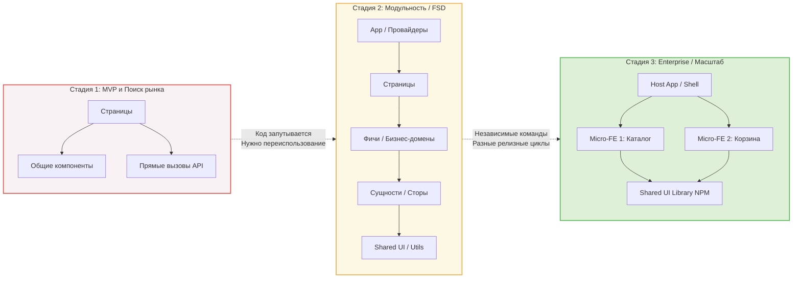

# Architecture

- ### [[Frontend/Architecture/Clean Architecture (Чистая архитектура)/Hexagonal Architecture|Hexagonal Architecture]]
- ### [[Frontend/Architecture/Clean Architecture (Чистая архитектура)/Разделение слоев (Domain, Infrastructure, UI)|Разделение слоев (Domain, Infrastructure, UI)]]
- ### [[Feature-Sliced Design (FSD)|Feature-Sliced Design (FSD)]]
- ### [[Microfrontends (Module Federation)|Microfrontends (Module Federation)]]
- ### [[Frontend/Architecture/Monorepos (Монорепозитории)/Инструменты (Nx, Turborepo, pnpm workspaces, Lerna)|Инструменты (Nx, Turborepo, pnpm workspaces, Lerna)]]
- ### [[Frontend/Architecture/Monorepos (Монорепозитории)/Разделение кода, версионирование и кэширование сборок|Разделение кода, версионирование и кэширование сборок]]
- ### [[Frontend/Architecture/System Design (Frontend)/Кэширование на уровне CDN|Кэширование на уровне CDN]]
- ### [[Frontend/Architecture/System Design (Frontend)/Оценка нагрузки и стратегии рендеринга|Оценка нагрузки и стратегии рендеринга]]
- ### [[Frontend/Architecture/System Design (Frontend)/Проектирование компонентов и API|Проектирование компонентов и API]]
- ### [[Frontend/Architecture/Архитектура API и сетевого слоя/Паттерн BFF (Backend For Frontend)|Паттерн BFF (Backend For Frontend)]]
- ### [[Frontend/Architecture/Архитектура стилизации (CSS)/Методологии и подходы|Методологии и подходы]]
- ### [[Frontend/Architecture/Принципы проектирования/Паттерны проектирования в JS|Паттерны проектирования в JS]]
- ### [[Frontend/Architecture/Принципы проектирования/DRY, KISS, YAGNI|DRY, KISS, YAGNI]]
- ### [[Frontend/Architecture/Принципы проектирования/GRASP|GRASP]]
- ### [[Frontend/Architecture/Принципы проектирования/SOLID во фронтенде (Практика)|SOLID во фронтенде (Практика)]]
- ### [[Frontend/Architecture/Управление состоянием (State Management)/Архитектура управления состоянием|Архитектура управления состоянием]]

«**Архитектура фронтенд-приложения** — это система решений о том, как организованы его части, как они взаимодействуют и где проходят границы ответственности.

В своей работе я опираюсь на несколько уровней проектирования:

- **Слои и модули** — четкое разделение на UI-компоненты, бизнес-логику, управление состоянием (State) и работу с сетью/API.
- **Управление данными** — откуда данные приходят, как кэшируются, как мутируют и как реактивно обновляют интерфейс.
- **Границы ответственности** — высокая связность внутри модулей и слабое зацепление между ними (high cohesion, loose coupling).
- **Контракты** — строгая типизация, форматы API и правила взаимодействия между слоями.
- **Нефункциональные требования** — производительность (в т.ч. размер бандла и скорость рендеринга), масштабируемость, тестируемость и удобство поддержки.

Для меня хорошая архитектура — это не навязанный паттерн вроде чистого MVC или жесткая структура папок. Это инструмент, который решает задачи продукта и снижает стоимость внесения изменений. Например, замена UI-библиотеки или переезд на другой API не должны приводить к переписыванию бизнес-логики.

При проектировании я иду от потребностей бизнеса: определяю домены и основные сценарии пользователя, затем выделяю зависимости. Я сторонник минимально достаточной архитектуры (KISS/YAGNI) — важно не переусложнить проект на старте, но заложить понятные точки расширения на будущее.»

---

### Эволюция фронтенд-архитектуры

Ниже представлена диаграмма, показывающая, как меняется структура проекта по мере роста бизнеса и команды.

---

### 1. Старт (MVP): Прагматизм и Скорость
На старте главная цель — проверить гипотезу. Писать сложную слоистую архитектуру (Clean Architecture) для формы логина и трех таблиц — это смерть продукта.

**Как мы действуем:**
*   **KISS:** Плоская структура папок. `pages/`, `components/`, `api/`, `utils/`.
*   **YAGNI:** Никакого Redux/MobX, если хватает React Context или простых хуков.

**Что здесь означает «точка расширения»? (Пример):**
Вы не строите сложный слой абстракции для работы с сетью, но вы **не пишете `axios.get('/users')` прямо внутри `onClick` в кнопке**.
Вы создаете файл `api/users.ts` и пишите там функцию `fetchUsers()`.
*   *Итог:* Если завтра бэкенд поменяет REST на GraphQL, вам нужно будет изменить код только в одном файле `api/users.ts`, а не искать `axios` по сотне компонентов. Это и есть точка расширения — **инкапсуляция логики во внешний модуль**.

### 2. Активный рост: Разделение по доменам (Слабое зацепление)
Продукт выстрелил. Фичей стало много (профиль, корзина, оплата, каталог). Папка `components` превратилась в свалку. Изменение в кнопке "Купить" ломает отображение в истории заказов.

**Что делаем потом:**
Здесь мы внедряем принципы **High Cohesion** (Высокая связность внутри домена) и **Low Coupling** (Слабое зацепление между доменами). Отличным стандартом на этом этапе является **Feature-Sliced Design (FSD)** или модульный монолит.

Мы режем приложение не по технологиям (компоненты/стили/хуки), а по **бизнес-ценности**.

**Пример перехода:**
*   Было: В хуке `useCart` лежала логика добавления товара, расчет скидки, аналитика и отправка запроса.
*   Стало: Мы выделяем фичу `AddToCart`. Она отвечает только за добавление. Скидки считает сущность `Order`. Аналитика вынесена на уровень выше (App/Pages).
*   *Точка расширения:* Теперь бизнес может легко запустить A/B тест логики корзины, не трогая карточку товара.

### 3. Зрелость (Enterprise): Границы команд и Контракты
В проекте 50+ фронтендеров. 5 разных команд пилят один продукт. Если все коммитят в один репозиторий и шарят один стейт (глобальный Redux), начинаются конфликты слияния и падают чужие тесты.

**Что делаем потом:**
Архитектура должна решать организационные проблемы (Закон Конвея). Мы переходим к жесткой изоляции.

**Как это выглядит на практике:**
*   **Микрофронтенды (Module Federation)** или строгий **Монорепозиторий (Nx, Turborepo)**.
*   Команда «Каталога» может писать на React 18, а команда «Легаси-админки» доживать на Vue 2 в рамках одного портала (Host App).
*   **Собственный UI-Kit:** Общие кнопки и инпуты выносятся в отдельную NPM-библиотеку со своим версионированием.
*   **BFF (Backend-for-Frontend):** Появляется прослойка (обычно на Node.js), которая агрегирует данные от микросервисов специально под нужды фронтенда, чтобы клиент не делал 10 запросов.

---

### Резюме: Как отвечать на вопрос об архитектуре в комплексе

Если на собеседовании или планировании вас спросят «Как вы подходите к архитектуре и что значит заложить точки расширения?», вот идеальный, структурный ответ:

> «Архитектура фронтенда — это эволюционный процесс. На старте проекта я применяю **стратегию отложенных решений (Deferred Decisions)**. 
>
> Например, я не буду сразу тянуть тяжелый State Manager или сложный DI-контейнер. Но я обязательно с первого дня изолирую UI от бизнес-логики и работы с API с помощью паттерна Фасад (кастомные хуки в React). Это и есть точка расширения.
> 
> По мере роста продукта (когда появляются десятки экранов) я перехожу к доменной архитектуре (например, Feature-Sliced Design), чтобы сгруппировать логику вокруг бизнес-фич и обеспечить **Low Coupling**. 
> 
> А когда масштабируется не только продукт, но и команда, архитектура должна обеспечивать независимость релизов — здесь я буду рассматривать монорепу с жесткими контрактами между пакетами или микрофронтенды. 
> 
> То есть архитектура должна ровно соответствовать стадии жизни бизнеса: на старте — не мешать скорости, в зрелости — обеспечивать безопасность и предсказуемость изменений».