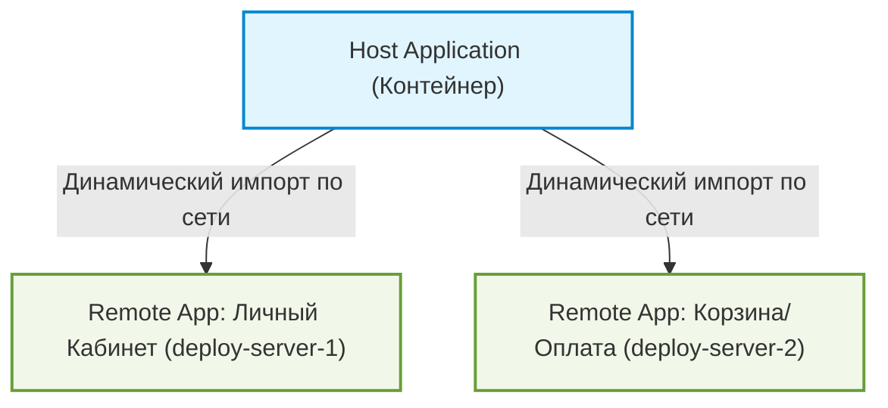

Микрофронтенды — это архитектурный подход, при котором крупное веб-приложение разбивается на набор независимых суб-приложений. Каждое из них разрабатывается, тестируется и развертывается (деплоится) изолированно отдельной командой, а затем собирается в единый интерфейс в браузере пользователя.

---

## 1. Webpack Module Federation: Суть технологии

До появления **Module Federation (Webpack 5)** интеграция микрофронтендов происходила либо через `iframe` (изолированно, но медленно, проблемы с UX и передачей стейта), либо через сборку npm-пакетов (требует пересборки всего приложения-контейнера при любом изменении в микрофронтенде).

Module Federation позволяет **динамически импортировать JS-модули из других независимых сборок в рантайме**.



### Основные понятия:
*   **Host (Хост / Контейнер):** Основное приложение-оболочка. Оно инициализирует страницу, загружает конфигурацию микрофронтендов и монтирует их в нужные места.
*   **Remote (Удаленный / Микрофронтенд):** Автономное приложение, которое экспортирует (экспонирует) свои компоненты, хуки или функции для внешнего использования.
*   **Shared (Общие зависимости):** Секция конфигурации, которая указывает, какие библиотеки (например, React, ReactDOM, Lodash) являются общими. Если Host и Remote используют React, браузер скачает его только один раз.

---

## 2. Практическая настройка (Webpack Config)

### 2.1. Конфигурация Remote (Микрофронтенд чата)
```javascript
// remote/webpack.config.js
const { ModuleFederationPlugin } = require('webpack').container;

module.exports = {
  plugins: [
    new ModuleFederationPlugin({
      name: 'chatApp', // Имя микрофронтенда
      filename: 'remoteEntry.js', // Имя файла манифеста, который загрузит Host
      exposes: {
        // Экспонируем наш React-компонент
        './ChatWindow': './src/components/ChatWindow.tsx',
      },
      shared: {
        react: { singleton: true, requiredVersion: '^18.0.0' },
        'react-dom': { singleton: true, requiredVersion: '^18.0.0' },
      },
    }),
  ],
};
```

### 2.2. Конфигурация Host (Контейнер приложения)
```javascript
// host/webpack.config.js
const { ModuleFederationPlugin } = require('webpack').container;

module.exports = {
  plugins: [
    new ModuleFederationPlugin({
      name: 'hostApp',
      remotes: {
        // Подключаем удаленный манифест чата
        chat: 'chatApp@http://localhost:3001/remoteEntry.js',
      },
      shared: {
        react: { singleton: true, requiredVersion: '^18.0.0' },
        'react-dom': { singleton: true, requiredVersion: '^18.0.0' },
      },
    }),
  ],
};
```

### 2.3. Использование в коде Host приложения (React)
```tsx
import React, { Suspense } from 'react';

// Динамический ленивый импорт компонента из удаленного чата
const RemoteChatWindow = React.lazy(() => import('chat/ChatWindow'));

export function App() {
  return (
    <div>
      <h1>Панель управления</h1>
      <Suspense fallback={<div>Загрузка чата...</div>}>
        <RemoteChatWindow />
      </Suspense>
    </div>
  );
}
```

---

## 3. Проблемы и архитектурные вызовы

1.  **Версионирование зависимостей (`singleton: true`):**
    Если Host использует React 18, а Remote — React 17, параметр `singleton` заставит Module Federation выбрать старшую версию для обоих. Но если обратная совместимость нарушена, Remote может упасть в рантайме. Разработчики должны координировать мажорные обновления фреймворков.
2.  **Изоляция стилей (CSS Leakage):**
    Микрофронтенды загружаются на одну страницу. Если в Host и Remote написаны одинаковые CSS-классы (например, `.btn`), они перекроют друг друга.
    *   *Решение:* Использование CSS Modules (с хэшированием имен классов при сборке), CSS-in-JS (с уникальными префиксами) или Shadow DOM.
3.  **Независимый деплой и оркестрация:**
    Жесткое прописывание URL-адресов (`http://localhost:3001/remoteEntry.js`) в конфиг сборщика мешает независимому деплою на тестовые и продакшен окружения.
    *   *Решение:* Использование **динамического Module Federation**, когда URL-адреса `remoteEntry` загружаются рантайме через fetch-запрос к файлу конфигурации (манифесту инфраструктуры), минуя жесткую прошивку в Webpack.
