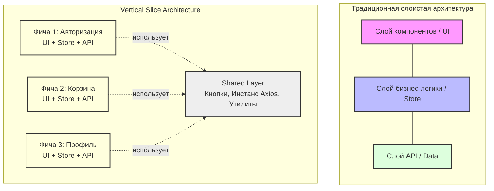

**Vertical Slice Architecture (VSA)** — это архитектурный паттерн, в котором приложение разделяется не по горизонтальным техническим слоям (UI, логика, работа с данными), а по **вертикальным бизнес-сценариям (слайсам / фичам)**.

Изначально паттерн приобрел популярность в бэкенд-разработке (во многом благодаря Джимми Богарду), но его принципы отлично ложатся и на фронтенд.

## Основная идея

В традиционной слоистой архитектуре добавление новой фичи (например, "Добавление товара в корзину") требует изменения множества файлов, разбросанных по разным папкам: нужно создать кнопку в `/components`, хук в `/hooks`, запрос в `/api` и редьюсер в `/store`. 

VSA решает эту проблему группировкой кода (High Cohesion). Слайс — это независимый кусок кода, реализующий конкретный бизнес-сценарий (Use Case) от начала (нажатие кнопки) до конца (запрос на сервер и обновление UI).

## Принципы VSA во фронтенде

1. **Группировка по фичам (Feature-Based):** Код организован в папки, представляющие собой независимые бизнес-модули (например, `Auth`, `Cart`, `Checkout`).
2. **Изоляция:** Один слайс не должен зависеть от внутренней логики другого слайса. Если им нужно взаимодействовать, они делают это через глобальное состояние, события или общий (shared) слой, а не через прямые импорты внутренностей друг друга.
3. **Разная сложность внутри слайсов:** Если фича "О нас" просто показывает статический текст, внутри нее будет только один компонент. Если фича "Корзина" сложная, внутри нее могут быть свои хуки, контексты, API-слой и сложная стейт-машина. VSA не заставляет вас писать boilerplate (лишний код) для простых фич.

## Пример структуры директорий (Текстом)

Сравним традиционный подход и VSA на фронтенде:

**Традиционный подход (По типу файлов):**
```text
src/
  api/
    authApi.ts
    cartApi.ts
  components/
    LoginForm.tsx
    CartWidget.tsx
    Button.tsx
  store/
    authStore.ts
    cartStore.ts
  utils/
    formatDate.ts
```
*Проблема:* Файлы, относящиеся к "Корзине", разбросаны по всему проекту.

**Vertical Slice Architecture (По фичам):**
```text
src/
  features/          <-- Вертикальные срезы
    auth/            <-- Слайс авторизации
      components/
        LoginForm.tsx
      auth.api.ts
      auth.store.ts
      index.ts       <-- Public API (экспортируем только то, что нужно снаружи)
    
    cart/            <-- Слайс корзины
      components/
        CartWidget.tsx
        CartItem.tsx
      cart.api.ts
      cart.store.ts
      cart.utils.ts  <-- Утилиты, специфичные только для корзины
      index.ts

  shared/            <-- Общий код (не привязан к фичам)
    ui/
      Button.tsx
    utils/
      formatDate.ts
```
*Преимущество:* Если нужно удалить или переписать авторизацию, вы работаете только внутри папки `features/auth/`.

## Диаграмма: Сравнение подходов



## Сравнение VSA и FSD (Feature-Sliced Design)

**FSD** — это, по сути, очень строгая и детализированная спецификация, основанная на идеях Vertical Slicing, специально адаптированная для сложных фронтенд-приложений. 

| Критерий | Vertical Slice Architecture (VSA) | Feature-Sliced Design (FSD) |
| :--- | :--- | :--- |
| **Жёсткость правил** | Низкая. Главное — группировать по фичам. | Очень высокая. Строгая иерархия из 7 слоев. |
| **Иерархия слоев** | Отсутствует. Фичи просто лежат рядом и не зависят друг от друга. | Строгая: `app` -> `pages` -> `widgets` -> `features` -> `entities` -> `shared`. Импорты только "сверху вниз". |
| **Порог входа** | Низкий. Легко понять и внедрить даже на существующем проекте. | Высокий. Требует изучения документации, линтеров, правильного разбиения логики. |
| **Boilerplate (лишний код)** | Почти нет. Вы создаете только то, что нужно. | Высокий. Требуется строгая структура папок и создание Public API (`index.ts`) для каждого сегмента. |
| **Целевой масштаб** | Любые проекты (от малых до крупных). | Крупные Enterprise-приложения со сложной бизнес-логикой. |
| **Разделение сущностей и фичей** | Обычно всё лежит вместе в папке фичи. | Разделено: `entities` (бизнес-модели, например "Пользователь") и `features` (действия, например "Авторизация пользователя"). |

**Вывод:**
Если вы хотите навести порядок в проекте, избавиться от "спагетти-кода", но не готовы внедрять тяжеловесный FSD с его строгими слоями — используйте классический Vertical Slicing. Просто создайте папку `features` (или `modules`) и инкапсулируйте логику фичей внутри них, вынося общие элементы в `shared`.
