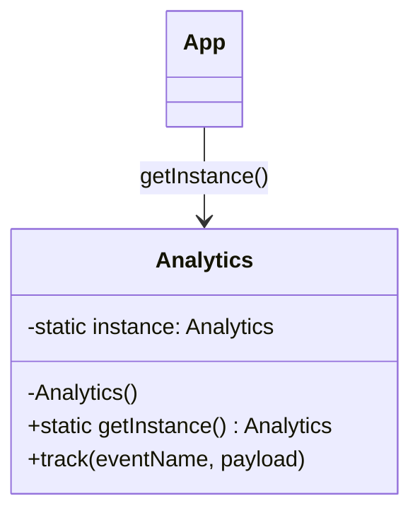
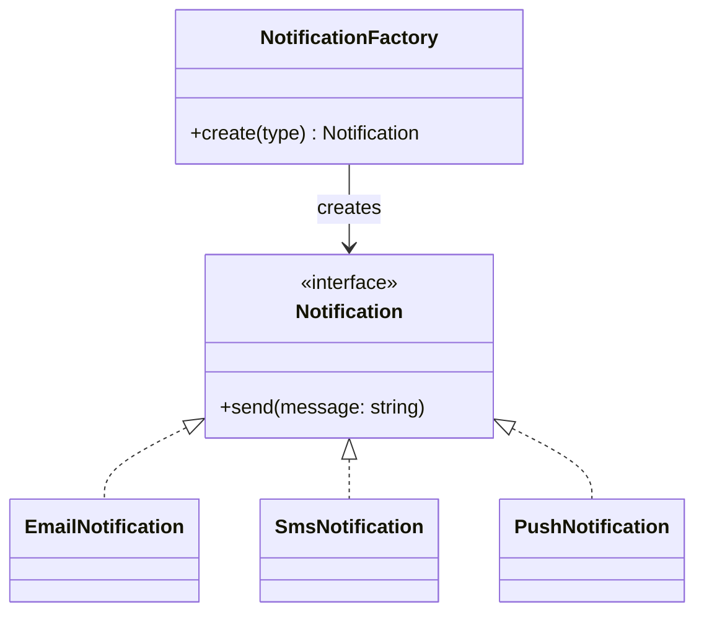
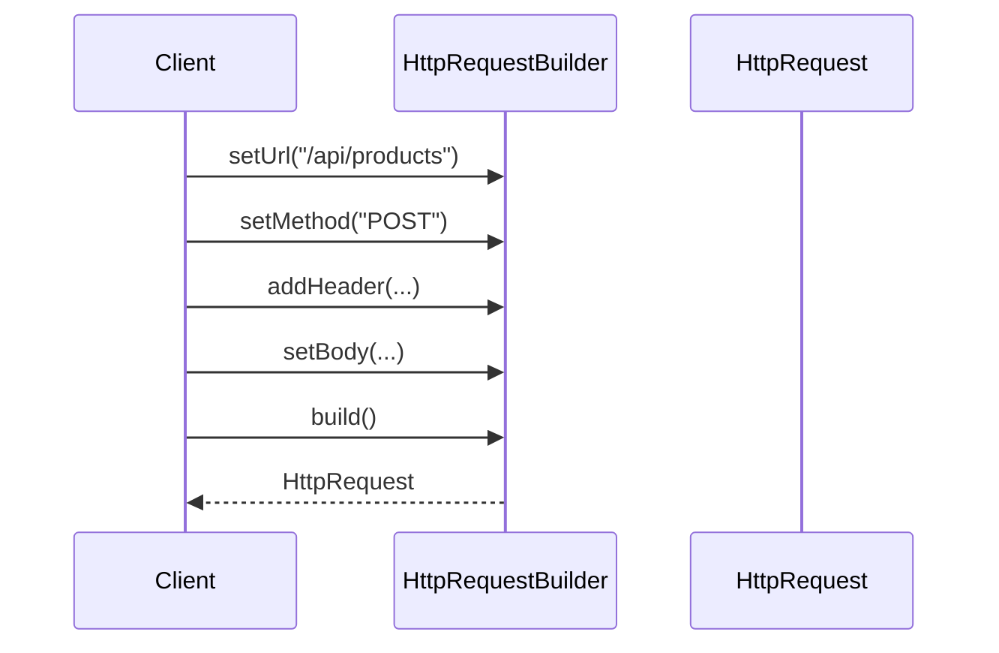
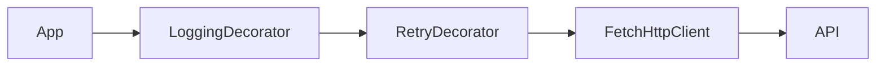
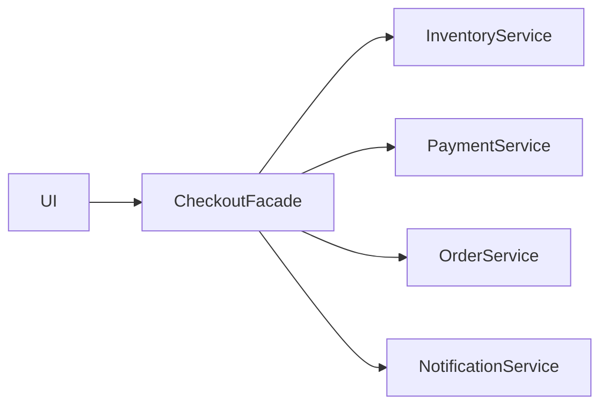
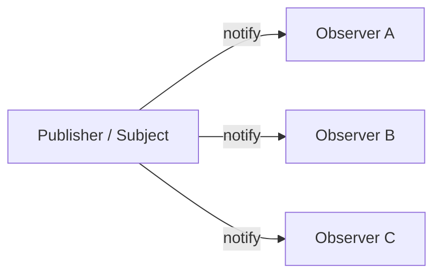
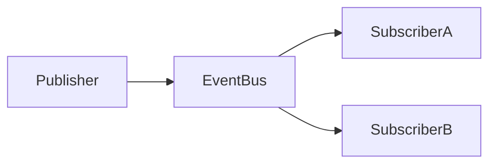
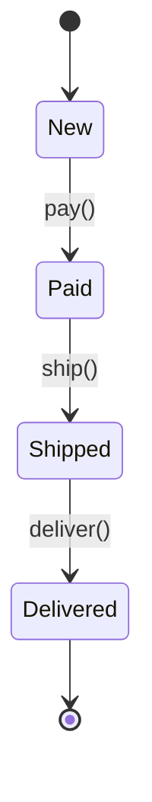

# Паттерны проектирования в JavaScript и TypeScript

Паттерны проектирования — это проверенные подходы к решению повторяющихся архитектурных задач. Они не являются готовым кодом или обязательными правилами: паттерн описывает **идею организации кода**.

Во фронтенд-разработке паттерны особенно часто встречаются в:

- управлении состоянием;
- работе с API;
- UI-компонентах;
- маршрутизации;
- валидации форм;
- обработке событий;
- создании сервисов и конфигураций.

Обычно их делят на три группы:

1. **Порождающие (Creational)** — как создавать объекты.
2. **Структурные (Structural)** — как связывать объекты друг с другом.
3. **Поведенческие (Behavioral)** — как объекты взаимодействуют и распределяют ответственность.

---

# 1. Порождающие паттерны

## Singleton — Одиночка

**Singleton** гарантирует, что у некоторого класса или сервиса существует только один экземпляр, доступный из разных частей приложения.

Типичные применения:

- глобальный store;
- клиент для API;
- сервис аналитики;
- конфигурация приложения;
- логгер;
- подключение к WebSocket.

### Пример: сервис аналитики

```ts
class Analytics {
  private static instance: Analytics | null = null;

  private constructor() {
    console.log("Analytics initialized");
  }

  static getInstance(): Analytics {
    if (!Analytics.instance) {
      Analytics.instance = new Analytics();
    }

    return Analytics.instance;
  }

  track(eventName: string, payload?: Record<string, unknown>) {
    console.log("[Analytics]", eventName, payload);
  }
}

const analytics1 = Analytics.getInstance();
const analytics2 = Analytics.getInstance();

console.log(analytics1 === analytics2); // true

analytics1.track("page_opened", { page: "/profile" });
```

### Как это работает



### Более естественный вариант для ES-модулей

В JavaScript модули сами по себе кэшируются после первого импорта. Поэтому часто Singleton вообще не нужно реализовывать классом.

```ts
// apiClient.ts
class ApiClient {
  async get<T>(url: string): Promise<T> {
    const response = await fetch(url);

    if (!response.ok) {
      throw new Error(`Request failed: ${response.status}`);
    }

    return response.json();
  }
}

export const apiClient = new ApiClient();
```

```ts
// userService.ts
import { apiClient } from "./apiClient";

export async function getUser(id: string) {
  return apiClient.get(`/api/users/${id}`);
}
```

Во всех импортирующих файлах `apiClient` будет одним и тем же объектом.

### Недостатки Singleton

Singleton удобен, но его легко превратить в «глобальную переменную в красивой упаковке».

Проблемы:

- сложнее тестировать;
- скрытые зависимости;
- сложнее заменить реализацию;
- может появиться сильная связанность компонентов.

Например, для тестирования лучше передавать зависимости явно:

```ts
class UserService {
  constructor(private apiClient: ApiClient) {}

  getUser(id: string) {
    return this.apiClient.get(`/api/users/${id}`);
  }
}
```

---

## Factory Method — Фабричный метод

**Factory Method** выносит создание объектов в отдельный метод. Клиентский код не обязан знать, какой именно класс будет создан.

Это полезно, когда нужно создавать разные объекты с общим интерфейсом.

Например:

- разные способы оплаты;
- уведомления через email, SMS и push;
- разные типы UI-элементов;
- разные обработчики файлов;
- разные API-клиенты.

### Пример: уведомления

Есть общий контракт:

```ts
interface Notification {
  send(message: string): void;
}
```

Несколько реализаций:

```ts
class EmailNotification implements Notification {
  send(message: string): void {
    console.log(`Email sent: ${message}`);
  }
}

class SmsNotification implements Notification {
  send(message: string): void {
    console.log(`SMS sent: ${message}`);
  }
}

class PushNotification implements Notification {
  send(message: string): void {
    console.log(`Push notification sent: ${message}`);
  }
}
```

Фабрика выбирает нужную реализацию:

```ts
type NotificationType = "email" | "sms" | "push";

class NotificationFactory {
  static create(type: NotificationType): Notification {
    switch (type) {
      case "email":
        return new EmailNotification();

      case "sms":
        return new SmsNotification();

      case "push":
        return new PushNotification();

      default:
        throw new Error(`Unknown notification type: ${type}`);
    }
  }
}
```

Использование:

```ts
const notification = NotificationFactory.create("email");

notification.send("Ваш заказ принят");
```

### Диаграмма



### Фабричный метод в React

Частый вариант — выбрать компонент по типу данных.

```tsx
type FieldConfig =
  | { type: "text"; label: string }
  | { type: "checkbox"; label: string }
  | { type: "select"; label: string; options: string[] };

function FieldFactory({ config }: { config: FieldConfig }) {
  switch (config.type) {
    case "text":
      return (
        <label>
          {config.label}
          <input type="text" />
        </label>
      );

    case "checkbox":
      return (
        <label>
          <input type="checkbox" />
          {config.label}
        </label>
      );

    case "select":
      return (
        <label>
          {config.label}
          <select>
            {config.options.map((option) => (
              <option key={option}>{option}</option>
            ))}
          </select>
        </label>
      );
  }
}
```

---

## Builder — Строитель

**Builder** нужен для пошагового создания сложного объекта.

Подходит, если:

- у объекта много необязательных полей;
- нужно собирать конфигурацию постепенно;
- важна читаемость;
- требуется валидация перед финальным созданием объекта.

### Проблема без Builder

```ts
const request = {
  url: "/api/products",
  method: "GET",
  headers: {
    Authorization: "Bearer token",
  },
  query: {
    page: "1",
    limit: "20",
  },
  timeout: 5000,
  cache: true,
};
```

Когда параметров становится много, объект становится сложно читать и поддерживать.

### Пример: построитель HTTP-запроса

```ts
type HttpMethod = "GET" | "POST" | "PUT" | "PATCH" | "DELETE";

interface HttpRequest {
  url: string;
  method: HttpMethod;
  headers: Record<string, string>;
  query: Record<string, string>;
  body?: unknown;
  timeout?: number;
}

class HttpRequestBuilder {
  private request: HttpRequest = {
    url: "",
    method: "GET",
    headers: {},
    query: {},
  };

  setUrl(url: string): this {
    this.request.url = url;
    return this;
  }

  setMethod(method: HttpMethod): this {
    this.request.method = method;
    return this;
  }

  addHeader(name: string, value: string): this {
    this.request.headers[name] = value;
    return this;
  }

  addQueryParam(name: string, value: string): this {
    this.request.query[name] = value;
    return this;
  }

  setBody(body: unknown): this {
    this.request.body = body;
    return this;
  }

  setTimeout(timeout: number): this {
    this.request.timeout = timeout;
    return this;
  }

  build(): HttpRequest {
    if (!this.request.url) {
      throw new Error("Request URL is required");
    }

    return { ...this.request };
  }
}
```

Использование:

```ts
const request = new HttpRequestBuilder()
  .setUrl("/api/products")
  .setMethod("POST")
  .addHeader("Authorization", "Bearer token")
  .addHeader("Content-Type", "application/json")
  .addQueryParam("lang", "ru")
  .setBody({ title: "Keyboard", price: 150 })
  .setTimeout(5000)
  .build();

console.log(request);
```

### Идея Builder



---

# 2. Структурные паттерны

## Module — Модуль

**Module** инкапсулирует данные и поведение, скрывая внутренние детали реализации.

Исторически в JavaScript использовали IIFE — самовызывающиеся функции.

```js
const counter = (() => {
  let value = 0;

  return {
    increment() {
      value += 1;
    },

    getValue() {
      return value;
    },
  };
})();

counter.increment();
console.log(counter.getValue()); // 1

console.log(counter.value); // undefined
```

Сегодня вместо этого обычно используются **ES Modules**.

```ts
// counter.ts
let value = 0;

export function increment() {
  value += 1;
}

export function getValue() {
  return value;
}
```

```ts
// app.ts
import { getValue, increment } from "./counter";

increment();

console.log(getValue()); // 1
```

Переменная `value` не экспортирована, поэтому внешний код не может изменить её напрямую.

### Пример модуля API

```ts
// userApi.ts
interface User {
  id: string;
  name: string;
}

const BASE_URL = "/api";

async function request<T>(path: string): Promise<T> {
  const response = await fetch(`${BASE_URL}${path}`);

  if (!response.ok) {
    throw new Error("API request failed");
  }

  return response.json();
}

export const userApi = {
  getById(id: string) {
    return request<User>(`/users/${id}`);
  },

  getAll() {
    return request<User[]>("/users");
  },
};
```

---

## Decorator — Декоратор

**Decorator** добавляет объекту новую функциональность через обёртку, не меняя исходный объект или класс.

Важно не путать:

1. классический паттерн Decorator;
2. синтаксические декораторы TypeScript `@Decorator`;
3. React HOC — это тоже вариация идеи декорирования.

### Пример: HTTP-клиент с логированием

Есть базовый интерфейс:

```ts
interface HttpClient {
  get<T>(url: string): Promise<T>;
}
```

Базовая реализация:

```ts
class FetchHttpClient implements HttpClient {
  async get<T>(url: string): Promise<T> {
    const response = await fetch(url);

    if (!response.ok) {
      throw new Error(`Request failed: ${response.status}`);
    }

    return response.json();
  }
}
```

Декоратор для логирования:

```ts
class LoggingHttpClient implements HttpClient {
  constructor(private client: HttpClient) {}

  async get<T>(url: string): Promise<T> {
    console.log(`[HTTP] GET ${url}`);

    const start = performance.now();

    try {
      const result = await this.client.get<T>(url);

      console.log(
        `[HTTP] Success: ${url}, ${Math.round(performance.now() - start)}ms`
      );

      return result;
    } catch (error) {
      console.error(`[HTTP] Failed: ${url}`, error);
      throw error;
    }
  }
}
```

Использование:

```ts
const baseClient = new FetchHttpClient();
const client = new LoggingHttpClient(baseClient);

const user = await client.get<{ id: string; name: string }>("/api/users/1");
```

### Можно добавлять несколько декораторов

```ts
const client = new LoggingHttpClient(
  new RetryHttpClient(
    new FetchHttpClient(),
    3
  )
);
```



### Пример HOC в React

```tsx
import type { ComponentType } from "react";

function withLogger<P extends object>(Component: ComponentType<P>) {
  return function LoggedComponent(props: P) {
    console.log("Component rendered:", Component.name);

    return <Component {...props} />;
  };
}

function Profile({ name }: { name: string }) {
  return <h1>{name}</h1>;
}

const ProfileWithLogger = withLogger(Profile);
```

---

## Facade — Фасад

**Facade** предоставляет простой интерфейс к сложной подсистеме.

Например, чтобы оформить заказ, нужно:

1. проверить остатки;
2. зарезервировать товары;
3. списать деньги;
4. создать заказ;
5. отправить уведомление.

Без фасада UI должен был бы знать обо всех этих сервисах.

### Сервисы подсистемы

```ts
class InventoryService {
  async reserve(productId: string, quantity: number) {
    console.log(`Reserved ${quantity} units of ${productId}`);
  }
}

class PaymentService {
  async charge(userId: string, amount: number) {
    console.log(`Charged ${amount} from user ${userId}`);
  }
}

class OrderService {
  async create(userId: string, productId: string, quantity: number) {
    console.log(`Order created for ${userId}`);
    return { id: "order-123" };
  }
}

class NotificationService {
  async sendOrderConfirmation(userId: string, orderId: string) {
    console.log(`Confirmation sent to ${userId} for ${orderId}`);
  }
}
```

### Фасад

```ts
class CheckoutFacade {
  constructor(
    private inventory = new InventoryService(),
    private payment = new PaymentService(),
    private orders = new OrderService(),
    private notifications = new NotificationService()
  ) {}

  async checkout(params: {
    userId: string;
    productId: string;
    quantity: number;
    amount: number;
  }) {
    await this.inventory.reserve(params.productId, params.quantity);
    await this.payment.charge(params.userId, params.amount);

    const order = await this.orders.create(
      params.userId,
      params.productId,
      params.quantity
    );

    await this.notifications.sendOrderConfirmation(params.userId, order.id);

    return order;
  }
}
```

Использование в UI:

```ts
const checkout = new CheckoutFacade();

await checkout.checkout({
  userId: "user-1",
  productId: "keyboard-1",
  quantity: 1,
  amount: 150,
});
```



---

## Proxy — Заместитель

**Proxy** — объект, который контролирует доступ к другому объекту.

В JavaScript есть встроенный механизм:

```ts
const proxy = new Proxy(target, handler);
```

Proxy может перехватывать:

- чтение свойств (`get`);
- изменение свойств (`set`);
- удаление (`deleteProperty`);
- вызов функций (`apply`);
- создание объектов через `new` (`construct`).

### Пример: логирование изменений объекта

```ts
const user = {
  name: "Anna",
  age: 25,
};

const userProxy = new Proxy(user, {
  get(target, property) {
    console.log(`Read property: ${String(property)}`);
    return Reflect.get(target, property);
  },

  set(target, property, value) {
    console.log(`Changed ${String(property)} to ${value}`);
    return Reflect.set(target, property, value);
  },
});

console.log(userProxy.name);
// Read property: name
// Anna

userProxy.age = 26;
// Changed age to 26
```

### Пример: простая реактивность

Идея похожа на реактивность Vue 3: при изменении данных вызываются подписчики.

```ts
type Listener = () => void;

function reactive<T extends object>(target: T) {
  const listeners = new Set<Listener>();

  return {
    state: new Proxy(target, {
      set(obj, property, value) {
        const oldValue = obj[property as keyof T];

        const result = Reflect.set(obj, property, value);

        if (oldValue !== value) {
          listeners.forEach((listener) => listener());
        }

        return result;
      },
    }),

    subscribe(listener: Listener) {
      listeners.add(listener);

      return () => listeners.delete(listener);
    },
  };
}
```

Использование:

```ts
const store = reactive({
  count: 0,
});

store.subscribe(() => {
  console.log("State changed:", store.state.count);
});

store.state.count += 1;
// State changed: 1
```

---

## Adapter — Адаптер

**Adapter** позволяет работать с объектами, интерфейсы которых несовместимы.

Частый фронтенд-сценарий: старый API возвращает данные в одном формате, а приложение ожидает другой.

### Старый API

```ts
interface LegacyUserResponse {
  user_id: number;
  full_name: string;
  registered_at: string;
}
```

### Новый формат внутри приложения

```ts
interface User {
  id: string;
  name: string;
  registeredAt: Date;
}
```

### Адаптер

```ts
function adaptLegacyUser(response: LegacyUserResponse): User {
  return {
    id: String(response.user_id),
    name: response.full_name,
    registeredAt: new Date(response.registered_at),
  };
}
```

Использование:

```ts
const legacyResponse: LegacyUserResponse = {
  user_id: 42,
  full_name: "Иван Петров",
  registered_at: "2025-01-10T12:00:00Z",
};

const user = adaptLegacyUser(legacyResponse);

console.log(user);
// {
//   id: "42",
//   name: "Иван Петров",
//   registeredAt: Date(...)
// }
```

### Пример: адаптация библиотеки

Допустим, приложение ожидает метод `notify`, а сторонняя библиотека предоставляет `showToast`.

```ts
class ThirdPartyToastLibrary {
  showToast(text: string, kind: "success" | "error") {
    console.log(`[${kind.toUpperCase()}] ${text}`);
  }
}
```

Нужный приложению интерфейс:

```ts
interface Notifier {
  success(message: string): void;
  error(message: string): void;
}
```

Адаптер:

```ts
class ToastNotifierAdapter implements Notifier {
  constructor(private toastLibrary: ThirdPartyToastLibrary) {}

  success(message: string): void {
    this.toastLibrary.showToast(message, "success");
  }

  error(message: string): void {
    this.toastLibrary.showToast(message, "error");
  }
}
```

---

# 3. Поведенческие паттерны

## Observer — Наблюдатель

**Observer** создаёт зависимость «один ко многим»: когда состояние одного объекта меняется, все подписчики получают уведомление.

Примеры:

- обработчики DOM-событий;
- Redux store;
- Vue watchers;
- RxJS;
- подписка на WebSocket;
- обновление UI после изменения данных.

### Простой EventEmitter

```ts
type Listener<T> = (data: T) => void;

class EventEmitter<T> {
  private listeners = new Set<Listener<T>>();

  subscribe(listener: Listener<T>): () => void {
    this.listeners.add(listener);

    return () => {
      this.listeners.delete(listener);
    };
  }

  emit(data: T): void {
    this.listeners.forEach((listener) => listener(data));
  }
}
```

Использование:

```ts
const userUpdated = new EventEmitter<{ id: string; name: string }>();

const unsubscribe = userUpdated.subscribe((user) => {
  console.log("User updated:", user.name);
});

userUpdated.emit({
  id: "1",
  name: "Анна",
});

// User updated: Анна

unsubscribe();
```

### Диаграмма Observer



---

## Observer и Pub/Sub: разница

Эти понятия часто используют как синонимы, но есть отличие.

### Observer

Подписчики обычно подписываются напрямую на конкретный объект.

```ts
store.subscribe(listener);
```

### Pub/Sub

Между издателем и подписчиками есть посредник — брокер событий.



Пример Event Bus:

```ts
type EventMap = {
  "user:logged-in": { userId: string };
  "cart:updated": { count: number };
};

class EventBus {
  private listeners = new Map<string, Set<(payload: any) => void>>();

  on<T extends keyof EventMap>(
    event: T,
    listener: (payload: EventMap[T]) => void
  ) {
    if (!this.listeners.has(event)) {
      this.listeners.set(event, new Set());
    }

    this.listeners.get(event)!.add(listener);

    return () => {
      this.listeners.get(event)?.delete(listener);
    };
  }

  emit<T extends keyof EventMap>(event: T, payload: EventMap[T]) {
    this.listeners.get(event)?.forEach((listener) => listener(payload));
  }
}
```

```ts
const eventBus = new EventBus();

eventBus.on("cart:updated", ({ count }) => {
  console.log(`Items in cart: ${count}`);
});

eventBus.emit("cart:updated", { count: 3 });
```

---

## Strategy — Стратегия

**Strategy** позволяет определить несколько взаимозаменяемых алгоритмов и выбирать нужный во время выполнения.

Полезно, когда есть много `if/else` или `switch`, определяющих разное поведение.

Типичные сценарии:

- валидация;
- сортировка;
- расчёт скидок;
- способы доставки;
- способы оплаты;
- обработка ошибок;
- форматирование данных.

### Пример: расчёт скидки

Общий контракт:

```ts
interface DiscountStrategy {
  calculate(price: number): number;
}
```

Стратегии:

```ts
class NoDiscount implements DiscountStrategy {
  calculate(price: number): number {
    return price;
  }
}

class PercentageDiscount implements DiscountStrategy {
  constructor(private percent: number) {}

  calculate(price: number): number {
    return price * (1 - this.percent / 100);
  }
}

class FixedDiscount implements DiscountStrategy {
  constructor(private amount: number) {}

  calculate(price: number): number {
    return Math.max(0, price - this.amount);
  }
}
```

Контекст:

```ts
class PriceCalculator {
  constructor(private strategy: DiscountStrategy) {}

  setStrategy(strategy: DiscountStrategy) {
    this.strategy = strategy;
  }

  calculate(price: number): number {
    return this.strategy.calculate(price);
  }
}
```

Использование:

```ts
const calculator = new PriceCalculator(new NoDiscount());

console.log(calculator.calculate(1000)); // 1000

calculator.setStrategy(new PercentageDiscount(15));
console.log(calculator.calculate(1000)); // 850

calculator.setStrategy(new FixedDiscount(300));
console.log(calculator.calculate(1000)); // 700
```

### Более JavaScript-подход: стратегии как функции

Во многих случаях отдельные классы не нужны.

```ts
type DiscountStrategy = (price: number) => number;

const noDiscount: DiscountStrategy = (price) => price;

const percentageDiscount = (percent: number): DiscountStrategy => {
  return (price) => price * (1 - percent / 100);
};

const fixedDiscount = (amount: number): DiscountStrategy => {
  return (price) => Math.max(0, price - amount);
};
```

```ts
const strategy = percentageDiscount(20);

console.log(strategy(1000)); // 800
```

---

## Command — Команда

**Command** превращает действие в объект.

То есть вместо непосредственного вызова:

```ts
editor.save();
```

создаётся объект-команда:

```ts
const command = new SaveCommand(editor);
command.execute();
```

Это позволяет:

- складывать действия в очередь;
- логировать их;
- повторять;
- отменять;
- реализовывать undo/redo;
- передавать действия между частями системы.

### Пример: редактор текста с Undo

```ts
class TextEditor {
  private content = "";

  write(text: string) {
    this.content += text;
  }

  deleteLast(count: number) {
    this.content = this.content.slice(0, -count);
  }

  getContent() {
    return this.content;
  }
}
```

Контракт команды:

```ts
interface Command {
  execute(): void;
  undo(): void;
}
```

Команда добавления текста:

```ts
class WriteCommand implements Command {
  constructor(
    private editor: TextEditor,
    private text: string
  ) {}

  execute(): void {
    this.editor.write(this.text);
  }

  undo(): void {
    this.editor.deleteLast(this.text.length);
  }
}
```

История команд:

```ts
class CommandHistory {
  private history: Command[] = [];

  execute(command: Command) {
    command.execute();
    this.history.push(command);
  }

  undoLast() {
    const command = this.history.pop();
    command?.undo();
  }
}
```

Использование:

```ts
const editor = new TextEditor();
const history = new CommandHistory();

history.execute(new WriteCommand(editor, "Hello"));
history.execute(new WriteCommand(editor, " world"));

console.log(editor.getContent()); // Hello world

history.undoLast();

console.log(editor.getContent()); // Hello
```

### Команды в Redux

Redux-actions похожи на упрощённый Command-подход.

```ts
type Action =
  | { type: "counter/increment" }
  | { type: "counter/decrement" }
  | { type: "counter/add"; payload: number };
```

Action описывает **что нужно сделать**, а reducer решает, **как изменить состояние**.

---

## State — Состояние

**State** позволяет объекту менять своё поведение в зависимости от текущего внутреннего состояния.

Например:

- заказ: `new → paid → shipped → delivered`;
- загрузка: `idle → loading → success/error`;
- плеер: `playing / paused / stopped`;
- форма: `editing / submitting / submitted / failed`.

### Простой вариант через `switch`

```ts
type RequestStatus = "idle" | "loading" | "success" | "error";

function getButtonText(status: RequestStatus) {
  switch (status) {
    case "idle":
      return "Отправить";

    case "loading":
      return "Загрузка...";

    case "success":
      return "Отправлено";

    case "error":
      return "Повторить";
  }
}
```

Для простых случаев этого достаточно.

### Полноценный State-паттерн

Рассмотрим заказ.

```ts
interface OrderState {
  pay(order: Order): void;
  ship(order: Order): void;
  deliver(order: Order): void;
  getName(): string;
}
```

Состояние нового заказа:

```ts
class NewOrderState implements OrderState {
  pay(order: Order): void {
    order.setState(new PaidOrderState());
  }

  ship(): void {
    throw new Error("Cannot ship an unpaid order");
  }

  deliver(): void {
    throw new Error("Cannot deliver an unshipped order");
  }

  getName(): string {
    return "new";
  }
}
```

Оплаченный заказ:

```ts
class PaidOrderState implements OrderState {
  pay(): void {
    throw new Error("Order is already paid");
  }

  ship(order: Order): void {
    order.setState(new ShippedOrderState());
  }

  deliver(): void {
    throw new Error("Cannot deliver an unshipped order");
  }

  getName(): string {
    return "paid";
  }
}
```

Отправленный заказ:

```ts
class ShippedOrderState implements OrderState {
  pay(): void {
    throw new Error("Order is already paid");
  }

  ship(): void {
    throw new Error("Order is already shipped");
  }

  deliver(order: Order): void {
    order.setState(new DeliveredOrderState());
  }

  getName(): string {
    return "shipped";
  }
}
```

Доставленный заказ:

```ts
class DeliveredOrderState implements OrderState {
  pay(): void {
    throw new Error("Order is already delivered");
  }

  ship(): void {
    throw new Error("Order is already delivered");
  }

  deliver(): void {
    throw new Error("Order is already delivered");
  }

  getName(): string {
    return "delivered";
  }
}
```

Контекст — сам заказ:

```ts
class Order {
  private state: OrderState = new NewOrderState();

  setState(state: OrderState) {
    this.state = state;
    console.log(`Order state changed to: ${state.getName()}`);
  }

  pay() {
    this.state.pay(this);
  }

  ship() {
    this.state.ship(this);
  }

  deliver() {
    this.state.deliver(this);
  }

  getStatus() {
    return this.state.getName();
  }
}
```

Использование:

```ts
const order = new Order();

console.log(order.getStatus()); // new

order.pay();     // paid
order.ship();    // shipped
order.deliver(); // delivered

console.log(order.getStatus()); // delivered
```

### Диаграмма состояний



---

# Как паттерны выглядят во фронтенд-фреймворках

## React

| Задача | Часто используемый паттерн |
|---|---|
| Переиспользование логики | Hooks, Custom Hooks |
| Обёртка компонентов | Decorator / HOC |
| Выбор компонента по конфигурации | Factory |
| Глобальное состояние | Singleton, Observer |
| Управление сложным UI-состоянием | State Machine / State |
| API-слой | Facade, Adapter |
| История действий | Command |
| Валидация | Strategy |

Пример Strategy для валидации:

```ts
type Validator = (value: string) => string | null;

const required: Validator = (value) => {
  return value.trim() ? null : "Поле обязательно";
};

const minLength = (length: number): Validator => {
  return (value) => {
    return value.length >= length
      ? null
      : `Минимальная длина: ${length}`;
  };
};

function validate(value: string, validators: Validator[]) {
  for (const validator of validators) {
    const error = validator(value);

    if (error) {
      return error;
    }
  }

  return null;
}

const error = validate("", [required, minLength(5)]);

console.log(error); // "Поле обязательно"
```

---

## Vue

| Задача | Паттерн |
|---|---|
| `reactive`, `ref` | Proxy, Observer |
| `watch` | Observer |
| composables | Module |
| Pinia/Vuex | Singleton, Observer, Command-подобные actions |
| адаптация API-данных | Adapter |
| сложные формы и UI | State / State Machine |

Пример composable как модуля:

```ts
// useCounter.ts
import { ref, computed } from "vue";

export function useCounter(initialValue = 0) {
  const count = ref(initialValue);

  const doubled = computed(() => count.value * 2);

  function increment() {
    count.value += 1;
  }

  return {
    count,
    doubled,
    increment,
  };
}
```

---

# Когда не стоит использовать паттерны

Паттерны полезны, но их не нужно добавлять «на всякий случай».

Не стоит создавать сложную иерархию классов, если задача решается обычной функцией:

```ts
function formatPrice(price: number, currency: "RUB" | "USD") {
  return new Intl.NumberFormat("ru-RU", {
    style: "currency",
    currency,
  }).format(price);
}
```

Не нужно делать Factory, если есть только один объект:

```ts
const apiClient = new ApiClient();
```

Не нужен State-паттерн с десятком классов, если достаточно union-типа:

```ts
type Status = "idle" | "loading" | "success" | "error";
```

Главный принцип: паттерн должен **упрощать изменение и поддержку кода**, а не делать архитектуру формально «правильной».

---

# Краткая шпаргалка

| Паттерн | Когда использовать |
|---|---|
| Singleton | Нужен один общий экземпляр сервиса или store |
| Factory | Нужно создавать разные объекты с общим интерфейсом |
| Builder | Объект создаётся пошагово и имеет много параметров |
| Module | Нужно скрыть внутренние детали и экспортировать публичный API |
| Decorator | Нужно добавить поведение через обёртку |
| Facade | Нужно упростить работу со сложной подсистемой |
| Proxy | Нужно перехватывать доступ к объекту или добавить реактивность |
| Adapter | Нужно привести несовместимый интерфейс к нужному формату |
| Observer | Нужна реакция подписчиков на изменения или события |
| Strategy | Нужно переключать алгоритмы/правила |
| Command | Нужно представлять действия объектами, поддержать undo/redo |
| State | Поведение зависит от текущего состояния объекта |

В современном JavaScript паттерны часто реализуются не через классы, а через:

- функции;
- замыкания;
- ES-модули;
- объекты-конфигурации;
- `Map`;
- callbacks;
- hooks и composables;
- `Proxy`;
- union-типы TypeScript.
