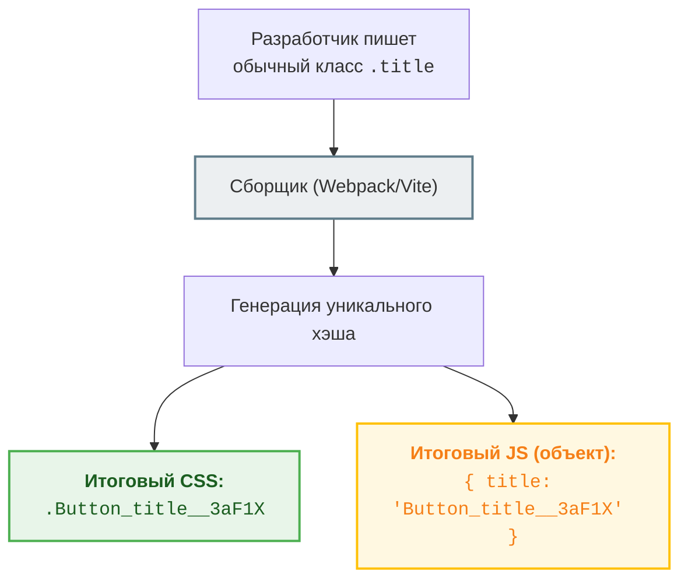

# CSS Modules: Локальная изоляция из коробки

CSS Modules — это не официальная спецификация W3C, а подход к сборке CSS (через Webpack, Vite и др.), который автоматически решает проблему глобальной области видимости. В мире CSS Modules каждый класс по умолчанию считается локальным для того компонента, куда он импортирован.

## 1. Какую боль мы решаем?

Несмотря на строгие методологии вроде BEM, человеческий фактор всегда дает о себе знать. Разработчики могут опечататься, нарушить конвенцию именования или забыть про нее. Это снова возвращает нас к проблеме коллизии имен классов.

CSS Modules перекладывает ответственность за уникальность имен с человека на машину.



## 2. Как это работает на практике?

При использовании CSS Modules вы создаете CSS-файл с расширением `.module.css` (или `.module.scss`). 

### Хороший паттерн (Использование CSS Modules)

```css
/* Button.module.css */
.button {
  background-color: blue;
  color: white;
  border-radius: 4px;
}

.disabled {
  opacity: 0.5;
  pointer-events: none;
}
```

Внутри React-компонента вы импортируете этот файл как объект, где ключи — это исходные имена классов, а значения — сгенерированные уникальные строки.

```tsx
// Button.tsx
import React from 'react';
// styles - это JS-объект с хэшированными классами
import styles from './Button.module.css'; 

export const Button = ({ disabled, children }) => {
  return (
    <button 
      // Собираем классы с помощью шаблонных строк или clsx/classnames
      className={`${styles.button} ${disabled ? styles.disabled : ''}`}
    >
      {children}
    </button>
  );
};
```

В результате в браузере DOM будет выглядеть примерно так:
`<button class="Button_button__a1b2c Button_disabled__d3e4f">Click me</button>`

Никаких конфликтов! Вы можете иметь класс `.button` в 50 разных компонентах, и каждый из них получит уникальный хэш.

## 3. Неочевидные нюансы и скрытые трейдоффы

У CSS Modules есть свои особенности, которые нужно учитывать:

1.  **Глобальные стили требуют явного указания:**
    Так как всё по умолчанию локально, для применения глобального стиля (например, к классу из внешней библиотеки) нужно использовать псевдокласс `:global()`.
    ```css
    /* Антипаттерн: попытка переопределить сторонний слайдер */
    .swiper-button-next { color: red; } /* Будет захэшировано! */
    
    /* Хороший паттерн: */
    :global(.swiper-button-next) { color: red; }
    ```

2.  **Сложность динамических классов (Оверхед):**
    В нативном CSS написать `className="btn active"` очень просто. В CSS Modules для сборки динамических классов приходится писать больше JS-кода или использовать сторонние библиотеки (например, `clsx`).

3.  **Мертвый код (Частично решено):**
    Если вы написали класс в CSS-модуле, но забыли использовать его в JS (опечатались в `styles.titl` вместо `styles.title`), сборщик не удалит этот класс из финального CSS бандла. Однако TypeScript-плагины (например, `typescript-plugin-css-modules`) могут подсветить такие ошибки на этапе компиляции.

4.  **Специфичность никуда не делась:**
    CSS Modules спасают от коллизии имен, но не от войн специфичности. Если вы начнете использовать вложенные селекторы (`.wrapper .title { ... }`), то при переиспользовании вам все равно придется бороться с весом селекторов.

## 4. Границы применимости

*   **Где CSS Modules — идеальный выбор:**
    *   Крупные React/Vue проекты со сложной структурой компонентов.
    *   Миграция с legacy-проекта: модули можно внедрять постепенно, компонент за компонентом, они не сломают старый глобальный код.
    *   Когда вы хотите получить мощь нативного CSS/SCSS (псевдоклассы, медиа-запросы, анимации) без оверхеда CSS-in-JS (нулевой рантайм, чистый CSS-файл на выходе).
*   **Где лучше выбрать другое:**
    *   Создание npm-пакетов (UI-китов) для публичного использования. Использование CSS Modules внутри библиотеки может затруднить переопределение стилей вашими пользователями (им придется бороться с захэшированными классами). В таких случаях лучше использовать чистый BEM.
    *   Проекты, требующие высокой скорости стилизации "на лету" (здесь выигрывает Tailwind).