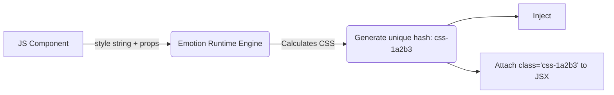

# Emotion (CSS-in-JS)

## Суть концепции
Emotion — это одна из самых популярных библиотек для подхода CSS-in-JS. Она позволяет писать CSS-стили прямо внутри JavaScript (или TypeScript) файлов компонентов, используя шаблонные строки (Template Literals) или JS-объекты. Emotion динамически генерирует уникальные классы, вставляет их в `<style>` тег в `<head>` документа и применяет к элементам.

## Какую боль мы решаем
1. **Изоляция:** Нет коллизий имен (Emotion генерирует хэши вроде `.css-1r4qjig`).
2. **Динамика:** В классическом CSS сложно менять значения на основе пропсов (нужно добавлять классы). В Emotion можно писать функции: `color: ${props => props.error ? 'red' : 'blue'}`.
3. **Мертвый код:** Если компонент не рендерится, его CSS не попадает в DOM. При удалении компонента стили удаляются вместе с ним.

## Как это работает



## Примеры кода

**❌ Антипаттерн: CSS классы + инлайн стили (Без Emotion)**
```jsx
// Громоздко, логика размазана между CSS файлом и JS инлайн-стилями
import './Button.css'; // .btn { padding: 10px; }

const Button = ({ isPrimary, customWidth }) => (
  <button 
    className={`btn ${isPrimary ? 'btn-primary' : ''}`}
    style={{ width: customWidth }}
  >
    Click
  </button>
);
```

**✅ Правильное решение: Emotion (styled API)**
```jsx
import styled from '@emotion/styled';

// Стили, логика и HTML-тег инкапсулированы в одной сущности
const StyledButton = styled.button`
  padding: 10px;
  border-radius: 4px;
  /* Использование JS логики прямо в CSS */
  background-color: ${props => props.isPrimary ? 'blue' : 'gray'};
  color: white;
  width: ${props => props.width || 'auto'};
  
  &:hover {
    background-color: darkblue;
  }
`;

// Использование:
<StyledButton isPrimary width="200px">Click</StyledButton>
```

## Неочевидные нюансы и границы применимости
- **Runtime Performance (Производительность):** Главная проблема Emotion. В браузере при каждом рендере компонента отрабатывает JS-движок Emotion, который парсит стили, вычисляет хэш и обновляет DOM. В больших списках это приводит к серьезным "тормозам".
- **React Server Components (RSC) и Next.js App Router:** Emotion (как и Styled Components) основан на React Context и вставке стилей в рантайме. Это **несовместимо** с серверными компонентами по умолчанию (требует директивы `"use client"`), что лишает вас главных преимуществ нового Next.js.
- **Тренд на отказ:** Из-за проблем с производительностью и несовместимости с RSC, индустрия сейчас уходит от Runtime CSS-in-JS (Emotion) в сторону Zero-Runtime решений (Vanilla Extract, Panda CSS, Linaria) или Tailwind. Emotion считается технологией вчерашнего дня для новых проектов.
