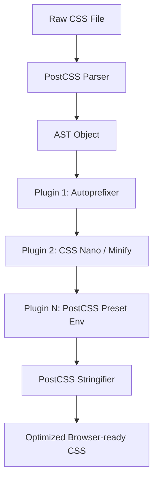

# PostCSS

## Суть концепции
PostCSS — это инструмент для трансформации CSS с помощью JavaScript-плагинов. Часто его ошибочно называют препроцессором (как Sass), но на самом деле это **парсер**. Он берет ваш CSS, превращает его в абстрактное синтаксическое дерево (AST), передает плагинам для модификации, а затем собирает обратно в строку. Это "Babel для CSS".

## Какую боль мы решаем
До PostCSS мы страдали от вендорных префиксов: чтобы скругление углов работало в старых браузерах, приходилось писать `-webkit-border-radius`, `-moz-border-radius`. Позже появились препроцессоры (Sass/Less), но они были монолитными: вы получали весь функционал сразу, даже если вам нужна была только одна функция, и новые фичи CSS появлялись в них с задержкой.

PostCSS решил это модульностью. Вы сами собираете свой идеальный "препроцессор" из плагинов. Самый известный плагин — `Autoprefixer`, который сам расставляет вендорные префиксы на основе статистики CanIUse.

## Как это работает



## Примеры кода

**❌ Антипаттерн: Ручное дублирование свойств (без PostCSS)**
```css
/* Разработчик тратит время на поддержку старых браузеров */
.grid-container {
  display: -ms-grid;
  display: grid;
  -webkit-appearance: none;
  appearance: none;
}
```

**✅ Правильное решение: Современный код + Autoprefixer**
```css
/* Разработчик пишет чистый стандартный CSS */
.grid-container {
  display: grid;
  appearance: none;
}
/* PostCSS + Autoprefixer сами добавят префиксы при сборке (build-time) */
```

## Неочевидные нюансы и границы применимости
- **PostCSS-Preset-Env:** Этот плагин позволяет писать CSS будущего (фичи из драфтов спецификации W3C) уже сегодня. PostCSS трансформирует их в CSS, понятный текущим браузерам.
- **Хрупкость конфигурации:** Гибкость — это и минус. Если вы наберете 20 разных плагинов для линтинга, минификации, вложенности и полифиллов, ваш `postcss.config.js` превратится в хрупкого монстра, который тяжело обновлять.
- **Связь с Tailwind:** Популярный фреймворк Tailwind CSS под капотом — это просто (очень сложный) плагин для PostCSS. Он ищет в вашем HTML утилиты и на лету генерирует для них CSS-правила в AST.
