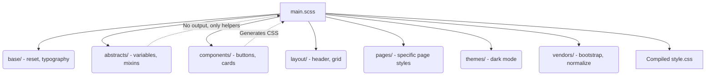

# Sass Architecture (Архитектура SCSS)

## Суть концепции
Sass (и его популярный синтаксис SCSS) — это мощный препроцессор, который добавляет в CSS возможности языков программирования: переменные, функции, миксины (mixins), математические операции и, самое главное, вложенность (nesting). 

Когда говорят об "Архитектуре Sass", чаще всего подразумевают паттерн **7-1 Pattern**, который описывает грамотное разбиение SCSS-кода на модули, чтобы проект не превратился в огромный нечитаемый файл `style.scss`.

## Какую боль мы решаем
В "ванильном" CSS (до появления кастомных свойств и `@layer`) не было возможности инкапсулировать логику, переиспользовать паттерны (например, центрирование flexbox) и структурировать код. Sass решил проблему спагетти-кода, позволив разбивать его на компоненты и собирать единый бандл через `@import` (а сейчас `@use`).

## Как это работает



## Примеры кода

**❌ Антипаттерн: Inception (Глубокая вложенность)**
```scss
// Разработчик радуется вложенности и переносит DOM-дерево в SCSS
.card {
  .body {
    .list {
      li {
        a {
          &:hover { color: red; }
        }
      }
    }
  }
}
// На выходе компилятор выдаст монстра: .card .body .list li a:hover { color: red; }
// Специфичность зашкаливает, переопределить это невозможно.
```

**✅ Правильное решение: Использование `@use` и миксинов**
```scss
// _mixins.scss
@mixin flex-center {
  display: flex;
  justify-content: center;
  align-items: center;
}

// _card.scss
@use 'abstracts/mixins' as *;

.card {
  padding: 1rem;
  
  &__header {
    @include flex-center;
  }
}
```

## Неочевидные нюансы и границы применимости
- **`@import` устарел:** Использование `@import` в Sass признано устаревшим (deprecated), так как оно делает все переменные глобальными и замедляет компиляцию. Вместо него нужно использовать модульную систему `@use` и `@forward`, которая вводит пространства имен (`colors.$primary`).
- **Переменные Sass статичны:** Переменная `$primary-color: blue;` компилируется в `blue` и запекается в CSS. Вы не можете изменить её в браузере через JavaScript. Для динамики (например, переключения тем) сейчас используют нативные CSS-переменные (`--primary: blue;`).
- **Актуальность:** С появлением нативного CSS-nesting и нативных переменных потребность в Sass значительно снизилась. Его продолжают использовать в legacy-проектах и ради мощных функций (математика цветов, генерация сеток в циклах `@for`).
