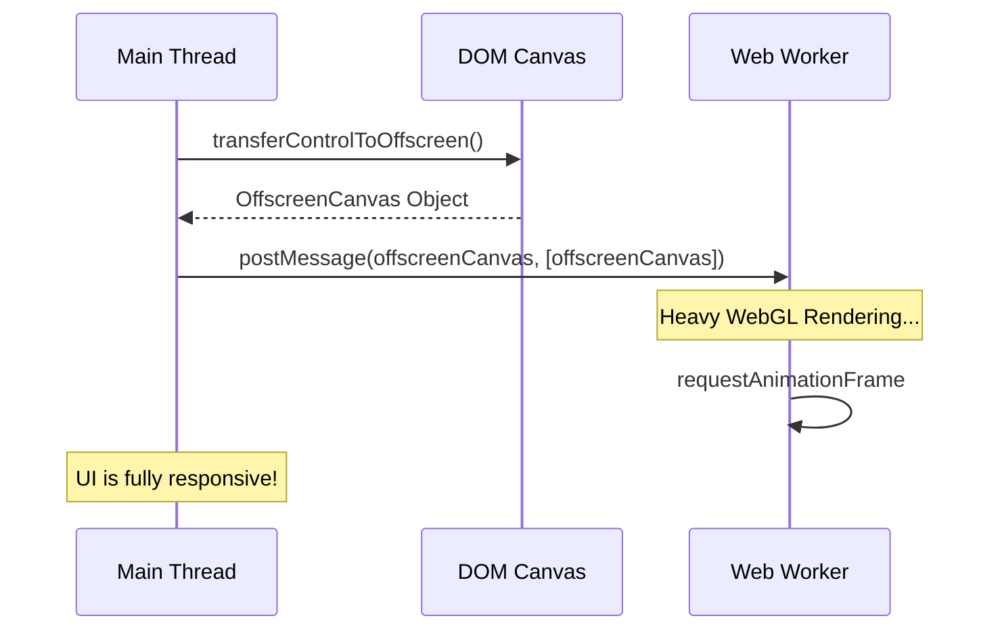

# OffscreenCanvas
OffscreenCanvas — это браузерный API, который позволяет выполнять рендеринг графики (через Canvas 2D или WebGL) вне основного потока (Main Thread), обычно в Web Worker. Боль: сложные анимации, парсинг изображений или генерация графиков блокируют основной поток. Из-за этого страница "замирает": кнопки не нажимаются, скролл дергается (jank). Перенося работу с Canvas в Worker, мы разгружаем UI-поток. Практика: холст (`<canvas>`) в DOM передает управление `OffscreenCanvas`, который отправляется в Worker. Трейдоффы: API доступно не во всех старых браузерах (хотя поддержка уже хорошая). Передача событий (например, клики мышью по координатам) между Main Thread и Worker требует ручной сериализации через `postMessage`, что усложняет архитектуру.



```javascript
// Правильное решение: Рендеринг в Web Worker
// --- main.js ---
const canvas = document.getElementById('myCanvas');
const offscreen = canvas.transferControlToOffscreen();
const worker = new Worker('worker.js');
// Передаем offscreen canvas в воркер
worker.postMessage({ canvas: offscreen }, [offscreen]);

// --- worker.js ---
self.onmessage = function(evt) {
  const canvas = evt.data.canvas;
  const ctx = canvas.getContext('2d');
  
  function render() {
    // Тяжелые вычисления и отрисовка
    ctx.clearRect(0, 0, canvas.width, canvas.height);
    ctx.fillRect(Math.random() * 100, 10, 50, 50);
    requestAnimationFrame(render);
  }
  render();
};
```
