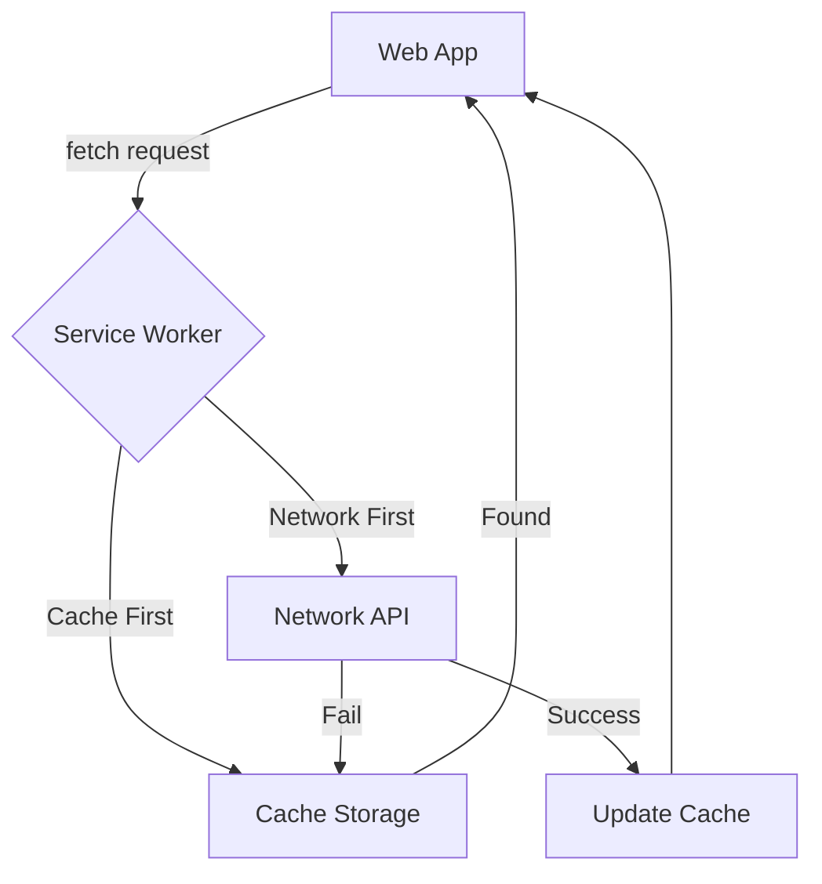

# Service Workers
Service Worker — это скрипт, который браузер запускает в фоновом режиме, отдельно от веб-страницы. Он действует как сетевой прокси-сервер между веб-приложением, браузером и сетью. Боль: веб-приложения беспомощны без интернета ("динозаврик" в Chrome). Кроме того, каждая перезагрузка страницы приводит к сетевым запросам статичных ассетов, даже если они не изменились. Service Worker решает это, перехватывая сетевые запросы (`fetch` event) и отвечая на них ресурсами из специального Cache Storage. Это основа для PWA (Progressive Web Apps) и работы в оффлайне. Практика: стратегии кэширования (Cache First, Network First, Stale-while-revalidate) реализуются через библиотеки вроде Workbox. Трейдоффы: жесточайшие проблемы с инвалидацией кэша. Если неправильно настроить Service Worker, пользователи могут сутками видеть старую версию сайта, а вы не сможете отправить им патч.



```javascript
// Правильное решение: Использование стратегии Stale-While-Revalidate
self.addEventListener('fetch', (event) => {
  event.respondWith(
    caches.match(event.request).then((cachedResponse) => {
      // Идем в сеть за новой версией (даже если есть кэш)
      const fetchPromise = fetch(event.request).then((networkResponse) => {
        caches.open('my-cache-v1').then((cache) => {
          cache.put(event.request, networkResponse.clone());
        });
        return networkResponse;
      });

      // Возвращаем кэш сразу (если есть), иначе ждем сеть
      return cachedResponse || fetchPromise;
    })
  );
});
```
