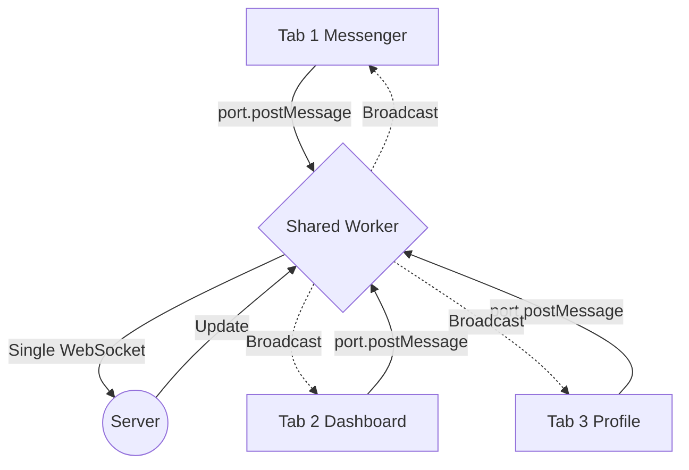

# Shared Workers
Shared Worker — это особый тип веб-воркера, к которому могут подключаться несколько скриптов из разных окон, вкладок или iframe-ов, если они находятся на одном домене (same-origin). Боль: пользователь открывает ваше веб-приложение (например, мессенджер или торговый терминал) в пяти разных вкладках. Если каждая вкладка откроет свое собственное WebSocket-соединение к серверу, это создаст лишнюю нагрузку и приведет к рассинхронизации данных. Shared Worker решает эту проблему, выступая в роли синглтона: он держит одно соединение с сервером и рассылает (broadcast) обновления во все открытые вкладки. Практика: коммуникация идет через порты (`MessagePort`), а не напрямую через `self.onmessage`. Трейдоффы: отладка Shared Workers сложнее, чем обычных. Их жизненный цикл привязан к вкладкам (воркер умирает, когда закрывается последняя вкладка), и они не поддерживаются в некоторых мобильных браузерах (например, долгое время были проблемы в Safari на iOS).



```javascript
// Правильное решение: Использование Shared Worker для синхронизации вкладок
// --- main.js ---
const worker = new SharedWorker('shared-worker.js');
worker.port.start();
worker.port.onmessage = (event) => {
  console.log('Update from server:', event.data);
};

// --- shared-worker.js ---
const connections = [];

self.onconnect = (event) => {
  const port = event.ports[0];
  connections.push(port);
  
  port.onmessage = (e) => {
    // Рассылаем сообщение всем подключенным вкладкам
    connections.forEach(conn => {
      conn.postMessage({ type: 'SYNC', data: e.data });
    });
  };
};
```
