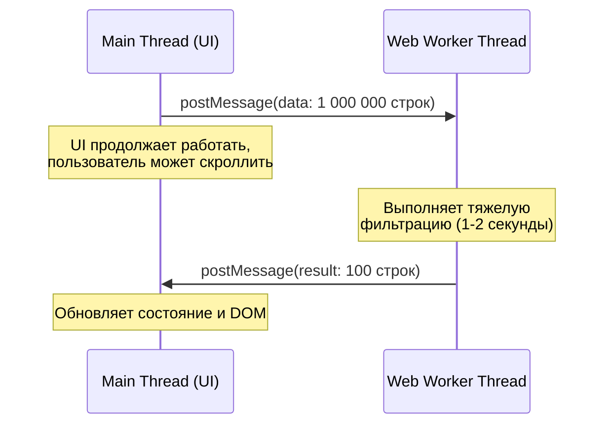

# Web Workers

## Суть концепции
JavaScript исторически является однопоточным языком: UI-отрисовка, обработка событий, парсинг данных и вычисления выполняются в одном Main Thread (главном потоке). Если вы попытаетесь отфильтровать массив из миллиона записей или обработать изображение, главный поток заблокируется. Результат — застывший интерфейс (frozen UI), неработающие кнопки и зависшие анимации (Long Tasks).

**Web Workers** решают эту боль, предоставляя возможность запускать скрипты в фоновых потоках, отдельно от главного потока приложения. Вы можете выполнять тяжелые математические расчеты, парсинг огромных JSON или криптографию, не блокируя пользовательский интерфейс.

## Как это работает

Worker запускается в собственном изолированном контексте. У него **нет доступа к DOM**, объекту `window` или `document`. Общение между главным потоком и воркером происходит асинхронно через систему передачи сообщений (`postMessage`).



## Примеры кода

### ❌ Антипаттерн: Блокировка главного потока
```javascript
// Клик по кнопке полностью повесит вкладку браузера
button.addEventListener('click', () => {
  const data = fetchHugeData();
  const processed = heavyCPUIntensiveCalculation(data); // Занимает 3 секунды
  renderUI(processed); 
});
```

### ✅ Как надо: Вынос в Worker
```javascript
// main.js
const worker = new Worker('worker.js');

button.addEventListener('click', () => {
  showSpinner();
  worker.postMessage({ type: 'START_CALC', payload: fetchHugeData() });
});

worker.onmessage = (event) => {
  hideSpinner();
  renderUI(event.data);
};

// worker.js
self.onmessage = (event) => {
  if (event.data.type === 'START_CALC') {
    // Выполняется в фоне, не блокируя UI
    const processed = heavyCPUIntensiveCalculation(event.data.payload);
    self.postMessage(processed);
  }
};
```

## Трейдоффы и границы применимости

- **Стоимость передачи данных:** По умолчанию `postMessage` клонирует данные (Structured Clone Algorithm). Если вы передаете 100 МБ JSON в воркер, само клонирование займет время и память.
  - *Решение:* Использование Transferable Objects (например, `ArrayBuffer`), которые передаются по ссылке и забираются у отправителя без копирования.
- **Оверхед на создание:** Создание Web Worker имеет затраты времени (~40-50мс). Не стоит создавать воркер для пустяковой задачи, лучше использовать пул воркеров.
- **Ограничения контекста:** Вы не можете манипулировать DOM из воркера. Архитектурно вам придется выносить только "чистую" бизнес-логику и работу с данными.
- **Где применимо:** Парсинг огромных файлов (Excel, CSV), обработка аудио/видео (Canvas/WebAudio), сложная математика, движки игр, хранение сложного стейта (в архитектуре Off-Main-Thread).
