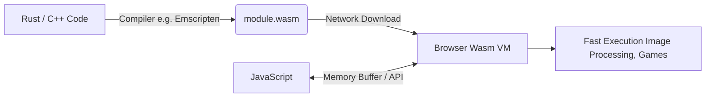

# WebAssembly
WebAssembly (Wasm) — это бинарный формат инструкций, созданный как цель компиляции для высокоуровневых языков (C, C++, Rust, Go), позволяющий выполнять код в браузере с производительностью, близкой к нативной. Боль: JavaScript невероятно быстр благодаря JIT-компиляторам, но для задач вроде обработки видео, 3D-движков, эмуляторов или криптографии его возможностей не хватает. Сборщик мусора (Garbage Collector) в JS может вызывать непредсказуемые паузы, что критично для игр. Wasm решает эту боль, предоставляя предсказуемую производительность и прямой доступ к памяти без GC. Практика: переписывание самых "узких" мест (bottlenecks) на Rust, компиляция в Wasm и вызов из JS. Трейдоффы: оверхед на передачу данных (особенно больших массивов или строк) между JS и Wasm может съесть весь выигрыш в скорости. Использовать Wasm для простого манипулирования DOM бессмысленно.



```rust
// Правильное решение: Тяжелая математика на Rust
// src/lib.rs
#[no_mangle]
pub extern "C" fn fibonacci(n: u32) -> u32 {
    if n <= 1 { return n; }
    fibonacci(n - 1) + fibonacci(n - 2)
}
```

```javascript
// Вызов из JS
const importObject = { env: {} };
WebAssembly.instantiateStreaming(fetch('math.wasm'), importObject)
  .then(obj => {
    // Вызов функции из Wasm
    const result = obj.instance.exports.fibonacci(40);
    console.log(result);
  });
```
