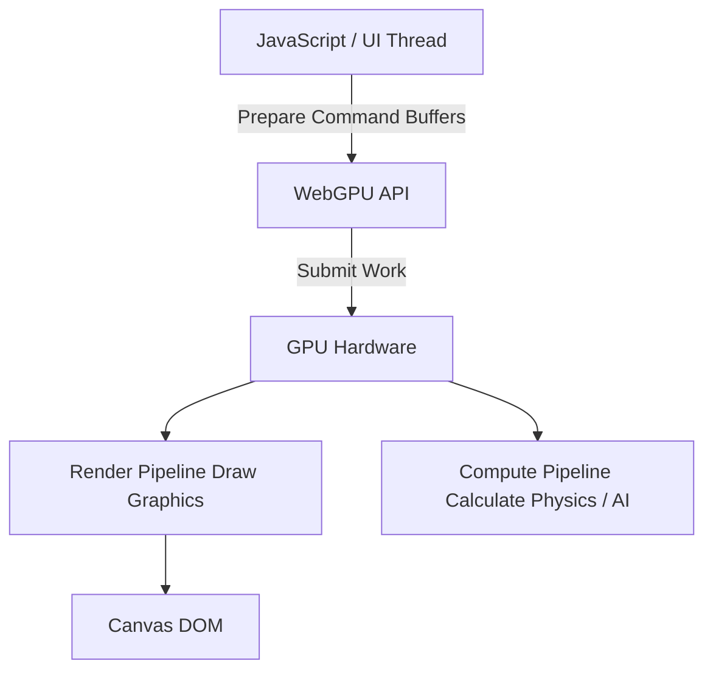

# WebGPU
WebGPU — это современный API для работы с 3D-графикой и вычислениями на GPU в браузере, пришедший на смену устаревшему WebGL. Боль: WebGL был основан на OpenGL ES, концепции которого тянутся из начала 2000-х (глобальный стейт-машинный подход). Это приводило к огромному оверхеду процессора (CPU) при подготовке данных для видеокарты (draw calls). Современные видеокарты работают иначе (через Vulkan, Metal, Direct3D 12). WebGPU предоставляет низкоуровневый доступ к современному аппаратному обеспечению, уменьшая нагрузку на CPU и позволяя запускать Compute Shaders (вычисления на видеокарте). Практика: создание сложных 3D-сцен, симуляций частиц или даже инференс нейросетей прямо в браузере. Трейдоффы: невероятно высокий порог входа. Написание собственного движка на WebGPU требует глубоких знаний линейной алгебры и архитектуры GPU. Код становится очень многословным (verbose). На практике большинство использует обертки вроде Three.js или Babylon.js, которые скрывают сложность WebGPU под капотом.



```javascript
// Антипаттерн: Пытаться писать на WebGPU без понимания концепций Pipeline
// Код инициализации WebGPU может занимать сотни строк

// Правильное решение: Использование абстракций (например, Three.js с WebGPU рендерером)
import * as THREE from 'three';
import WebGPURenderer from 'three/addons/renderers/webgpu/WebGPURenderer.js';

const scene = new THREE.Scene();
const camera = new THREE.PerspectiveCamera(75, window.innerWidth/window.innerHeight, 0.1, 1000);

// Под капотом Three.js берет на себя всю работу с WebGPU API
const renderer = new WebGPURenderer();
renderer.setSize(window.innerWidth, window.innerHeight);
document.body.appendChild(renderer.domElement);

const mesh = new THREE.Mesh(new THREE.BoxGeometry(), new THREE.MeshBasicMaterial({ color: 0x00ff00 }));
scene.add(mesh);
camera.position.z = 5;

renderer.renderAsync(scene, camera);
```
