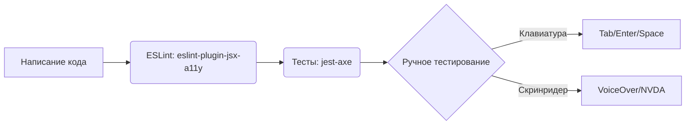

# Accessibility (A11y) Testing

## Что это и зачем нужно?

Тестирование доступности (a11y) — это процесс проверки того, что вашим приложением могут пользоваться люди с ограниченными возможностями (нарушения зрения, моторики, когнитивные особенности). Мы решаем боль изоляции части пользователей и предотвращаем возможные юридические иски (в США и Европе это частая практика). 

На практике это означает проверку контрастности, возможности навигации с клавиатуры, наличие правильных ARIA-атрибутов для скринридеров (VoiceOver, NVDA) и семантической верстки.

## Как это работает на практике

Процесс a11y тестирования автоматизируется с помощью линтеров и интеграционных тестов, но всегда требует ручной проверки. Автоматика ловит лишь около 20-30% проблем доступности.



### Пример использования `jest-axe`

**Антипаттерн:** Несемантичный HTML и отсутствие ролей.
```tsx
// Плохо: div вместо кнопки, не работает с клавиатуры
<div onClick={submit} className="btn">Submit</div>
```

**Правильное решение:** Использование семантики и автоматическая проверка с `axe`.
```tsx
import { render } from '@testing-library/react';
import { axe, toHaveNoViolations } from 'jest-axe';
import { Button } from './Button';

expect.extend(toHaveNoViolations);

test('Button should have no accessibility violations', async () => {
  const { container } = render(<button onClick={submit}>Submit</button>);
  
  // axe просканирует DOM на предмет типичных a11y ошибок
  const results = await axe(container);
  
  expect(results).toHaveNoViolations();
});
```

## Трейдоффы и границы применимости

1. **Ограничения автоматизации**: Инструменты вроде `axe` могут проверить наличие `aria-label` или контрастность, но они не поймут, имеет ли `aria-label` смысл в контексте. "Кнопка 1" пройдет автоматический тест, но будет бесполезна для незрячего пользователя.
2. **Оверхед на разработку**: Внедрение a11y в legacy-проект — это огромная боль. Легче закладывать доступность на этапе дизайн-системы.
3. **Конфликты с дизайном**: Иногда бренд-цвета не проходят проверку на контрастность (WCAG AA/AAA). Приходится искать компромиссы между эстетикой и доступностью.
