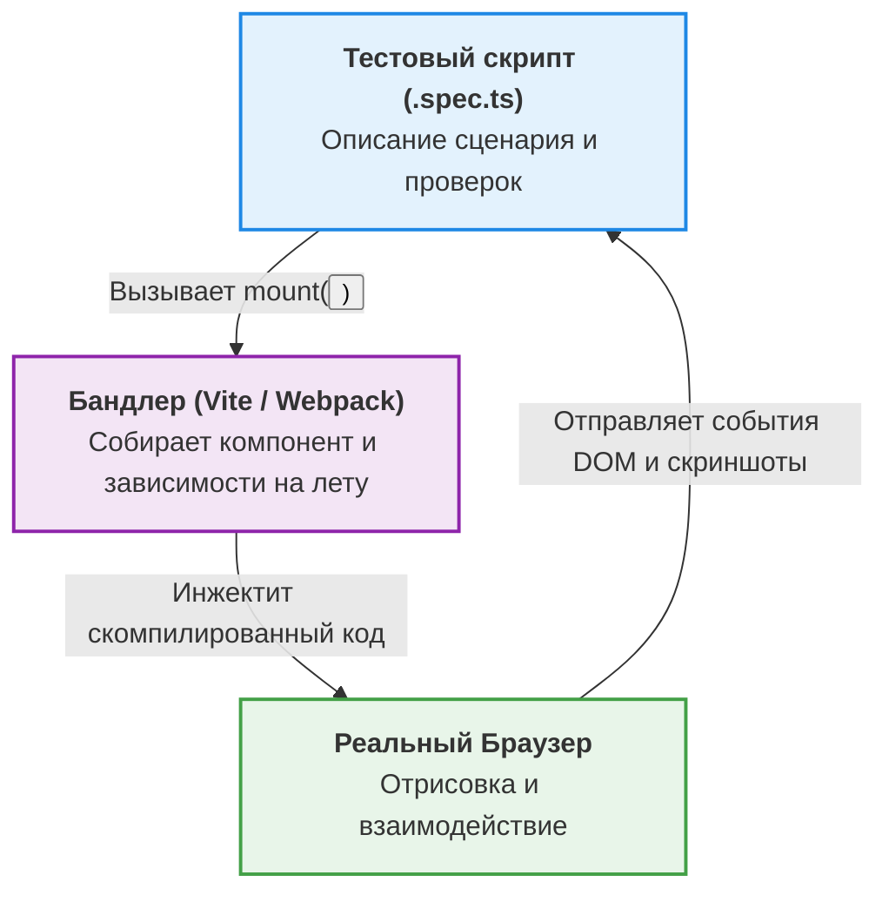

Традиционно тестирование фронтенда разбивалось на два лагеря: юнит-тесты (быстрые, но оторванные от реальности) и E2E тесты (реалистичные, но медленные и хрупкие). **Компонентное тестирование (Component Testing)** — это золотая середина, позволяющая тестировать UI-компоненты в реальном браузере, но изолированно от всего остального приложения.

Если интеграционные тесты (например, с React Testing Library в JSDOM) эмулируют DOM в Node.js, то современные инструменты компонентного тестирования (Cypress CT, Playwright CT) запускают компонент в настоящем Chromium/WebKit.

## 1. Какую боль мы решаем?

* **Ограничения JSDOM:** JSDOM не умеет рендерить CSS, не понимает реальные размеры элементов (getBoundingClientRect всегда возвращает нули), не поддерживает сложные API браузера (IntersectionObserver, Canvas, WebGL).
* **Сложность E2E:** E2E-тесты требуют поднятия всего приложения, бэкенда и базы данных. Чтобы протестировать редкое состояние компонента (например, ошибку загрузки), в E2E нужно выстраивать сложные сценарии мокирования целой страницы.
* **Слепота юнит-тестов:** Юнит-тест скажет, что компонент отрендерил `<div class="btn">`, но не скажет, что этот div невидимый, потому что у него `display: none` или он перекрыт модальным окном.

## 2. Как это работает (Архитектура подхода)

Вместо загрузки URL всего приложения, тест собирает бандл только для одного компонента и "монтирует" (mount) его на пустую HTML-страницу в реальном браузере.



## 3. Практический пример: Тестирование DatePicker

Рассмотрим сложный компонент выбора даты. Он сильно зависит от стилей и взаимодействия с мышью/клавиатурой.

### Антипаттерн: JSDOM + Enzyme / RTL для сложного UI
Попытка протестировать сложный визуальный компонент в Node.js обречена на написание костылей и моков для браузерных API.

```tsx
// ❌ ПЛОХО: JSDOM не знает про CSS и реальный фокус
import { render, fireEvent } from '@testing-library/react';
import DatePicker from './DatePicker';

test('opens calendar on click', () => {
  const { getByRole } = render(<DatePicker />);
  
  // JSDOM просто меняет свойства объектов, он не кликает физически
  fireEvent.click(getByRole('textbox'));
  
  // Мы можем проверить наличие узла в DOM, но не можем быть уверены, 
  // что попап реально видим на экране (а не скрыт за z-index).
  expect(getByRole('dialog')).toBeInTheDocument(); 
});
```

### Как надо: Playwright Component Testing
Компонент рендерится в реальном браузере. Playwright выполняет настоящие клики мышью, проверяя видимость элемента с учетом CSS, прозрачности и перекрытий.

```tsx
// ✅ ХОРОШО: Тестирование в реальном браузере
import { test, expect } from '@playwright/experimental-ct-react';
import { DatePicker } from './DatePicker';

test('should render calendar popup and allow date selection', async ({ mount, page }) => {
  // 1. Монтируем компонент изолированно
  const component = await mount(<DatePicker defaultDate="2024-01-01" />);
  
  // 2. Взаимодействуем как реальный пользователь
  await component.locator('input').click();
  
  // Playwright проверит, что попап действительно видим (CSS display, visibility, opacity)
  const popup = page.locator('.calendar-popup');
  await expect(popup).toBeVisible();
  
  // Проверяем визуальную регрессию (скриншотные тесты из коробки)
  await expect(component).toHaveScreenshot('datepicker-open.png');
});
```

## 4. Скрытые трейдоффы и границы применимости

### Оверхед и настройка
Настроить Component Testing сложнее, чем Jest/Vitest. Инструменту (Playwright/Cypress) нужно уметь собирать ваш код. Если у вас сложный Webpack конфиг с десятками плагинов и алиасов, вам придется дублировать эту логику в конфиг тестового раннера.

### Контекст компонента (Context Providers)
Компоненты редко существуют в вакууме. Обычно им нужен Router, Store (Redux/Zustand), Theme Provider, i18n. При компонентном тестировании вам придется создавать обертки (`mount(<Providers><Component /></Providers>)`). Чем сложнее компонент привязан к глобальному стейту, тем тяжелее его монтировать.

**Идеальное применение:**
* **Design System / UI Kit:** Тестирование кнопок, модалок, селектов, таблиц — там, где визуал и сложные взаимодействия с DOM (drag-n-drop, виртуализация) критически важны.
* Глупые (Dumb/Presentational) компоненты.

**Плохое применение:**
* Smart-компоненты на уровне целых страниц, которые делают 15 сетевых запросов при рендере. Для них лучше использовать интеграционные тесты с MSW или полноценный E2E.
