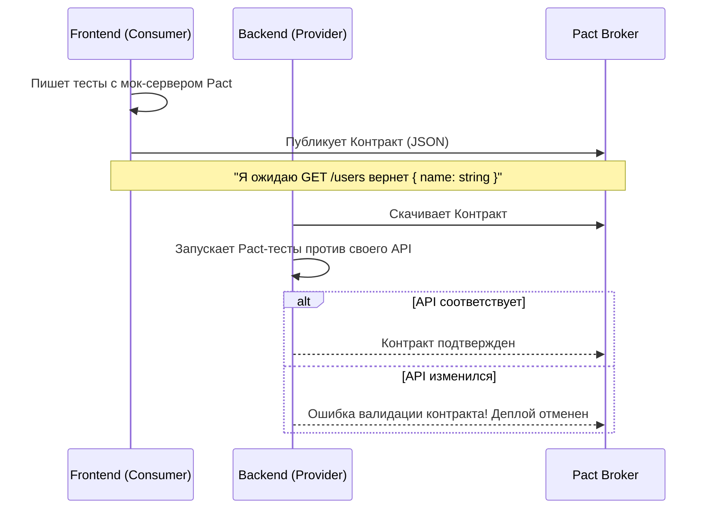

# Contract Testing (Контрактное тестирование)

## Что это и зачем нужно?

Контрактное тестирование — это способ проверки интеграции между распределенными системами (например, Фронтенд и Бэкенд) без необходимости поднимать их одновременно. Мы решаем классическую боль: бэкендер переименовал поле `userName` в `user_name`, задеплоил, и фронтенд упал в проде, потому что никто это не протестировал.

Вместо того чтобы писать тяжелые, хрупкие и медленные End-to-End (E2E) тесты, мы фиксируем "контракт" — соглашение о том, какие запросы отправляет Consumer (фронтенд) и какие ответы обещает вернуть Provider (бэкенд).

## Как это работает на практике

Фронтенд пишет тесты, описывающие ожидания от API. На основе этих тестов генерируется контракт (обычно JSON-файл). Этот контракт передается бэкенду, который в своем пайплайне прогоняет тесты против своего актуального кода, проверяя, что он не нарушил ожидания фронтенда. Самый популярный инструмент — **Pact**.



### Пример (Pact)

**Контракт на стороне Фронтенда:**
```typescript
import { PactV3, MatchersV3 } from '@pact-foundation/pact';

const provider = new PactV3({
  consumer: 'ReactApp',
  provider: 'UserService',
});

test('get user profile', async () => {
  // 1. Описываем ожидаемое взаимодействие
  provider
    .given('User exists')
    .uponReceiving('A request for user profile')
    .withRequest({ method: 'GET', path: '/api/users/1' })
    .willRespondWith({
      status: 200,
      body: {
        id: 1,
        name: MatchersV3.string('John Doe'), // Важен тип, а не конкретное значение
      },
    });

  // 2. Выполняем реальный запрос к поднятому Pact-моку
  await provider.executeTest(async (mockServer) => {
    const api = new ApiClient(mockServer.url);
    const user = await api.getUser(1);
    expect(user.name).toBe('John Doe');
  });
  // После успеха сгенерируется JSON контракт
});
```

## Трейдоффы и границы применимости

1. **Сложность инфраструктуры**: Требуется поднять и поддерживать Pact Broker (хранилище контрактов), настроить CI/CD пайплайны на обеих сторонах, чтобы они обменивались версиями контрактов. Это значительный DevOps-оверхед.
2. **Сломанные процессы**: Контрактное тестирование работает только если **обе** команды (frontend и backend) готовы инвестировать в него время и соблюдать процесс. Если бэкенд игнорирует упавшие контракты — всё бессмысленно.
3. **Границы**: Контракты не проверяют бизнес-логику (например, правильно ли посчиталась скидка). Они проверяют только формат и структуру данных (схема, типы, статусы ответов).
