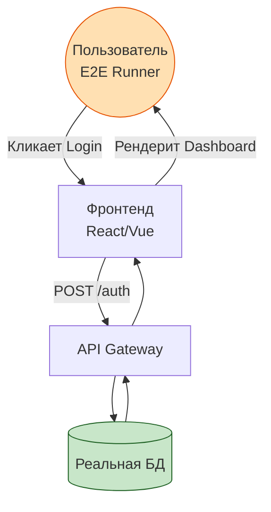

# End to End Testing (E2E)

## Что это и зачем нужно?

End-to-End (E2E) тестирование — это симуляция действий реального пользователя в реальном браузере с реальным (или максимально приближенным к реальному) бэкендом. Мы решаем боль "у меня локально/на моках всё работает, а в проде не логинится". E2E — это высшая инстанция доверия: если E2E-тест прошел, значит, бизнес-фича скорее всего работает от интерфейса до базы данных.

Часто пишутся QA-инженерами или разработчиками с использованием Playwright, Cypress или Selenium.

## Как это работает на практике

Тестраннер открывает настоящий браузер (Chromium, WebKit), переходит по URL, ищет элементы на странице, кликает, вводит текст и проверяет, что на экране появились нужные данные или произошел редирект.



### Пример (Playwright)

**Антипаттерн:** Использование хрупких CSS-селекторов.
```typescript
// Если дизайнер поменяет класс, тест упадет (Flaky test)
await page.click('.login-btn-blue.mt-4');
```

**Правильное решение:** Использование data-атрибутов или ролей a11y.
```typescript
import { test, expect } from '@playwright/test';

test('пользователь может войти в систему', async ({ page }) => {
  await page.goto('https://myapp.com/login');

  // Ориентируемся на то, что видит пользователь, или на data-testid
  await page.fill('[data-testid="email-input"]', 'user@example.com');
  await page.fill('[data-testid="password-input"]', 'password123');
  await page.click('button:has-text("Войти")');

  // Ждем, пока URL не изменится на /dashboard
  await expect(page).toHaveURL(/.*dashboard/);
  await expect(page.locator('h1')).toContainText('Добро пожаловать');
});
```

## Трейдоффы и границы применимости

1. **Скорость**: E2E-тесты невероятно медленные. Прогон сюиты может занимать десятки минут. Их невозможно запускать на каждый чих (каждый коммит), только перед мерджем или деплоем.
2. **Хрупкость (Flakiness)**: Сеть мигнула, анимация не успела отработать, сторонний API (например, Stripe) ответил с задержкой — тест упал. Поддержка E2E тестов требует много ресурсов.
3. **Сложность окружения**: Чтобы E2E был "честным", нужна тестовая база данных, которую нужно накатывать и очищать перед каждым запуском (seed & teardown).
