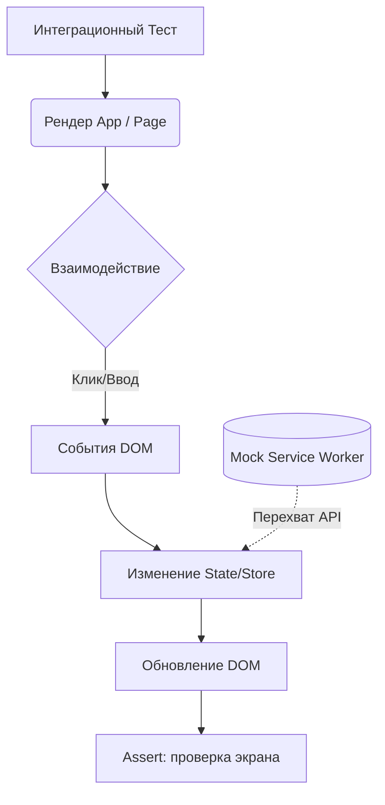

# Integration Testing (Интеграционное тестирование)

## Что это и зачем нужно?

Во фронтенде интеграционное тестирование — это проверка того, как несколько компонентов (и хуков) работают вместе. Если юнит-тесты проверяют отдельную функцию или кнопку, то интеграционный тест проверяет целую страницу или сложную форму.

Мы решаем боль "каждая деталь машины работает, но машина не едет". Интеграционные тесты (особенно с использованием `Testing Library`) — это "сладкая точка" (sweet spot) фронтенд-тестирования. Они дают много уверенности и при этом работают быстро, так как запускаются в jsdom, а не в реальном браузере.

## Как это работает на практике

Мы рендерим дерево компонентов, мокаем сетевые запросы (например, через MSW) и взаимодействуем с DOM-деревом как пользователь.



### Пример (React Testing Library)

**Антипаттерн:** Shallow-рендеринг (Enzyme) и проверка внутреннего стейта. Это привязывает тесты к реализации.

**Правильное решение:** Полный рендер в jsdom и тестирование поведения.
```tsx
import { render, screen } from '@testing-library/react';
import userEvent from '@testing-library/user-event';
import { UserProfile } from './UserProfile';

test('сохраняет профиль после изменения имени', async () => {
  const user = userEvent.setup();
  // 1. Рендерим компонент (без реального браузера, всё в памяти)
  render(<UserProfile />);
  
  // 2. Находим инпут и кнопку
  const input = screen.getByLabelText(/имя/i);
  const saveButton = screen.getByRole('button', { name: /сохранить/i });
  
  // 3. Симулируем поведение пользователя
  await user.clear(input);
  await user.type(input, 'Alex');
  await user.click(saveButton);
  
  // 4. Проверяем результат (например, появилось уведомление)
  expect(await screen.findByText(/успешно сохранено/i)).toBeInTheDocument();
});
```

## Трейдоффы и границы применимости

1. **jsdom не браузер**: Интеграционные тесты во фронтенде (обычно) работают в Node.js-среде с симуляцией DOM (`jsdom`). jsdom не умеет считать размеры элементов (layout), не поддерживает CSS-анимации, IntersectionObserver и некоторые другие браузерные API (их приходится мокать).
2. **Сложность моков**: Если компонент глубоко завязан на глобальные провайдеры (Redux, Router, Theme, Intl), настройка рендера для теста становится громоздкой (нужны кастомные функции `render`).
3. **Скорость**: Они медленнее юнит-тестов (рендеринг React-дерева занимает время), поэтому 1000 интеграционных тестов могут бежать пару минут.
