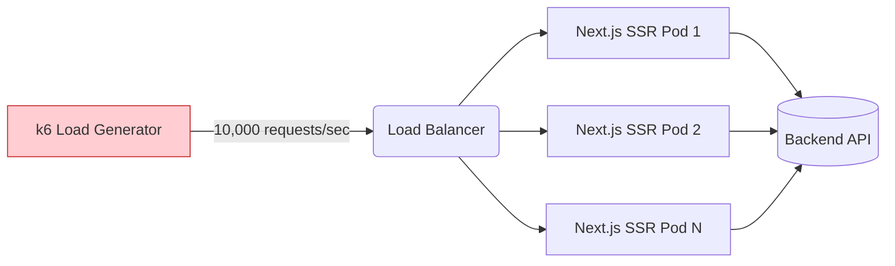

# Load Testing (Нагрузочное тестирование)

## Что это и зачем нужно?

Нагрузочное тестирование — это проверка того, как система ведет себя под высокой нагрузкой (много одновременных пользователей или запросов). Для фронтенд-разработчика это особенно актуально в архитектурах с Server-Side Rendering (SSR, например, Next.js) или Backend-for-Frontend (BFF).

Мы решаем боль: "Всё летало в dev-режиме, а когда мы запустили рекламную кампанию, Node.js сервер Next.js упал с Out of Memory, и все увидели 502 Bad Gateway".

## Как это работает на практике

Специальный инструмент (например, k6, Artillery или JMeter) генерирует сотни или тысячи виртуальных пользователей, которые одновременно запрашивают страницы нашего приложения. Мы замеряем время ответа (latency), пропускную способность (RPS - requests per second) и процент ошибок.



### Пример (k6)

Скрипт для тестирования SSR-страницы фронтенда с помощью Artillery или k6.

**k6 script (`load-test.js`):**
```javascript
import http from 'k6/http';
import { check, sleep } from 'k6';

// Конфигурация нагрузки
export const options = {
  stages: [
    { duration: '30s', target: 50 },  // Разгон до 50 пользователей
    { duration: '1m', target: 50 },   // Держим нагрузку 1 минуту
    { duration: '30s', target: 0 },   // Остываем
  ],
};

export default function () {
  // Запрашиваем тяжелую SSR-страницу
  const res = http.get('https://my-nextjs-app.com/products/heavy-item');
  
  // Проверяем, что сервер выжил и не вернул 500-ку
  check(res, {
    'status is 200': (r) => r.status === 200,
    'response time < 500ms': (r) => r.timings.duration < 500,
  });
  
  sleep(1); // Имитация задержки перед следующим кликом
}
```

## Трейдоффы и границы применимости

1. **Не для SPA**: Если у вас чистое Single Page Application (статика на S3/CDN), нагрузочное тестирование фронтенда не имеет смысла — CDN выдержит почти любую нагрузку. В этом случае тестировать нужно только API бэкенда.
2. **Цена инфраструктуры**: Генерация большой нагрузки из облака (особенно распределенной из разных регионов) стоит реальных денег.
3. **Сложность симуляции**: Написать скрипт, который просто дергает один URL, легко. Написать скрипт, который эмулирует сложный флоу (добавление в корзину, заполнение формы, оплата с сохранением сессий) — очень сложно и дорого поддерживать.
