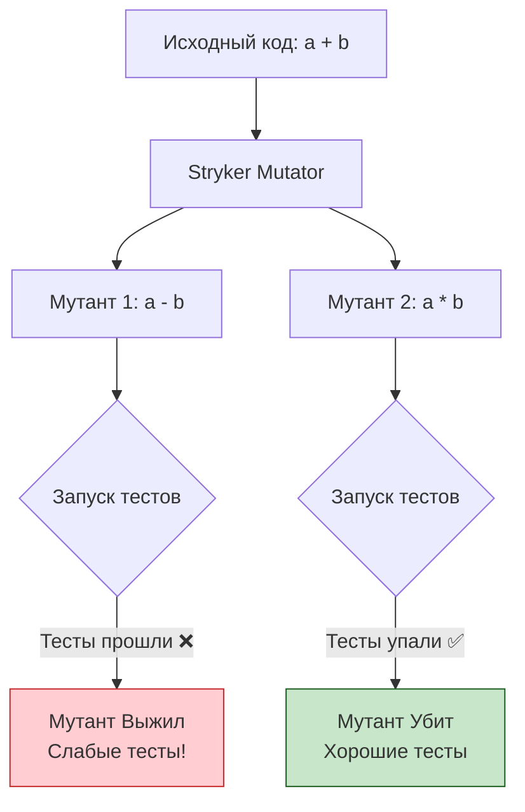

# Mutation Testing (Мутационное тестирование)

## Что это и зачем нужно?

Мутационное тестирование отвечает на вопрос: **"Кто протестирует сами тесты?"**
Оно решает фундаментальную боль покрытия кода (Code Coverage). 100% Code Coverage означает лишь то, что тесты *выполнили* эти строки кода, но не гарантирует, что тесты что-то *проверяют*. Разработчик мог забыть написать `expect(...)` или написать тривиальный `expect(true).toBe(true)`.

Мутационное тестирование намеренно вносит мелкие ошибки (мутации) в исходный код (например, меняет `+` на `-`, `if (a > b)` на `if (a < b)`) и прогоняет тесты. Если тесты после этого прошли успешно — значит, тесты плохие, мутант "выжил". Если тесты упали — мутант "убит", тесты хорошие.

## Как это работает на практике

Во фронтенде/JS для этого чаще всего используется фреймворк **Stryker Mutator**.



### Пример

**Исходный код (`math.js`):**
```javascript
export const isAdult = (age) => {
  return age >= 18;
};
```

**Слабый тест:**
```javascript
test('isAdult works', () => {
  isAdult(20); // Ошибка: забыли expect!
});
```

*Code coverage покажет 100%.* Но Stryker сделает мутацию:
```javascript
// Мутант:
export const isAdult = (age) => {
  return age < 18; // Изменил знак
};
```
Затем запустит тесты. Тест `isAdult works` пройдет успешно. Stryker выдаст отчет: **Мутант выжил! У вас дыра в тестах на строке 2.**

**Правильный тест:**
```javascript
test('isAdult works', () => {
  expect(isAdult(20)).toBe(true);
  expect(isAdult(17)).toBe(false);
  expect(isAdult(18)).toBe(true); // Boundary check
});
```
Теперь любые изменения знаков `>` или `>=` приведут к падению теста, мутанты будут убиты.

## Трейдоффы и границы применимости

1. **Экстремальная медлительность**: Если у вас 1000 строк кода, Stryker может сгенерировать 5000 мутантов. Это значит, что ваши юнит-тесты будут запущены 5000 раз. Прогон может занимать часы.
2. **Эквивалентные мутанты**: Иногда мутация меняет код, но бизнес-логика остается эквивалентной (например, оптимизация производительности). Тест логично не падает, но метрика мутационного покрытия портится.
3. **Границы применимости**: Мутационное тестирование подходит только для критического ядра приложения (финансовые расчеты, сложные алгоритмы, core-библиотеки). Использовать его для UI-компонентов — пустая трата ресурсов и времени.
