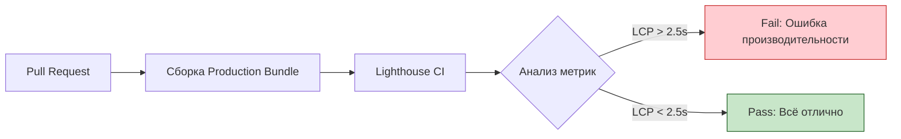

# Performance Testing (Тестирование производительности)

## Что это и зачем нужно?

Тестирование производительности во фронтенде — это регулярный замер метрик (Web Vitals), которые показывают, насколько быстро и плавно приложение работает у конечного пользователя. 

Мы решаем фундаментальную боль разработчика: "У меня на топовом MacBook с гигабитным интернетом всё летает". А в реальности пользователь заходит с бюджетного Android на 3G-сети и ждет 10 секунд белого экрана. Если производительность не тестировать в CI, она неизбежно деградирует (добавили тяжелую библиотеку, сломали tree-shaking).

## Как это работает на практике

Мы используем Lighthouse CI или WebPageTest в пайплайне для замера **Core Web Vitals**:
- **LCP (Largest Contentful Paint)**: Скорость отрисовки основного контента.
- **FID (First Input Delay) / INP (Interaction to Next Paint)**: Отзывчивость (не "фризит" ли кнопка при клике).
- **CLS (Cumulative Layout Shift)**: Визуальная стабильность (не прыгает ли текст при загрузке картинок).



### Пример (Lighthouse CI)

**Конфигурация `.lighthouserc.js`:**
```javascript
module.exports = {
  ci: {
    collect: {
      staticDistDir: './build',
      numberOfRuns: 3, // Запускаем 3 раза для стабильности
    },
    assert: {
      assertions: {
        'categories:performance': ['error', { minScore: 0.9 }], // Должно быть > 90
        'first-contentful-paint': ['warn', { maxNumericValue: 2000 }],
        'cumulative-layout-shift': ['error', { maxNumericValue: 0.1 }],
      },
    },
  },
};
```

## Трейдоффы и границы применимости

1. **Нестабильность метрик (Flakiness)**: Производительность зависит от мощности сервера, где бежит CI, и "соседей" по виртуальной машине. Разброс (variance) может быть ±15%, что приводит к ложным падениям пайплайна.
2. **Синтетика vs Реал**: Lighthouse тестирует страницу в лабораторных условиях (Synthetic). Реальные данные (RUM - Real User Monitoring из Google Analytics или Sentry) гораздо важнее, но их нельзя проверить до деплоя в прод.
3. **SPA проблемы**: Метрики вроде LCP сложно корректно замерять при Client-Side переходах в SPA (React Router), они заточены под классическую навигацию с перезагрузкой страницы.
