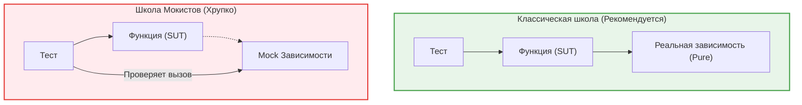

Модульное (Unit) тестирование — это проверка минимально неделимых частей кода (функций, классов, хуков) в полной изоляции. На фронтенде это самая противоречивая зона: из-за сильной связности UI с бизнес-логикой разработчики часто тестируют не то и не так.

## 1. Какую боль мы решаем?

* **Быстрая обратная связь:** В отличие от Playwright (минуты) или RTL (секунды), тысячи юнит-тестов выполняются за миллисекунды. Вы моментально узнаете, что сломали логику.
* **Комбинаторный взрыв состояний:** У функции форматирования телефона может быть 20 краевых случаев (пустая строка, буквы, разные коды стран). Покрывать все 20 случаев интеграционными тестами через рендер формы — безумие. Юнит-тесты делают это за секунду.
* **Документация кодом:** Набор тестов (test cases) описывает, как разработчик задумывал использование функции.

## 2. Архитектура: Мокисты против Классицистов

В юнит-тестах всегда есть разделение на то, как мы работаем с зависимостями.



Фронтенд-разработчики часто скатываются в школу Мокистов, создавая заглушки на каждую функцию и проверяя, *сколько раз* она вызвана. Это приводит к тестам, которые всегда «зеленые», даже если приложение не работает.

## 3. Практический пример: Тестирование бизнес-логики

Представим логику расчета цены корзины с учетом скидки и налогов.

### Антипаттерн: Тотальное мокирование
Мы мокаем зависимости, привязываясь к реализации. Если мы решим объединить функции в одну, тест упадет, хотя математика не изменится.

```typescript
// ❌ ПЛОХО: Мокистский подход
import { calculateTotal } from './cart';
import * as taxModule from './taxHelper';

test('calculates total with tax', () => {
  // Мы заменяем реальную реализацию
  const spy = jest.spyOn(taxModule, 'calculateTax').mockReturnValue(20);
  
  const total = calculateTotal(100);
  
  // Мы тестируем, что функция была вызвана, а не реальный результат работы!
  expect(spy).toHaveBeenCalledWith(100);
  expect(total).toBe(120); 
});
```

### Как надо: Чистые функции (Black Box)
Входные данные -> Функция -> Результат. Мы тестируем **поведение**, а не реализацию.

```typescript
// ✅ ХОРОШО: Классический Black Box подход
import { calculateTotal } from './cart';

// Мы описываем разные краевые случаи (Table-driven tests)
describe('calculateTotal', () => {
  test.each([
    { amount: 100, hasDiscount: false, expected: 120 }, // 100 + 20% налог
    { amount: 100, hasDiscount: true, expected: 108 },  // (100 - 10%) + 20% налог
    { amount: 0, hasDiscount: true, expected: 0 },      // Граничное условие
  ])('amount=$amount, discount=$hasDiscount -> $expected', ({ amount, hasDiscount, expected }) => {
    
    expect(calculateTotal(amount, hasDiscount)).toBe(expected);
  });
});
```

## 4. Скрытые трейдоффы и границы применимости

### Что НУЖНО покрывать юнит-тестами во фронтенде:
1. **Чистые функции и утилиты:** Парсеры дат, математические расчеты, форматтеры строк.
2. **Бизнес-правила:** Стейт-машины, сложные селекторы Redux/Zustand, валидаторы форм.
3. **Сложные кастомные хуки:** Хуки, которые инкапсулируют сложную логику без привязки к DOM (используя `@testing-library/react-hooks`).

### Что НЕ НУЖНО покрывать юнит-тестами (и где они ломаются):
1. **UI-компоненты (Кнопки, Карточки):** Если вы тестируете, что `<Button type="primary" />` добавляет класс `btn-primary`, вы тестируете реализацию React, а не свое приложение. Это работа для скриншотных или интеграционных тестов.
2. **Обвязка API (Axios/Fetch вызовы):** Тестировать, что вызов `api.getUsers()` вызвал `axios.get('/users')` бессмысленно. Вы дублируете код в тесте. Лучше использовать интеграционные тесты с MSW.
3. **Компоненты с сильной зависимостью от DOM:** Логика позиционирования тултипов, drag-n-drop. JSDOM в юнит-тестах не имеет реального Layout Engine (CSSOM), поэтому тесты будут врать.

**Главное правило юнит-теста:** Если при рефакторинге (без изменения поведения для пользователя) вам приходится править тест — это плохой юнит-тест.
