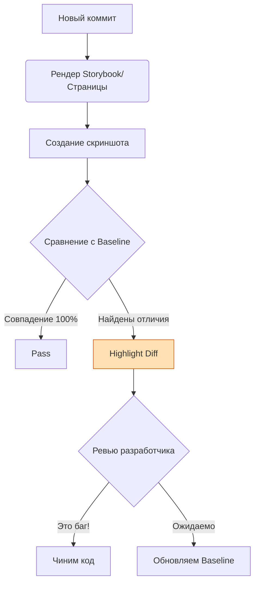

# Visual Regression Testing (Визуальное регрессионное тестирование)

## Что это и зачем нужно?

Визуальные тесты проверяют, как ваше приложение **выглядит**, сравнивая скриншоты попиксельно. 
Мы решаем классическую боль фронтендера: "Я поменял глобальный отступ в сетке, и на странице контактов съехала кнопка, а юнит-тесты этого не заметили". Юнит и E2E тесты проверяют DOM (существует ли кнопка), но им плевать, если кнопка прозрачная или перекрыта другим элементом (z-index).

## Как это работает на практике

Инструмент (Percy, Chromatic, Playwright) делает скриншот компонента или страницы и сравнивает его с "эталонным" (baseline) скриншотом из `main` ветки. Если найдена разница в пикселях — тест помечается как упавший, и разработчик должен вручную подтвердить: это баг или ожидаемое изменение дизайна.



### Пример (Playwright Visual Comparisons)

**Антипаттерн:** Игнорирование динамических данных (дат, анимаций, iframe). Скриншот будет всегда разным.
```typescript
// Плохо: на странице крутится спиннер
await expect(page).toHaveScreenshot('dashboard.png');
```

**Правильное решение:** Заморозка анимаций, мокирование данных.
```typescript
import { test, expect } from '@playwright/test';

test('Карточка продукта выглядит корректно', async ({ page }) => {
  await page.goto('/product/1');
  
  // Убираем курсор, мокаем дату или прячем нестабильные элементы
  const card = page.locator('.product-card');
  
  await expect(card).toHaveScreenshot('product-card.png', {
    animations: 'disabled',
    mask: [page.locator('.dynamic-timer')], // Маскируем таймер черным квадратом
    maxDiffPixels: 100, // Допускаем легкий антиалиасинг шрифтов
  });
});
```

## Трейдоффы и границы применимости

1. **Проблема рендеринга**: Шрифты и антиалиасинг (сглаживание) рендерятся по-разному на Linux (CI) и Mac (локально). Скриншот, сделанный локально, почти всегда упадет в CI. Поэтому скриншоты нужно генерировать только в Docker-контейнере.
2. **False Positives**: Любое, даже микроскопическое изменение (новая версия браузера обновила скругление инпутов) "ломает" все 500 визуальных тестов, требуя ручного аппрува.
3. **Хранение данных**: Скриншоты занимают много места. Хранить их в Git (LFS) — плохая идея. Нужны специализированные платные сервисы (Chromatic, Percy).
