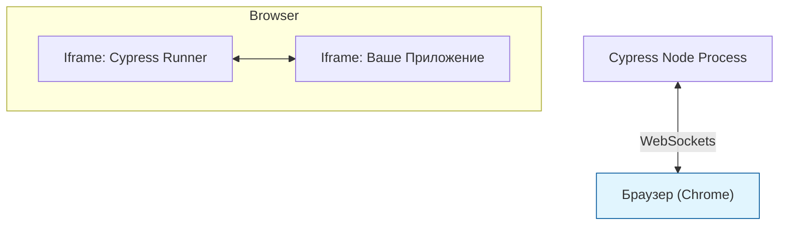

# Cypress

## Что это и зачем нужно?

Cypress — это инструмент для E2E и компонентного тестирования во фронтенде. 
До его появления миром правил Selenium (WebDriver), который был медленным, хрупким и заставлял разработчиков плакать от боли `Thread.sleep()`. Cypress решил боль девелоперского опыта (DX): он запускается **внутри самого браузера**, в том же event loop, что и ваше приложение.

Это дало невероятные возможности: отладку (Time Travel), мгновенный доступ к DOM, window, local storage и стейту приложения прямо из тестов, а также встроенное ожидание (auto-waiting).

## Как это работает на практике

Cypress встраивается в браузер через iframe. Вы пишете тесты на JavaScript/TypeScript. У Cypress есть шикарный UI, где можно кликать по шагам теста и видеть, как выглядело приложение (DOM snapshot) в тот момент.



### Пример использования

**Антипаттерн:** Использование `cy.wait(5000)` (жестких пауз).
```javascript
cy.get('.submit-btn').click();
cy.wait(3000); // Плохо: мы либо ждем лишнее, либо сеть тупит дольше 3с
cy.get('.success-modal').should('be.visible');
```

**Правильное решение:** Cypress умеет сам дожидаться элементов (Auto-waiting) и сетевых запросов (Aliasing).
```javascript
// Перехватываем API-запрос и даем ему имя
cy.intercept('POST', '/api/checkout').as('checkoutRequest');

cy.get('[data-test="submit-btn"]').click();

// Cypress будет ждать, пока этот конкретный запрос не завершится
cy.wait('@checkoutRequest').its('response.statusCode').should('eq', 200);

// И затем будет ждать появления модалки (до 4 секунд по умолчанию)
cy.get('[data-test="success-modal"]').should('be.visible');
```

## Трейдоффы и границы применимости

1. **Архитектурные ограничения**: Поскольку Cypress работает в iframe внутри браузера, у него исторически огромные проблемы с тестированием multiple tabs (несколько вкладок) и cross-origin запросами (переход на другой домен, например, для OAuth-авторизации). Playwright решил эти проблемы лучше.
2. **Скорость**: Cypress медленнее Playwright и потребляет много оперативной памяти (особенно в долгих сюитах).
3. **Сложность моков**: Мокать функции внутри самого приложения сложно, Cypress больше заточен под мокирование именно сетевого слоя (через `cy.intercept`).
