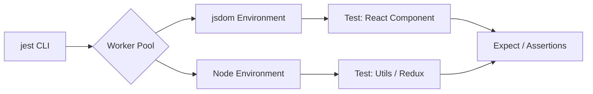

# Jest

## Что это и зачем нужно?

Jest — это фреймворк для юнит- и интеграционного тестирования, созданный Facebook (Meta). 
Он решил главную боль настройки тестов в 2015-2018 годах. До Jest разработчикам приходилось собирать "франкенштейна": Mocha (runner) + Chai (assertions) + Sinon (mocks) + Istanbul (coverage) + Karma (браузер). 

Jest предоставил принцип "Всё из коробки" (Zero configuration). Он включает в себя тест-раннер, библиотеку утверждений (expect), мощную систему моков и встроенный `jsdom` (виртуальный браузер для тестирования React-компонентов без запуска реального Chrome).

## Как это работает на практике

При запуске `jest`, он сканирует проект на файлы `*.test.js`, параллельно запускает их в воркерах (Node.js), автоматически симулирует браузерное окружение (`jsdom`) и выдает красивый отчет о покрытии кода (coverage).



### Пример использования

**Антипаттерн:** Тестирование с реальными таймерами, что замедляет тесты.
```javascript
test('wait 5 seconds', async () => {
  await new Promise(r => setTimeout(r, 5000));
  // Тест будет идти 5 секунд!
});
```

**Правильное решение:** Использование Fake Timers из Jest.
```javascript
import { doSomethingAfterDelay } from './utils';

// Подменяем реальные setTimeout на моки Jest
jest.useFakeTimers();

test('doSomethingAfterDelay calls callback', () => {
  const callback = jest.fn(); // Создаем шпиона (mock function)
  
  doSomethingAfterDelay(callback);
  
  // Проматываем время на 5 секунд вперед мгновенно!
  jest.advanceTimersByTime(5000);
  
  expect(callback).toHaveBeenCalledTimes(1);
});
```

## Трейдоффы и границы применимости

1. **Медленный старт**: В больших монорепозиториях запуск Jest может занимать слишком много времени, так как он тяжело парсит зависимости. `Vitest` (построенный на Vite) решает эту проблему, предлагая HMR (мгновенную перезагрузку) и лучшую скорость.
2. **Проблемы с ESM**: У Jest исторически тяжелые отношения с нативными ES-модулями (`import`/`export`). Настройка Jest для работы с современными библиотеками, которые поставляются только в ESM формате (например, `node-fetch` v3 или `d3`), часто вызывает боль и требует костылей (Babel/ts-jest).
3. **Утечки памяти**: При огромном количестве тестов в одном прогоне, Jest страдает от утечек памяти (memory leaks), так как `jsdom` не всегда корректно очищается между тестами.
