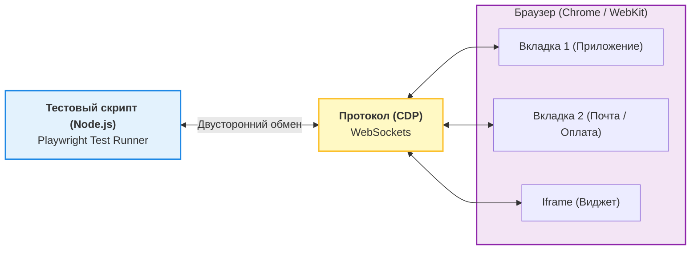

Долгое время на рынке E2E-тестирования доминировал Cypress. Он был прорывом по сравнению с неповоротливым Selenium, но имел архитектурный недостаток: Cypress запускался *внутри* вкладки браузера, в том же самом Event Loop, что и ваше приложение. Из-за этого он не мог тестировать несколько вкладок, тяжело работал с iframe и падал при редиректах на другие домены (например, при оплате через Stripe).

В ответ на эти боли Microsoft создал **Playwright** — инструмент нового поколения для автоматизации браузеров.

## 1. Как это работает (Архитектура)

Главная фишка Playwright — он общается с браузером извне (из Node.js процесса) через протоколы отладки (Chrome DevTools Protocol - CDP).



Благодаря этой архитектуре Playwright:
* Умеет управлять сразу несколькими вкладками и окнами.
* Понимает нативные браузерные события (скачивание файлов, перехват сетевых запросов).
* Не страдает от изоляции контекстов (cors, cross-origin).

## 2. Какую боль мы решаем?

### Боль 1: Ожидание элементов (Flaky tests)
В Selenium часто приходилось писать `sleep(2000)`, чтобы дождаться анимации или загрузки данных. В Playwright есть **Auto-waiting**.
Перед тем как кликнуть, Playwright сам проверяет, что элемент: прикреплен к DOM, видим, не скрыт анимацией и может получать события.

### Боль 2: Разбор падений в CI
Когда тест падает на сервере, понять причину по логам невозможно. Playwright предлагает **Trace Viewer**. Он записывает весь прогон теста в архив, который можно открыть в браузере и посмотреть: состояние DOM в каждую миллисекунду, сетевые запросы, скриншоты и консоль.

## 3. Практический пример: Мультивкладки и Локаторы

### Антипаттерн: Ручное ожидание и хрупкие селекторы (Наследие Selenium/Cypress)

```typescript
// ❌ ПЛОХО: Ждем времени и используем классы, которые изменятся
test('login', async ({ page }) => {
  await page.click('.btn-primary');
  await page.waitForTimeout(3000); // 🚨 Хрупко: А вдруг сеть лагнет на 3001мс?
  expect(await page.locator('.welcome-msg').innerText()).toBe('Привет');
});
```

### Как надо: Auto-waiting, User-facing Locators и Контексты

```typescript
// ✅ ХОРОШО: Ориентируемся на текст и доступность
import { test, expect } from '@playwright/test';

test('совершает покупку с подтверждением через email во второй вкладке', async ({ context }) => {
  // 1. Открываем магазин
  const shopPage = await context.newPage();
  await shopPage.goto('https://shop.com');
  
  // Кликаем по тексту, Playwright сам дождется, пока кнопка станет кликабельной (Auto-waiting)
  await shopPage.getByRole('button', { name: 'Купить' }).click();

  // 2. Открываем почту В ТОМ ЖЕ тесте (В Cypress это невозможно)
  const emailPage = await context.newPage();
  await emailPage.goto('https://mock-email.com');
  
  // 3. Ждем письмо
  const link = emailPage.getByRole('link', { name: 'Подтвердить заказ' });
  await link.click(); // Возвращает нас в магазин

  // Assert: Проверяем, что в первой вкладке обновился статус
  await expect(shopPage.getByText('Заказ подтвержден')).toBeVisible();
});
```

## 4. Скрытые трейдоффы и границы применимости

* **Оверхед на запуск:** Playwright запускает реальные браузеры. Если у вас 500 E2E тестов, они будут выполняться 15-30 минут даже в параллельном режиме. Не используйте Playwright для тестирования бизнес-логики (расчета налогов, парсинга дат), для этого есть юнит-тесты.
* **Обновления браузеров:** Playwright скачивает свои бинарники браузеров. Если ваша компания блокирует скачивание файлов через proxy, настройка CI превратится в ад для DevOps.
* **Trace Viewer весит много:** Полная запись трейсов для каждого теста быстро забьет диск на вашем CI. **Правило:** Включайте запись трейсов только при падении теста (`trace: 'retain-on-failure'`).
