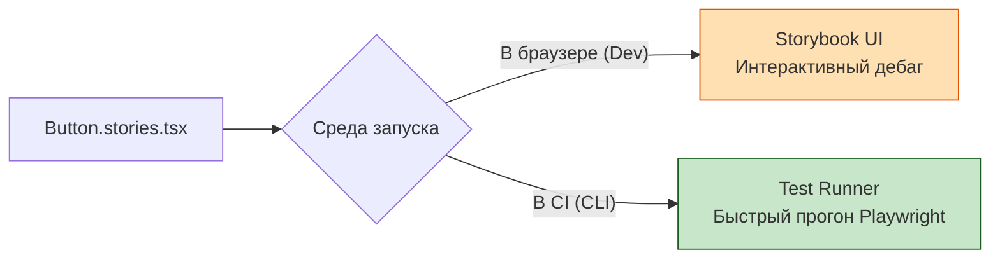

# Storybook Tests

## Что это и зачем нужно?

Исторически Storybook был просто "каталогом" или витриной UI-компонентов. Но со временем стало очевидно: раз мы уже рендерим компонент в изоляции (пишем Story), почему бы не написать на него тест прямо там?

Storybook Tests решают боль дублирования. Раньше приходилось писать Story для визуальной проверки и отдельный `.test.tsx` файл для Jest. Теперь с помощью `playwright` (под капотом `storybook/test-runner`) вы пишете **Interaction Tests** (тесты взаимодействия) прямо внутри сторибука.

## Как это работает на практике

Вы используете функцию `play` внутри Story. Storybook рендерит компонент в браузере, а затем выполняет скрипт: кликает, вводит текст и делает ассерты. Если тест упадет, вы увидите это прямо в UI Storybook с подсветкой ошибки.



### Пример использования

**Правильное решение:** Использование функции `play`.
```tsx
import type { Meta, StoryObj } from '@storybook/react';
import { userEvent, within, expect } from '@storybook/test';
import { LoginForm } from './LoginForm';

const meta: Meta<typeof LoginForm> = { component: LoginForm };
export default meta;

type Story = StoryObj<typeof LoginForm>;

export const SuccessfulLogin: Story = {
  // 1. Сначала рендерится эта сторя
  args: { onSuccess: console.log },
  // 2. Затем выполняется play-функция (тест)
  play: async ({ canvasElement }) => {
    // Canvas ограничивает область поиска только текущим компонентом
    const canvas = within(canvasElement);

    await userEvent.type(canvas.getByLabelText(/email/i), 'test@test.com');
    await userEvent.type(canvas.getByLabelText(/password/i), '12345');
    await userEvent.click(canvas.getByRole('button', { name: /submit/i }));

    // Проверяем результат (например, кнопка стала disabled)
    await expect(canvas.getByRole('button')).toBeDisabled();
  },
};
```

## Трейдоффы и границы применимости

1. **Оверхед на написание**: Писать полноценные E2E-подобные флоу внутри Storybook тяжело. Это лучше подходит для проверки сложных состояний отдельного компонента (например, валидация формы), а не целых страниц.
2. **Скорость в CI**: Запуск Storybook Test Runner требует сборки (или запуска) самого Storybook. Это медленнее, чем прогнать чистые юнит-тесты на Vitest.
3. **Хранение стейта**: Если ваш компонент зависит от глобального стейта (Redux/Zustand), вам придется писать сложные декораторы (Decorators) в Storybook для каждого теста, что усложняет код.
