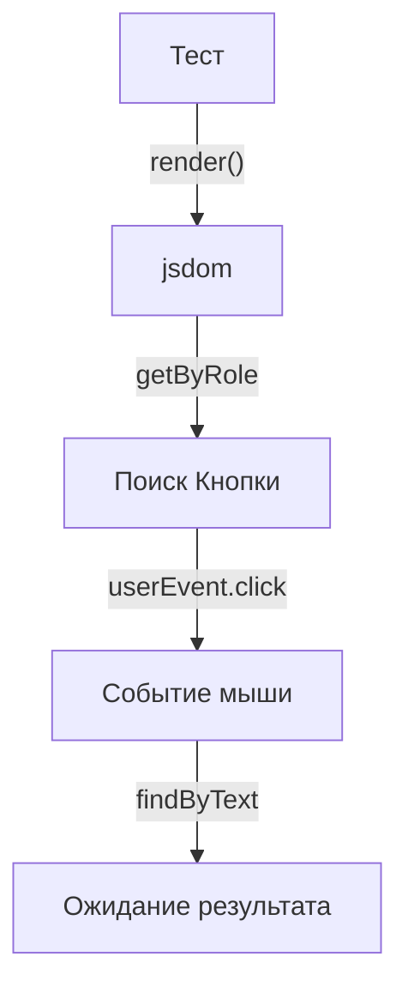

# Testing Library

## Что это и зачем нужно?

Testing Library (созданная Kent C. Dodds) — это набор утилит для тестирования, который произвел революцию во фронтенде, убив популярный тогда Enzyme.

Её главная философия: **"Чем больше ваши тесты похожи на то, как используется ваша программа, тем больше уверенности они вам дают."**
Она решает боль "хрупких тестов". Раньше разработчики тестировали детали реализации: вызывали внутренние методы компонентов, проверяли локальный State. При любом рефакторинге (например, переходе на React Hooks) тесты падали, хотя для пользователя ничего не менялось.

## Как это работает на практике

Testing Library не работает с компонентами React напрямую. Она рендерит их в виртуальный DOM (`jsdom`) и дает вам API для поиска элементов на экране точно так же, как это делает пользователь (по тексту, по роли, по label-у).



### Пример использования

**Антипаттерн (Enzyme-style):** Тестирование реализации.
```tsx
const wrapper = shallow(<Counter />);
wrapper.find('button').simulate('click');
expect(wrapper.state('count')).toBe(1); // Тест сломается, если мы заменим стейт на Redux
```

**Правильное решение (Testing Library):** Тестирование поведения (Behavior).
```tsx
import { render, screen } from '@testing-library/react';
import userEvent from '@testing-library/user-event';
import { Counter } from './Counter';

test('увеличивает счетчик при клике', async () => {
  render(<Counter />);
  
  // Пользователь ищет кнопку по тексту/роли, а не по CSS-классу
  const button = screen.getByRole('button', { name: /увеличить/i });
  
  // Симуляция реального клика со всеми фазами (hover, mousedown, mouseup)
  await userEvent.click(button);
  
  // Пользователь видит результат на экране
  expect(screen.getByText('Счет: 1')).toBeInTheDocument();
});
```

## Трейдоффы и границы применимости

1. **Проблема `act(...)`**: При асинхронных обновлениях стейта React может ругаться ошибкой "Warning: An update to Component inside a test was not wrapped in act(...)". Отладка этой ошибки — главная головная боль при использовании Testing Library.
2. **Асинхронные интерфейсы**: Использование `findBy` (который ждет появления элемента) требует хорошего понимания асинхронности (Promises). Если компонент делает запрос к API, нужно правильно настроить моки (например, MSW), иначе тест упадет по таймауту.
3. **Медленные запросы**: Запросы вроде `getByRole` (в отличие от `getByTestId`) могут работать довольно медленно в очень больших DOM-деревьях, так как вычисляют доступность (a11y tree) "на лету".
