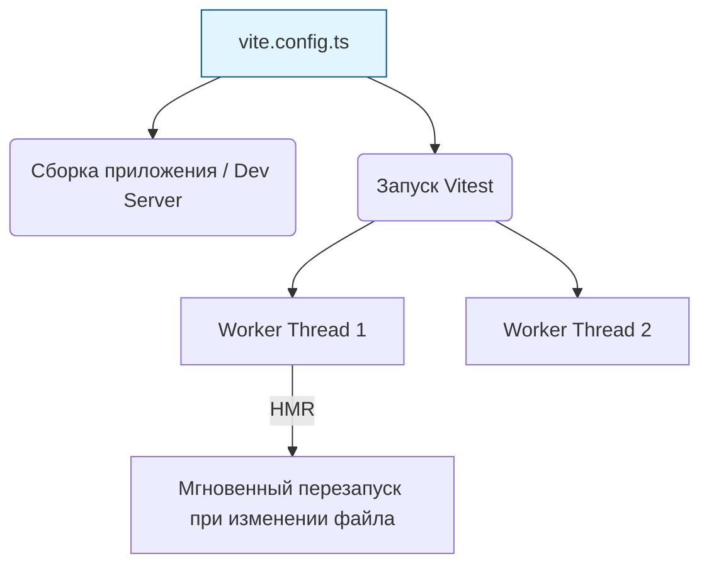

# Vitest

## Что это и зачем нужно?

Vitest — это современный тест-раннер нового поколения. Он решает фундаментальную архитектурную боль экосистемы Vite.

Если вы пишете приложение на Vite (который использует ESM и esbuild/Rollup), а тесты прогоняете через Jest (который использует CommonJS и Babel), у вас получается **два разных пайплайна**. Вам приходится дважды настраивать алиасы, трансформацию файлов, моки переменных окружения. Код в тестах работает не совсем так, как в браузере.

Vitest использует тот же самый конвейер (конфиг Vite), что и ваше приложение. Он невероятно быстр благодаря HMR (Hot Module Replacement) и нативно поддерживает TypeScript и ESM.

## Как это работает на практике

Vitest имеет API, почти на 100% совместимый с Jest (`describe`, `it`, `expect`, `vi.fn()` вместо `jest.fn()`). Миграция с Jest на Vitest обычно занимает минимум времени.



### Пример использования

Конфигурация общая для сборки и тестов.

**Правильное решение (`vite.config.ts`):**
```typescript
/// <reference types="vitest" />
import { defineConfig } from 'vite';
import react from '@vitejs/plugin-react';

export default defineConfig({
  plugins: [react()],
  test: {
    environment: 'jsdom', // Симулируем браузер для React-компонентов
    setupFiles: './setupTests.ts', // Файл, который запускается перед всеми тестами
    globals: true, // Позволяет не писать import { test, expect } from 'vitest' в каждом файле
    coverage: {
      provider: 'v8', // Очень быстрый сборщик покрытия из движка V8
      reporter: ['text', 'html'],
    },
  },
});
```

В самом коде вы просто пишете тесты, как привыкли в Jest:
```typescript
import { vi, test, expect } from 'vitest';

test('spy works', () => {
  const spy = vi.fn();
  spy('hello');
  expect(spy).toHaveBeenCalledWith('hello');
});
```

## Трейдоффы и границы применимости

1. **Экосистема**: Jest существует много лет, и для него есть плагины на любой случай жизни. В Vitest некоторые редкие плагины или кастомные трансформеры могут не работать.
2. **Мокирование ESM**: Мокать ES-модули (через `vi.mock()`) концептуально сложнее, чем CommonJS (`require`). Иногда возникают нюансы с порядком инициализации модулей.
3. **Не для всех**: Если у вас старый legacy-проект на Webpack/Babel, переход на Vitest потребует перевода всего билда на Vite. Это может быть неоправданно дорогой задачей (хотя и полезной).
