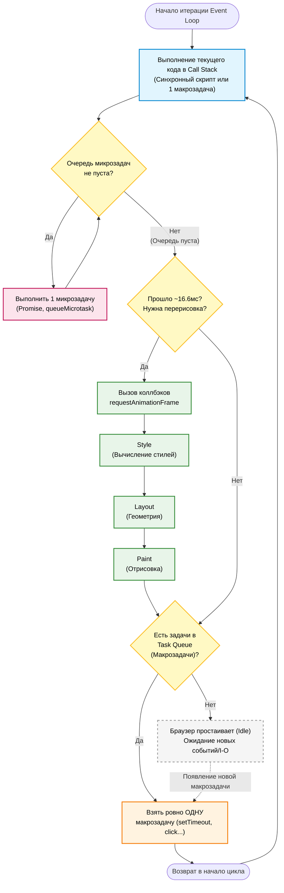

# Event Loop (Цикл событий) в JavaScript

**Event Loop** — это механизм, который координирует выполнение кода, сбор и обработку событий, а также выполнение подзадач в однопоточной среде. Он позволяет JavaScript выполнять асинхронные операции (сетевые запросы, таймеры, реакции на действия пользователя), не блокируя основной поток (Main Thread) и интерфейс браузера.

Код каждой HTML-страницы в браузере выполняется в **Main Thread**. Это основной поток, где браузер выполняет JS, делает перерисовки (рендер), обрабатывает пользовательские действия и многое другое. Важно понимать, что асинхронность берется не из самого языка JavaScript, а предоставляется окружением (браузером или Node.js).

![[event-loop.png]]

---

## 🏗 Архитектура: Движок vs Браузер

Сам по себе JavaScript-движок не умеет в асинхронность. Он лишь выполняет код, который ему передают. Асинхронность — это результат работы целой системы браузера:

1. **JS Engine (Движок)** — выполняет код. Состоит из:
   - **Heap (Куча)** — неструктурированная область памяти, где хранятся объекты (здесь же работает Garbage Collector).
   - **Call Stack (Стек вызовов)** — структура данных LIFO (последним пришёл — первым ушёл), куда попадают вызовы функций. Пока стек не пуст, никакой другой код не может быть выполнен.
2. **Web APIs** — интерфейсы, предоставляемые браузером, которые работают **вне** JS-потока. Это `setTimeout`, `fetch`, `DOM-события`, `WebSockets`. Когда JS вызывает `setTimeout`, отсчет времени ведет браузер, а не JS-движок.
3. **Очереди задач (Task Queues)** — места, куда Web APIs складывают коллбэки (функции обратного вызова) после завершения своих фоновых операций.

---

## 🚦 Виды очередей задач

Event Loop оперирует двумя основными очередями, которые имеют критически важные различия в приоритете:

### 1. Macrotask Queue (Очередь макрозадач / Task Queue)
Сюда попадают тяжелые или отложенные задачи:
- Коллбэки таймеров: `setTimeout`, `setInterval`.
- Обработчики UI-событий: `click`, `scroll`, `input`.
- I/O операции, `postMessage`.
> **Ключевое правило:** За одну итерацию Event Loop из этой очереди берется и выполняется **только одна** макрозадача.

### 2. Microtask Queue (Очередь микрозадач)
Очередь с наивысшим приоритетом. Сюда попадают задачи, которые нужно выполнить «сразу после текущего кода, но до любых других событий»:
- Промисы: `Promise.then()`, `.catch()`, `.finally()`.
- Код после `await` (под капотом это те же промисы).
- `MutationObserver` (наблюдение за изменениями DOM).
- `queueMicrotask(fn)`.
> **Ключевое правило:** Event Loop не перейдет к рендерингу или макрозадачам, пока **полностью не опустошит** очередь микрозадач. Если микрозадача порождает новую микрозадачу, она будет выполнена в этом же цикле.

---

## 🔄 Жизненный цикл (Порядок выполнения)

На каждой итерации (тике) Event Loop происходит следующий строго регламентированный алгоритм:

1. **Синхронный код:** Выполняется весь синхронный код (Call Stack заполняется и опустошается).
2. **Микрозадачи:** Очередь микрозадач дренируется **полностью**. Выполняются все `then`/`await`.
3. **Рендеринг (Rendering):** Браузер проверяет, нужна ли перерисовка экрана (обновление DOM). Если да, выполняются шаги рендеринга (подробнее ниже).
4. **Макрозадача:** Из Task Queue берется ровно **одна** макрозадача и переносится в Call Stack для выполнения.
5. **Возврат к шагу 2.**

```javascript
// Наглядный пример порядка выполнения:
console.log("1 — sync");

setTimeout(() => console.log("4 — macrotask"), 0);

Promise.resolve()
  .then(() => console.log("3 — microtask"))
  .then(() => console.log("3.5 — microtask 2"));

console.log("2 — sync");

// Вывод: 1 → 2 → 3 → 3.5 → 4
```

---

## 🎨 Шаг рендеринга и 16ms бюджет

Браузер нацелен на выдачу 60 кадров в секунду (60 FPS). Это значит, что на один кадр выделяется **~16.67 мс**. Если выполнение кода (Call Stack) занимает больше времени, интерфейс «виснет» (падает FPS).

Сам процесс рендеринга состоит из этапов:
1. `requestAnimationFrame` коллбэки.
2. **Style** — вычисление CSS-правил.
3. **Layout / Reflow** — расчёт размеров и геометрии элементов.
4. **Paint** — отрисовка пикселей (создание слоев).
5. **Composite** — сборка слоев видеокартой в итоговую картинку.

### Анимации и `requestAnimationFrame` (rAF)
`rAF` — это специальная функция, коллбэк которой браузер вызывает **непосредственно перед** шагом Layout/Paint. Это идеальное место для JS-анимаций, так как гарантируется, что кадр не будет пропущен, в отличие от `setTimeout`, который может сработать не вовремя.

### Layout Thrashing (Forced Reflow)
Если в цикле одновременно изменять стили (`el.style.width = ...`) и читать их геометрию (`el.offsetWidth`), браузер вынужден **синхронно пересчитывать Layout прямо посреди выполнения JS**. Это невероятно ресурсоёмкая операция. Правильный подход: сначала всё прочитать, затем всё записать.

---

## ⚠️ Нюансы и подводные камни

- **Microtask Starvation (Голодание микрозадач):** Так как очередь микрозадач очищается целиком, рекурсивный вызов промисов (`function loop() { Promise.resolve().then(loop); }`) намертво завесит страницу. Рендеринг и макрозадачи никогда не получат управление. Для обхода используют `setTimeout`.
- **`setTimeout(fn, 0)` не срабатывает мгновенно:** Коллбэк ставится в очередь макрозадач и ждет, пока очистятся микрозадачи и пройдет рендер. По спецификации минимальная задержка вложенных таймеров составляет ~4мс.
- **Web Workers:** Единственный способ настоящей многопоточности в браузере. Воркере работают в изолированном потоке, имеют свой V8 инстанс, свой Event Loop, но не имеют доступа к DOM. Общение с Main Thread идет через асинхронный `postMessage`.

---

## 🛠 Современные API шедулинга (Продвинутый уровень)

- `queueMicrotask(fn)` — удобный современный способ добавить задачу в конец очереди микрозадач (замена костылю `Promise.resolve().then()`).
- `requestIdleCallback(fn)` — выполняет коллбэк в «мёртвое время», когда браузер простаивает между кадрами. Идеально для тяжелой аналитики, предзагрузки данных.
- **Prioritized Task Scheduling API:** `scheduler.postTask(fn, { priority })` — позволяет гибко управлять приоритетами (`user-blocking`, `user-visible`, `background`).
- `scheduler.yield()` *(новейшее API)* — позволяет прервать долгую JS-задачу, отдать браузеру время на рендер (чтобы страница не зависла), и вернуться к выполнению кода с высшим приоритетом (в обход конца макро-очереди).

---

## ⚙️ Движки JavaScript
*Напоминание: движки занимаются парсингом, компиляцией в машинный код (JIT), оптимизациями и очисткой памяти. Event Loop реализуется средой (браузером), в которую встроен движок.*
- **V8** — Chrome, Edge, Node.js, Deno
- **SpiderMonkey** — Firefox
- **JavaScriptCore (Nitro)** — Safari
- *(Chakra — старый движок Edge, сейчас Edge работает на V8)*




---

## 🔗 Полезные ссылки
- **Визуализаторы:**
  - [JSv9000 (Visualized: Event Loop 1)](https://www.jsv9000.app/)
  - [JELoop Visualizer (Visualized: Event Loop 2)](https://kamronbekshodmonov.github.io/JELoop-Visualizer/)
- **Видео:**
  - [Philip Roberts: What the heck is the event loop anyway?](https://www.youtube.com/watch?v=8aGhPhVfaqM) *(Золотая классика)*
  - [In The Loop - Jake Archibald](https://www.youtube.com/watch?v=cCOL7MC4Pl0) *(Отличное видео про микротаски и рендер)*
- **Статьи:**
  - [Event Loop and the Big Picture](https://blog.xnim.me/event-loop-and-render-queue)
  - [MDN: Справочник по Event Loop](https://developer.mozilla.org/ru/docs/Web/JavaScript/Event_loop)
