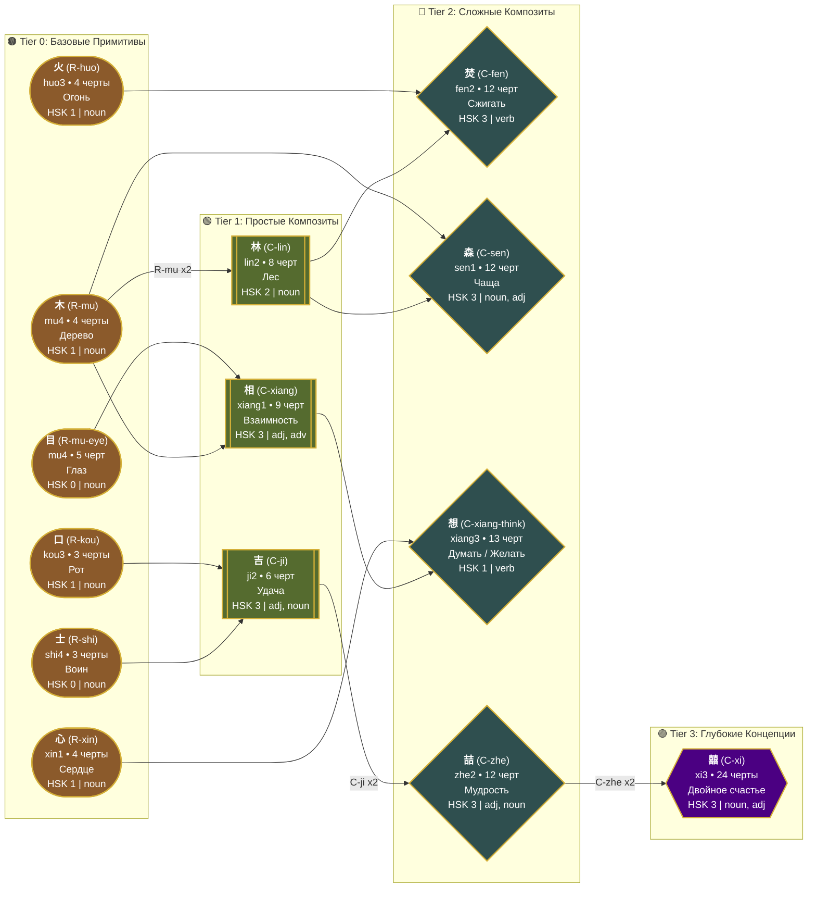
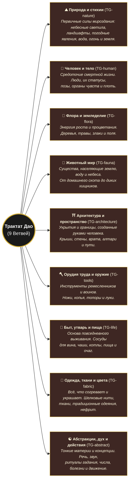
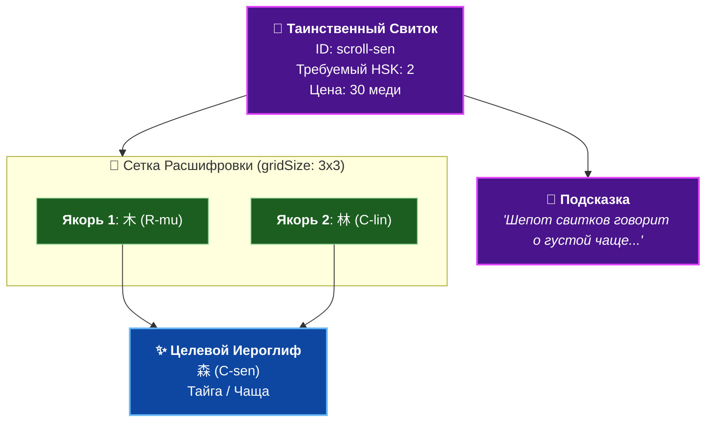
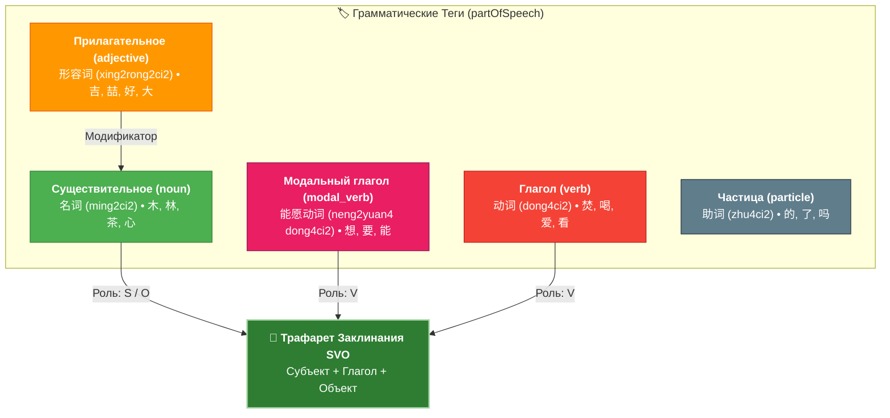
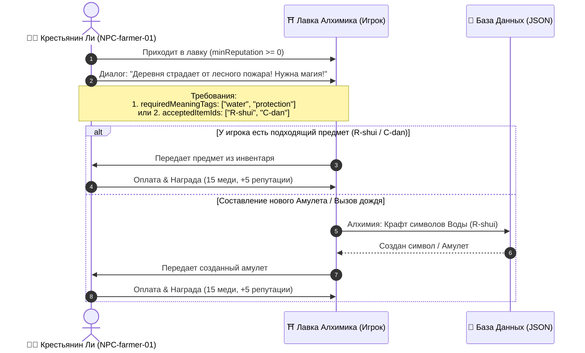

# Архитектура Данных и Игровые Механики "Dao of Ink"

## 1. Прогрессия Иероглифов и Направленный Ациклический Граф (DAG Crafting)

---

## 2. Древо Групп Радикалов (Трактат Дао / `radical-group.json`)

---

## 3. Механика Расшифровки Таинственных Свитков (`mystery-scrolls.json`)

---

## 4. Грамматические Категории и Режим Амулетов (`formulas.json`)

---

## 5. Цикл Исполнения Заказов Клиентов (`customers.json`)

