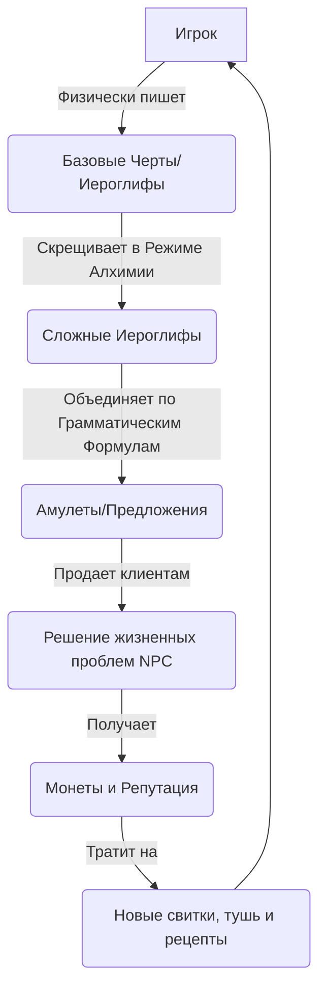

# Часть 1: Обзор игры (Game Overview) — «Мастерская Смыслов: Дао Иероглифа»

## 1.1. Концептуальное ядро
**«Мастерская Смыслов: Дао Иероглифа» (Dao of Ink)** — это медитативный однопользовательский симулятор лавки каллиграфа и алхимика слов в эстетике древнекитайского фэнтези (Сянься/Уся). 

Игра объединяет тактильный игровой процесс создания предметов (крафтинг) с образовательной методикой изучения китайского языка (стандарт HSK 1-3+). Игрок не просто учит слова по карточкам; он проживает их значение, создавая физические артефакты для решения проблем виртуальных посетителей.

---

## 1.2. Анализ ключевых референсов и заимствований

Игра переосмысляет популярные механики инди-игр, адаптируя их под образовательные цели:

| Референс | Что заимствуется | Как адаптируется в Dao of Ink |
| :--- | :--- | :--- |
| **Potion Craft: Alchemist Simulator** | • Тактильный интерфейс • Физическое взаимодействие с ингредиентами • Карта алхимии | • Игрок физически перетаскивает радикалы на бумаге. • Вместо варки зелий игрок занимается «алхимией иероглифов» (слияние радикалов `氵` + `木` = `沐`). • Процесс растирания туши на камне (ASMR-механика). |
| **Thaumcraft (мод для Minecraft)** | • Система исследований на гексагональной сетке | • Расшифровка древних свитков. • Соединение базовых иероглифов (ключей) через семантические или морфологические связи для открытия новых слов. |
| **Papers, Please** | • Взаимодействие с клиентами через прилавок • Контекстные диалоги | • NPC приходят с конкретной человеческой бедой. • Игрок должен правильно интерпретировать запрос и подобрать/создать нужный иероглиф или амулет-предложение. |
| **Anki / SuperMemo** | • Алгоритмы интервального повторения (SRS) | • Система утренней медитации (тестирование написания черт). • Частота появления иероглифов в квизах зависит от того, насколько успешно игрок воспроизводит их на холсте. |

---

## 1.3. Жанр, Платформа и Технологический стек

*   **Жанр:** Crafting Simulator (Симулятор ремесла), Puzzle (Головоломка), Educational (Обучающая игра / Serious Game).
*   **Платформа:** Web-браузер (первичный фокус — Desktop с поддержкой мыши; вторичный — Tablet с поддержкой стилуса/пальца).
*   **Стек технологий:**
    *   **Frontend-фреймворк:** Vue 3 (Composition API) для реактивного интерфейса.
    *   **Логика и типизация:** TypeScript (строгая типизация состояний игры, рецептов и грамматики).
    *   **Управление состоянием:** Pinia (разделение на сторы: `playerStore`, `inventoryStore`, `dictionaryStore`, `clientStore`).
    *   **Отрисовка иероглифов:** Hanzi Writer API (библиотека на базе SVG для контроля порядка черт и распознавания жестов).
    *   **Искусственный Интеллект:** LLM API (GPT-4o mini / Claude 3.5 Haiku) через защищенный прокси-сервер для динамической генерации лора, проверки грамматики предложений и обработки кастомных диалогов.

---

## 1.4. Целевая аудитория

1.  **Изучающие китайский язык (HSK 1 - 3):** Люди, уставшие от рутинного зазубривания карточек в Anki/Quizlet и ищущие контекстное, геймифицированное применение знаний.
2.  **Любители инди-крафтингов:** Игроки, ценящие медитативный геймплей, визуальный стиль "коричневой бумаги" и ASMR-звуки (как в *Potion Craft* или *Strange Horticulture*).
3.  **Поклонники восточной эстетики:** Люди, интересующиеся китайской каллиграфией, даосизмом, чаем и восточной философией.

---

## 1.5. Ключевые УТП (Уникальные торговые предложения)
*   **Физическое письмо как геймплей:** Вы не выбираете ответ из вариантов, вы *пишете* иероглиф на виртуальной бумаге, чувствуя сопротивление кисти.
*   **Семантическая алхимия:** Буквальное соединение смыслов. Понимание того, почему «Человек» + «Дерево» = «Отдых» (`人` + `木` = `休`).
*   **Синтаксис как магия:** Изучение грамматики через создание амулетов-заклинаний, где слова должны стоять на строго определенных позициях (потоках Ци).
*   **Живой мир через LLM:** Уникальные клиенты, которые реагируют на ваши свитки не заготовленными фразами, а контекстными ответами, учитывающими смысл написанного.
