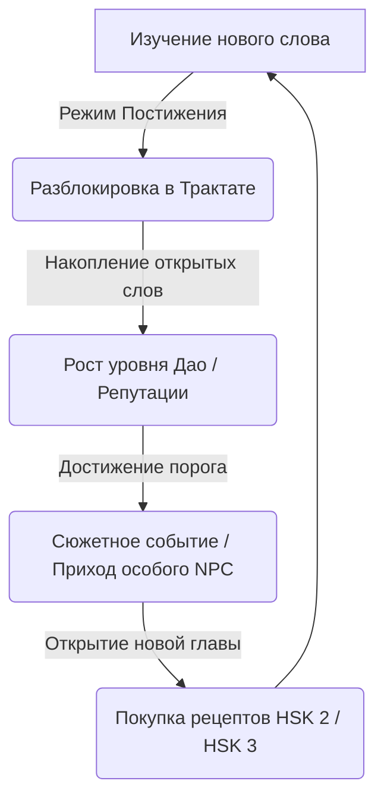

# Часть 2: Глобальная цель игры и Нарратив (Narrative & Metagame)

## 2.1. Сюжетная завязка
Вы — молодой послушник (или послушница) в горной провинции древнего Китая. Ваш учитель, старый мастер каллиграфии и даосской алхимии слов, внезапно исчез (по слухам, совершил «Слияние с Дао» или был призван к императорскому двору для тайной работы). 

Он оставил вам заброшенную лавку, полную пыльных полок, старый письменный стол и **«Утраченный Небесный Трактат» (失落的天书 - Shīluò de Tiānshū)**. Это легендарный артефакт, страницы которого чисты, а обложка сияет блеклым золотым светом. 

Легенда гласит: тот, кто заполнит все пустоты в Трактате правильными иероглифами и грамматическими формулами, познает истинный язык Небес, обретет гармонию и сможет раскрыть тайну исчезновения Мастера.

---

## 2.2. Мета-игра и «Утраченный Небесный Трактат»

Трактат служит глобальным игровым хабом прогресса и визуальным представлением игрового словаря. Он заменяет скучную «таблицу достижений» интерактивной книгой.

### Структура Трактата
Книга разделена на три великих тома (соответствующих уровням HSK):

1.  **Том Земли (Уровень Ученика / HSK 1):**
    *   *Тематика:* Базовые стихии, простые предметы, числа, фундаментальные действия.
    *   *Цель:* Восстановить 150 базовых слов и 5 простых синтаксических формул.
    *   *Визуальный эффект:* Страницы выглядят как грубая коричневая рисовая бумага. Рисунки тушью простые, схематичные.

2.  **Том Человека (Уровень Подмастерья / HSK 2):**
    *   *Тематика:* Социальные взаимодействия, эмоции, направления движения, время, покупки, простые составные концепты.
    *   *Цель:* Открыть еще 150 слов (итого 300) и 10 формул грамматики.
    *   *Визуальный эффект:* Бумага становится более гладкой, желтоватого оттенка. Появляются цветные акценты (печать киноварью, золотые нити переплета).

3.  **Том Неба (Уровень Мастера / HSK 3):**
    *   *Тематика:* Философия, абстрактные понятия, сравнения, сложные глаголы, союзы.
    *   *Цель:* Открыть 300+ дополнительных слов (всего 600+) и овладеть продвинутым синтаксисом.
    *   *Визуальный эффект:* Тончайший белый шелк с золотым тиснением. Каллиграфия начинает слабо светиться при наведении курсора.

---

## 2.3. Структура прогресса и Сюжетные вехи (Milestones)

Сюжет продвигается вперед через визиты особых (сюжетных) клиентов. Они приходят в лавку, когда Репутация (Дао) игрока достигает определенных значений.

### Веха 1: Пробуждение Силы (Начало HSK 1)
*   **Условие:** Первый запуск игры.
*   **Событие:** В лавку забредает местный крестьянин. В его колодце пропала вода из-за засухи. Вы дарите ему простую табличку с иероглифом Воды (`水`). Иероглиф начинает светиться на его глазах, а в колодце прибывает влага. Это подтверждает, что вы унаследовали магическую силу Мастера.

### Веха 2: Испытание Чиновника (Переход к HSK 2)
*   **Условие:** Открыто 80% слов Тома Земли.
*   **Событие:** Приезжает высокомерный Императорский Налоговый Чиновник. Он требует написать защитный амулет для его кареты от грабителей. Если игрок справляется (используя правильную грамматическую конструкцию защиты), чиновник официально разрешает лавке вести торговлю редкими свитками и открывает доступ к товарам странствующих монахов HSK 2.

### Веха 3: Встреча со Снежной Лисой (Переход к HSK 3)
*   **Условие:** Открыто 80% слов Тома Человека.
*   **Событие:** Ночью в закрытую лавку проникает раненый Хули-цзин (Девятихвостая Лиса) в человеческом облике. Ей нужно не простое слово, а сложное заклинание исцеления души и тела. Успешное составление амулета открывает доступ к Томе Неба и самым абстрактным концепциям игры.

### Веха 4: Великое слияние (Финал игры)
*   **Условие:** Заполнены все 600+ слотов в Трактате.
*   **Событие:** Трактат полностью загорается золотым пламенем, на столе материализуется прощальное письмо Учителя. Он сообщает, что вы превзошли его, и теперь вы — Хранитель Смыслов Империи. Открывается бесконечный Sandbox-режим (песочница) с генерацией сложнейших запросов от духов и богов.

---

## 2.4. Технические аспекты хранения прогресса
*   **Словарь игрока (`dictionaryStore`):** Хранит массив объектов иероглифов. Каждый объект содержит ID HSK, статус (не изучен / фантом на столе постижения / изучен), историю SRS (интервального повторения), дату последней каллиграфической практики.
*   **Состояние Трактата (`treatiseStore`):** Отвечает за рендеринг книги. Для оптимизации книга рендерится как 3D-книга (или псевдо-3D через CSS Transforms) с отрисовкой только текущих открытых страниц.
*   **Триггеры событий:** Нарративный движок постоянно слушает изменение уровня Репутации. При совпадении с ID вехи, в очередь клиентов (`clientStore.queue`) насильно добавляется сюжетный персонаж, блокируя приход обычных клиентов, пока квест не будет сдан или провален.
