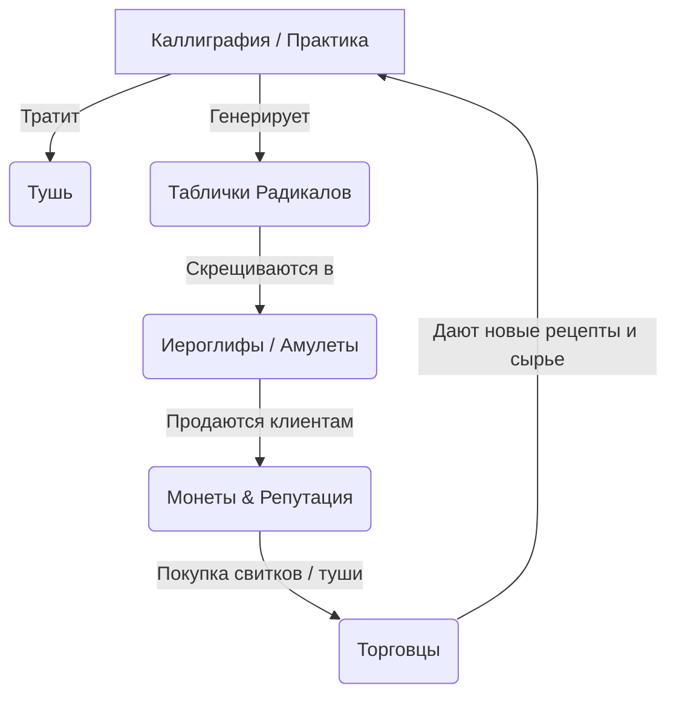

# Часть 4: Экономика и Ресурсы (Economy & Resources)

## 4.1. Основные ресурсы и валюты

Игровая экономика спроектирована как замкнутый цикл, где знания игрока напрямую конвертируются в материальные и духовные ресурсы.



### 1. Монеты (Валюта торговли)
Делятся на три номинала: **Медные (铜钱)**, **Серебряные (银两)** и **Золотые (金币)**.
*   *Курс обмена:* 1 Золотая = 100 Серебряных, 1 Серебряная = 100 Медных.
*   *Источники:* Продажа готовых свитков и амулетов клиентам; выполнение особых поручений чиновников.
*   *Траты:* Покупка новых Загадочных Свитков (рецептов), Грамматических Формул, качественной туши, баночек с водой или редких коллекционных кистей.

### 2. Репутация «Дао» (道 - Уровень духовного признания)
*   *Суть:* Очки опыта игрока. Не тратится напрямую (за исключением особых «кармических» выборов в диалогах).
*   *Источники:* Идеально написанные иероглифы в режиме квиза (SRS), точное попадание в запрос сложного клиента, составление красивых амулетов без подсказок.
*   *Влияние:* Открывает новые тома Трактата (HSK-уровни), разблокирует приход более богатых клиентов (купцы, генералы, духи) и снижает цены у странствующих торговцев.

### 3. Тушь (墨 - Расходный материал)
*   *Суть:* Магический лимит действий на день. Отображается в виде шкалы в каменной тушенице (Дуаньси) на столе.
*   *Расход:* Тратится на физическое написание базовых черт. Написание простого иероглифа (например, `口` - рот, 3 черты) тратит 3 единицы туши. Написание сложного (например, `囊` - мешок, 22 черты) тратит 22 единицы.
*   *Пополнение:*
    *   **ASMR-активность «Растирание тушеницы»:** Игрок берет брусок сухой туши, капает воду на камень и делает круговые движения мышкой. Это бесплатно, но тратит игровое время.
    *   **Покупка готовой жидкой туши:** Быстрое пополнение за монеты у торговцев.

### 4. Деревянные таблички Радикалов (Сырье)
*   *Суть:* Материальное воплощение базовых графем и ключей (например, `木` - дерево, `氵` - вода, `火` - огонь).
*   *Хранение:* Хранятся на деревянных полках над рабочим столом. Количество ограничено объемом полок (апгрейдится за золото).
*   *Как добыть:*
    *   Успешная утренняя практика (интервальное повторение) дает таблички тех иероглифов, которые игрок практиковал.
    *   Покупка у торговцев древесиной/минералами.
*   *Использование:* Полностью расходуются при алхимическом скрещивании слов.

---

## 4.2. Механика Торговли с NPC

В полдень к прилавку могут подойти торговцы. Торговля происходит через физическое взвешивание на весах (скевоморфный UI).

1.  **Интерфейс весов:** Слева — чаша торговца (туда кладутся его товары: Свитки, Чертежи формул, Сырье). Справа — чаша игрока (туда игрок кладет монеты или свои готовые амулеты/иероглифы на продажу).
2.  **Баланс ценности:** Стрелка весов показывает разницу в цене. Сделка совершается только тогда, когда чаша игрока весит столько же или больше, чем чаша торговца.
3.  **Торг (Торговые диалоги):** Игрок может попытаться снизить цену, предложив торговцу редкий каллиграфический свиток с благопожеланием (например, амулет «Богатство и Процветание» - `吉祥如意`).

---

## 4.3. Технические параметры Ресурсов (JSON-структура Состояния)

Состояние ресурсов игрока хранится в Pinia-сторе `playerStore.ts` и выглядит следующим образом:

```typescript
interface PlayerState {
  currency: {
    copper: number; // Медные монеты
    silver: number; // Серебряные монеты
    gold: number;   // Золотые монеты
  };
  reputation: {
    current: number; // Текущий уровень Дао
    tier: number;    // Ранг (1 - Ученик, 2 - Подмастерье, 3 - Мастер)
  };
  ink: {
    current: number; // Текущий объем туши (0 - 100)
    max: number;     // Максимальный объем (повышается покупкой лучших тушениц)
  };
  shelves: {
    slotsCount: number; // Общий размер полки для радикалов
    items: Array<{
      character: string; // Иероглиф радикала (например, '木')
      quantity: number;  // Количество табличек на полке
    }>;
  };
}
```
*Для транзакций в сторе прописываются экшены `addCurrency`, `spendCurrency`, `modifyInk` с проверками на отрицательный баланс, возвращающими промисы для синхронизации анимаций золотых монет.*
