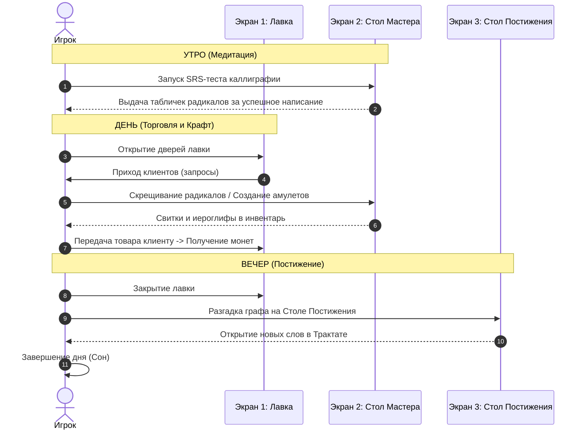

# Часть 5: Игровой цикл и Структура времени (Game Loop & Time)

## 5.1. Игровой День как базовая единица времени

Вся игра структурирована по игровым Дням. Время не идет в реальном времени непрерывно; вместо этого день делится на три дискретные фазы (Утро, День, Вечер). Переход между фазами инициируется действиями игрока, что исключает стресс и позволяет играть в комфортном медитативном темпе.

---

## 5.2. Фазы игрового дня

### Фаза 1: Утро (Медитация и Каллиграфия)
*   **Игровой контекст:** Солнечные лучи пробиваются сквозь бамбуковые жалюзи. Звучит утреннее пение птиц. Лавка еще закрыта.
*   **Активность:** Игрок садится за стол в режиме каллиграфии. Система выбирает 5-10 иероглифов, требующих повторения согласно алгоритму SRS.
*   **Игровой процесс:**
    1.  Игрок видит перевод слова и слышит аудио-произношение.
    2.  Игрок пишет иероглиф кистью на бумаге.
    3.  За каждый успешный иероглиф (написанный без подсказок) игрок получает физические таблички этого радикала/слова на свои полки.
*   **Завершение фазы:** Фаза заканчивается автоматически, когда весь список утренней практики исчерпан или игрок решает пропустить ее (теряя возможность получить бесплатные таблички).

### Фаза 2: День (Торговля и Крафт)
*   **Игровой контекст:** Двери лавки открываются, слышен шум улицы, приходят посетители.
*   **Активность:** Центральная фаза игры.
*   **Игровой процесс:**
    1.  У прилавка появляется NPC. Над ним висит облако мыслей с его бедой (на русском/английском языке с постепенным добавлением китайских слов по мере роста уровня).
    2.  Игрок переходит на Стол Мастера, чтобы собрать нужный ответ:
        *   Либо скрещивает базовые элементы в режиме Алхимии.
        *   Либо накладывает грамматический трафарет и собирает предложение на Амулете.
    3.  Игрок отдает свиток NPC. Получает оплату и репутацию.
    4.  В этой же фазе могут заходить бродячие торговцы, предлагая купить уникальные свитки рецептов.
*   **Завершение фазы:** Фаза завершается кнопкой «Закрыть лавку на ночь», когда уходят все дневные клиенты (обычно 3-5 клиентов в день).

### Фаза 3: Вечер (Постижение и Подготовка)
*   **Игровой контекст:** За окном ночь, горит свеча, потрескивает фитиль. Слышны цикады.
*   **Активность:** Время для учебы и улучшения лавки.
*   **Игровой процесс:**
    1.  Игрок переходит к Столу Постижения. Здесь он может положить купленный за день «Загадочный Свиток».
    2.  Запускается мини-игра «Связующий граф», разгадав которую, игрок навсегда вписывает новое слово в Трактат и открывает его лор.
    3.  Игрок может потратить заработанные деньги на улучшение лавки (покупка более емких полок, лучшей тушеницы, которая снижает расход туши, покупка справочников).
*   **Завершение фазы:** Нажатие кнопки «Лечь спать». Показывается экран статистики дня (Заработано монет, получено очков Дао, выучено новых слов). Состояние сохраняется, наступает новое Утро.
