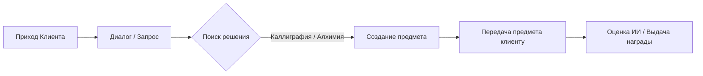

# Часть 6: Основные Игровые Экраны и Механики (Screens & Core Mechanics)

## 6.1. Экран 1: Лавка (The Shop)

Этот экран отвечает за интерактивное общение с клиентами и погружение в нарратив.



### Основные элементы экрана:
1.  **Прилавок и Персонаж:** Слева отображается полуростовой спрайт пришедшего NPC (анимированный эффект дыхания, смена эмоций при подаче товара).
2.  **Свиток Диалога (Диалоговое окно):** Текст стилизован под вертикальное или горизонтальное письмо. Здесь отображается запрос клиента.
3.  **Зона передачи товара (Active Slot):** Физическое гнездо на прилавке, куда игрок перетаскивает готовую деревянную табличку иероглифа или амулет из инвентаря.

---

## 6.2. Экран 2: Стол Мастера (The Master's Desk)

Центральный интерактивный хаб. Переключение режимов происходит через смену подложки на столе (кликом по ярлыкам в правой части экрана).

### Режим А: Каллиграфия (Calligraphy Mode / SRS)
Этот режим реализует проверку знаний и генерацию сырья (табличек радикалов).

*   **Как это работает:**
    1.  На листе бумаги отображается пиньинь и перевод слова: например, `rén (Человек)`.
    2.  Игрок должен кистью (курсором мыши или стилусом) нарисовать иероглиф.
    3.  Отрисовку и проверку порядка черт контролирует встроенная библиотека **Hanzi Writer**. Она отслеживает координаты курсора и сопоставляет их с эталонным SVG-контуром черт.
    4.  **Порядок черт (Stroke Order):** Правила каллиграфии строгие. Если игрок рисует черту в неверном направлении или нарушает порядок (например, пишет горизонтальную черту после вертикальной, когда нужно наоборот), линия подсвечивается красным, и тушь расходуется, но черта не засчитывается.
*   **Механика «Прозрение» (Hint):**
    *   Если игрок забыл, как пишется знак, он может кликнуть на иконку «Прозрение».
    *   На бумаге появляется полупрозрачный силуэт иероглифа с указанием стрелками порядка написания черт.
    *   *Штраф:* Игрок получает только 1 табличку радикала вместо 3 за безошибочное написание по памяти.

---

### Режим Б: Алхимия (Alchemy Mode / Скрещивание)
Механика объединения радикалов в сложные иероглифы.

*   **Процесс:**
    1.  Игрок берет табличку радикала `人` (Человек) с полки и кладет на рабочий холст.
    2.  Берет вторую табличку `木` (Дерево) и перетаскивает ее так, чтобы она пересеклась с первой табличкой.
    3.  Происходит проверка по **Базе Рецептов**: существует ли иероглиф, состоящий из этих ключей?
    4.  *Да:* Происходит вспышка, таблички растворяются, и на их месте появляется табличка `休` (Отдыхать — «человек прислонился к дереву»).
    5.  *Нет:* Таблички отскакивают друг от друга с глухим стуком, тратится 1 единица туши на «неудачный эксперимент».

---

### Режим В: Создание Амулетов (Amulet Crafting / Синтаксис)
Режим составления целых предложений из иероглифов для создания мощных заклинаний.

*   **Процесс:**
    1.  На стол кладется длинный вертикальный свиток из желтой бумаги с пустыми квадратными слотами.
    2.  Количество слотов зависит от выбранной игроком **Грамматической Формулы** (трафарета), которую он накладывает сверху.
    3.  Игрок перетаскивает готовые иероглифы-таблички из инвентаря в слоты амулета.
    4.  *Пример:* Используется формула SVO (Субъект-Глагол-Объект) на 3 слота. Игрок ставит: `我` (Я) -> `喝` (Пить) -> `水` (Вода).
    5.  После заполнения всех слотов игрок берет физическую печать, макает ее в киноварь и ставит оттиск внизу свитка. Амулет сворачивается и отправляется в инвентарь как готовый товар.

```
Формула SVO трафарет:
 [ Имя/Местоимение ]   <-- Сюда ставим табличку '我' (Я)
        v
    [ Глагол ]         <-- Сюда ставим табличку '喝' (Пить)
        v
    [ Объект ]         <-- Сюда ставим табличку '水' (Вода)
```
*Если амулет собран грамматически неверно, при попытке запечатать его печатью бумага вспыхивает фиолетовым дымом, и иероглифы возвращаются обратно на полки, а бумага амулета сгорает (игрок теряет 5 единиц туши, затраченные на подготовку свитков).*
