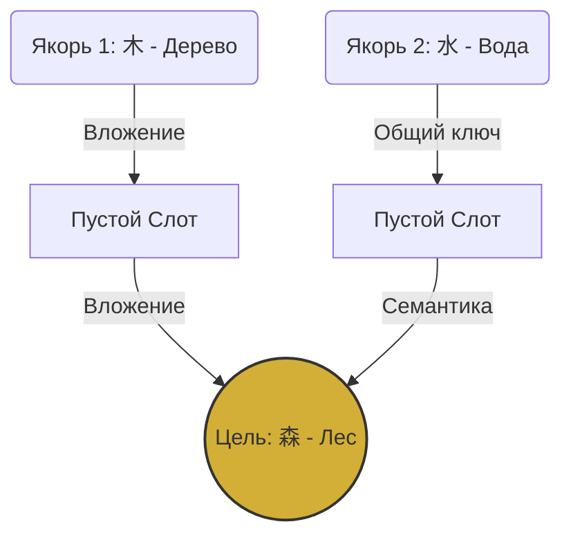

# Часть 7: Стол Постижения (The Research Desk) — Механика Thaumcraft

## 7.1. Концепция исследований и дешифровки

Когда игрок приобретает «Загадочный Свиток» (Mystery Scroll) у торговцев, он не получает рецепт нового иероглифа автоматически. Свиток нужно расшифровать на Столе Постижения. Эта механика заменяет простое «древо технологий» логической головоломкой, основанной на лингвистической структуре китайского языка.



---

## 7.2. Интерфейс и Структура пазла

Вечером игрок кладет свиток на стол. На экране разворачивается плоская пергаментная сетка из взаимосвязанных ячеек (слотов):

*   **Центральный узел (Target Node):** Фантомный, размытый силуэт иероглифа, который нужно изучить. Клик по нему проигрывает невнятный шепот (аудио-загадка) и показывает размытый перевод.
*   **Узлы-Якоря (Anchor Nodes):** От 2 до 4 стартовых точек на периферии сетки. Это простые иероглифы, которые игрок *уже* знает. Они жестко закреплены на поле и не могут быть перемещены.
*   **Связующие слоты (Path Slots):** Пустые гнезда на сетке, соединяющие Якоря с Центром. Задача игрока — выложить на эти слоты такие иероглифы из своего инвентаря, чтобы они сформировали непрерывную цепочку связей от всех Якорей к Центру.

---

## 7.3. Лингвистические правила соединений (Законы Синергии)

Два соседних иероглифа на сетке соединяются светящейся золотой нитью Ци только в том случае, если между ними есть логическая связь одного из двух типов:

### 1. Связь по Вложению (Радикал / Композиция)
Один иероглиф является составной частью другого.
*   *Пример A:* Табличка `木` (Дерево) может соединиться с табличкой `林` (Лес) или `森` (Тайга), так как они физически содержат в себе знак дерева.
*   *Пример B:* Табличка `人` (Человек) соединяется с `从` (Следовать) или `众` (Толпа).

### 2. Связь по Общему Корню (Морфологическая / Семантическая)
Оба иероглифа используют один и тот же базовый ключ (радикал канси).
*   *Пример А:* Табличка `海` (Море) может быть соединена с табличкой `河` (Река), потому что у них обеих слева стоит один и тот же ключ воды `氵`.
*   *Пример B:* Табличка `说` (Говорить) соединяется с `语` (Язык) через общий левый ключ речи `讠`.

---

## 7.4. Игровой процесс дешифровки

1.  Игрок открывает Свиток Постижения. Видит цель: например, иероглиф `淼` (Огромный поток воды / Пучина).
2.  Начальные якоря на поле: табличка `水` (Вода) и табличка `海` (Море).
3.  Игрок берет из инвентаря табличку `冰` (Лёд) и кладет в слот рядом с `水`. Связь образуется, так как левая часть льда `冫` — это видоизмененный ключ воды.
4.  В соседний слот игрок кладет `江` (Река Янцзы). Она связывается с `海` (Море) по общему ключу воды `氵`.
5.  Постепенно приближаясь к центру, игрок выстраивает связи. Когда последний слот перед целью заполнен и связь замыкается, весь граф вспыхивает золотым светом.
6.  Центральный фантом превращается в четкий золотой иероглиф, воспроизводится чистое аудио-произношение носителя языка, и слово записывается в Трактат и Книгу Рецептов (теперь игрок знает, из каких радикалов его крафтить).

---

## 7.5. Технические аспекты графовой сетки

*   **Логическая модель графа (TypeScript):**
    ```typescript
    interface ResearchGraph {
      nodes: Map<string, {
        id: string;
        character: string | null; // null если слот пуст
        isAnchor: boolean;
        isTarget: boolean;
        allowedConnections: string[]; // ID соседних узлов
      }>;
      targetId: string;
      anchors: string[]; // ID узлов-якорей
    }
    ```
*   **Алгоритм проверки связей (`checkConnection`):**
    При установке таблички в слот, игра проверяет всех соседей. Функция `hasRelation(charA, charB)` обращается к словарю данных и проверяет:
    1. Входит ли `charA` в массив радикалов `charB` (или наоборот).
    2. Совпадают ли их основные ключи (`radical` свойство в словарной базе).
*   Успешный путь ищется с помощью алгоритма поиска в ширину (BFS) от каждого якоря до целевого узла.
