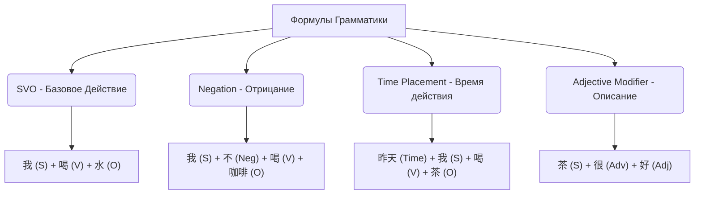

# Часть 8: Изучение Грамматики — «Формулы Заклинаний»

## 8.1. Концепция синтаксической магии

В Dao of Ink грамматика китайского языка преподносится как «Формулы Направления Энергии» (Spell Formulas). Китайский синтаксис имеет строгий порядок слов (аналитический язык без окончаний и падежей). Нарушение порядка слов буквально «разрушает магический поток Ци» амулета.

---

## 8.2. Базовые типы Формул (Грамматические шаблоны)

Игрок постепенно разблокирует и изучает ключевые правила HSK 1-3 через покупку или нахождение чертежей формул.

### 1. Формула «Базовое действие» (SVO - Subject-Verb-Object)
*   *Правило:* Подлежащее -> Сказуемое -> Дополнение.
*   *Обучающий эффект:* Игрок понимает структуру простых предложений.
*   *Пример:* `我` (Я) + `买` (Покупать) + `书` (Книга).

### 2. Формула «Отрицание силы» (Negation with 不 / 没)
*   *Правило:* Отрицательная частица ставится строго *перед* глаголом.
*   *Обучающий эффект:* Закрепление позиции `不` (bù) для настоящего/будущего времени и `没` (méi) для прошедшего времени с глаголом `有` (yǒu).
*   *Пример:* `他` (Он) + `不` (Не) + `来` (Приходить).

### 3. Формула «Время Восхода» (Time Expressions)
*   *Правило:* Обстоятельство времени ставится либо в самом начале предложения, либо строго после подлежащего, но *до* глагола.
*   *Обучающий эффект:* Избавление от типичной ошибки калькирования с европейских языков, где время ставят в конец.
*   *Пример:* `今天` (Сегодня) + `我` (Я) + `看` (Смотреть) + `电影` (Фильм).

### 4. Формула «Истинное качество» (Subject + 很 + Adjective)
*   *Правило:* При описании существительного прилагательным глагол-связка `是` (быть) не используется. Вместо него ставится наречие степени `很` (очень) или `весьма` (非常).
*   *Обучающий эффект:* Отучение от использования `是` перед прилагательными (одна из частых ошибок новичков).
*   *Пример:* `天气` (Погода) + `很` (Очень) + `热` (Жаркая).

---

## 8.3. Игровой процесс применения Трафаретов (Stencils)

1.  **Наложение трафарета:** Игрок открывает пустой Вертикальный Свиток и выбирает изученную Формулу. Полупрозрачный трафарет накладывается на бумагу, создавая подсвеченные рамки-гнезда.
2.  **Семантические теги-подсказки:** На каждом гнезде написана подсказка (например, *«Кто?»*, *«Что делает?»*, *«С чем?»*).
3.  **Перетаскивание карт-иероглифов:** Игрок ищет на полках нужные иероглифы и вставляет их в рамки. При наведении подходящего типа слова (например, существительного в слот «Объект») рамка подсвечивается зеленым.
4.  **Печать готовности:** После заполнения всех гнезд игрок штампует амулет печатью.

---

## 8.4. Механика «Мастерства» (No-Stencil Bonus)

Игра поощряет запоминание правил, а не постоянное использование подсказок.

*   Если игрок собирает предложение на свитке **без наложения трафарета** (вслепую выставляя таблички по памяти сверху вниз в правильном порядке) и ставит печать:
    1.  Система отправляет массив слов на проверку.
    2.  Если синтаксис верен, амулет вспыхивает ярким золотым светом, на нем появляется каллиграфический узор дракона.
    3.  Игрок получает статус **«Чистое Дао»** за этот предмет.
    4.  *Бонус:* **x2 к стоимости** при продаже клиенту и **+100% к очкам Репутации**. Это мотивирует игрока активно учить правила структуры предложений наизусть.
