# Часть 9: Интеграция Нейросетей (LLM & AI Systems)

## 9.1. Роль ИИ в игровом процессе

Использование LLM (GPT-4o mini / Claude 3.5 Haiku) позволяет отказаться от статичных скриптов и создать динамический, бесконечный игровой мир, который подстраивается под реальный прогресс игрока в изучении китайского языка.

```mermaid
sequenceDiagram
    autonumber
    participant Клиент as Vue 3 Client
    participant Сервер as Node.js Backend
    participant LLM as LLM API (OpenAI/Anthropic)

    Клиент->>Сервер: Отправка собранного амулета [我, 喝, 水] + запрос NPC
    Сервер->>Сервер: Сборка системного промпта и JSON-схемы
    Сервер->>LLM: API-запрос (Промпт + JSON Schema)
    LLM-->>Сервер: JSON-ответ { isCorrect: true, feedback: "..." }
    Сервер-->>Клиент: Валидация + Запуск анимации печати/дыма
```



---

## 9.2. Ключевые функции ИИ

### 1. Генератор этимологического лора (The Sage Etymologist)
Когда игрок открывает иероглиф на Столе Постижения, ИИ генерирует для него короткую поэтическую легенду, основанную на реальной этимологии ключей.
*   *Вход:* Иероглиф (`秋`), его ключи (`禾` - зерно, `火` - огонь).
*   *Промпт-требование:* Объяснить связь компонентов в стиле древнекитайского мудреца, уложившись в 2-3 предложения.
*   *Пример ответа:* *"Осень (秋) рождается из Зерна (禾) и Огня (火). Это напоминание о временах, когда древние земледельцы сжигали сухую солому на полях после сбора урожая, согревая землю перед зимним сном."*

### 2. Генератор динамических клиентов (Dynamic Client Spawner)
ИИ создает запросы от NPC, используя *только* те слова, которые игрок уже изучил (хранятся в `dictionaryStore`). Это предотвращает появление незнакомых слов и плавно повышает сложность.
*   *Пример запроса:* Если игрок знает только `我` (я), `喜欢` (любить/нравиться), `茶` (чай), `水` (вода), ИИ сгенерирует клиента: *"Странник устал с дороги. Он говорит: 'Я люблю воду, но больше всего я люблю чай'. Сделай мне амулет, подтверждающий это."*

### 3. Оценка Амулетов (Grammar & Semantic Checker)
Когда игрок собирает амулет-предложение, ИИ проверяет его на грамматическую корректность и семантическое соответствие запросу клиента.

---

## 9.3. Структурированный формат запросов (JSON Schema)

Для стабильной работы логики игры бэкенд требует от LLM строго типизированных JSON-ответов. Любое отклонение вызывает повторный запрос или откат к локальному валидатору.

### Пример API-запроса на валидацию амулета:
**System Prompt:**
> Вы — Мудрый Мастер Дао, оценивающий магические амулеты послушника. Игрок составил амулет из иероглифов: `{sentence}`. Запрос клиента был: `{clientRequest}`. 
> Проверьте:
> 1. Соответствует ли предложение грамматике китайского языка (порядок слов)?
> 2. Решает ли смысл предложения проблему клиента?
> Ответьте строго в формате JSON, соответствующем схеме.

**JSON Schema ответа:**
```json
{
  "type": "object",
  "properties": {
    "isCorrect": {
      "type": "boolean",
      "description": "True, если грамматика верна и смысл отвечает запросу клиента."
    },
    "score": {
      "type": "integer",
      "minimum": 0,
      "maximum": 100,
      "description": "Оценка качества решения от 0 до 100."
    },
    "feedback": {
      "type": "string",
      "description": "Художественный отзыв на русском языке в стиле мастера Дао. Объясните причину ошибки или похвалите за верное решение."
    }
  },
  "required": ["isCorrect", "score", "feedback"]
}
```

---

## 9.4. Оптимизация и Кэширование (Cost & Performance)
Прямые запросы к LLM на каждое действие игрока — это дорого и создает задержки (Latency). Для оптимизации применяются следующие подходы:
1.  **Статическое кэширование рецептов:** Все этимологии базовых 600+ иероглифов HSK 1-3 генерируются заранее на этапе сборки проекта и хранятся в локальном файле `etymology_db.json`. ИИ не вызывается при открытии стандартных слов.
2.  **Шаблонизация диалогов клиентов:** Базовые клиенты используют локальный пул предзаписанных шаблонов. LLM привлекается только для редких «Сюжетных Вех» и для проверки свободных предложений на амулетах (где комбинаций слишком много).
3.  **Локальный синтаксический анализатор (Fallback):** В случае сбоя сети или API, игра переключается на простую проверку соответствия регулярным выражениям грамматических формул без ИИ.
