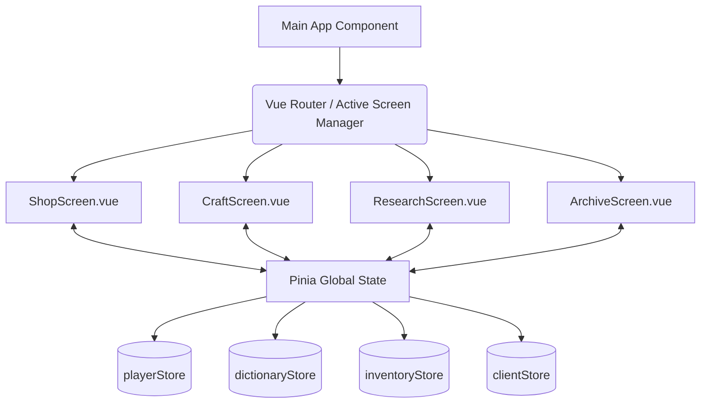

# Часть 10: Техническая реализация (Vue 3 + TypeScript)

## 10.1. Общая архитектура приложения

Игра строится как SPA (Single Page Application) на базе Vue 3 с использованием TypeScript. Переходы между экранами (Лавка, Стол крафта, Стол постижения, Архив) происходят мгновенно без перезагрузок страницы благодаря динамическому переключению компонентов или Vue Router.



---

## 10.2. Проектирование State Management (Pinia Stores)

Состояние игры разделено на независимые реактивные модули:

### 1. `playerStore.ts` (Состояние игрока)
Управляет ресурсами, валютой, репутацией и уровнем туши.
*   *Действия (Actions):* `spendInk(amount)`, `addReputation(amount)`, `changeCurrency(type, quantity)`.

### 2. `dictionaryStore.ts` (Словарь и СРС)
Содержит базу данных всех иероглифов игры и индивидуальный прогресс их изучения.
```typescript
interface CharacterData {
  id: string;         // 'H1-023' (HSK Level 1, номер 23)
  char: string;       // '木'
  pinyin: string;     // 'mù'
  translation: string;// 'Дерево'
  radicals: string[]; // ['木'] (радикалы-составляющие)
  srs: {
    interval: number; // Интервал повторения в днях
    easeFactor: number; // Коэффициент сложности (SM-2)
    repetitions: number; // Количество успешных повторений подряд
    nextReviewDate: string; // ISO дата следующей проверки
  };
  status: 'locked' | 'unlocked' | 'practicing';
}
```

### 3. `inventoryStore.ts` (Инвентарь и Полки)
Отвечает за физическое наличие табличек радикалов на полках и готовых амулетов на продажу.
*   *Действия:* `addTablet(character)`, `removeTablet(character)`, `createAmulet(words, formulaId)`.

### 4. `clientStore.ts` (Очередь клиентов)
Хранит информацию о текущих клиентах в лавке, их текстах запросов и статусе обслуживания.

---

## 10.3. Интеграция Hanzi Writer (Режим Каллиграфии)

Библиотека `hanzi-writer` используется для отрисовки и интерактивной проверки написания иероглифов.

### Жизненный цикл компонента каллиграфии (`CalligraphyCanvas.vue`):
1.  **Инициализация (`onMounted`):**
    Создается экземпляр писателя в скрытом или видимом контейнере:
    ```typescript
    import HanziWriter from 'hanzi-writer';

    let writer: HanziWriter;

    onMounted(() => {
      writer = HanziWriter.create('target-svg-container', '木', {
        width: 300,
        height: 300,
        showOutline: false, // Выключено по умолчанию для квиза
        showCharacter: false,
        strokeAnimationSpeed: 1,
        delayBetweenStrokes: 200,
        padding: 5
      });
    });
    ```
2.  **Запуск квиза:**
    При начале практики вызывается метод `writer.quiz()`.
3.  **Обработка событий (Callbacks):**
    Слушаются события рисования черт:
    *   `onCorrectStroke`: Игрок верно нарисовал черту. Проигрывается ASMR-звук скольжения кисти.
    *   `onMistake`: Ошибка в порядке или направлении. Тратится тушь (`playerStore.spendInk(2)`), черта стирается, воспроизводится звук кляксы.
    *   `onComplete`: Иероглиф завершен. Данные отсылаются в `dictionaryStore` для перерасчета интервала SRS. Выдается награда в `inventoryStore`.

---

## 10.4. Механика Drag & Drop и Коллизии на холсте

Свободное перетаскивание табличек и скрещивание реализуется на чистом Vue с использованием CSS Absolute positioning.

1.  **Захват элемента (`mousedown` / `touchstart`):**
    Фиксируются стартовые координаты курсора и смещение относительно левого верхнего угла таблички. Элемент переходит в состояние `isDragging: true`.
2.  **Перемещение (`mousemove` / `touchmove`):**
    Координаты `style.left` и `style.top` таблички обновляются вслед за курсором.
3.  **Отпускание (`mouseup` / `touchend`):**
    *   **Для алхимии (Скрещивание):** Игра пробегает по массиву активных табличек на холсте и вычисляет расстояние между центрами отпущенной таблички и другими табличками (метод AABB-коллизий). Если расстояние меньше порогового (например, 50px), запускается проверка рецепта слияния.
    *   **Для амулетов:** Проверяется попадание координат отпущенной таблички в прямоугольные области слотов свитка (Collision bounding box). При попадании табличка «прилипает» (снэппинг) к центру слота.
4.  **Анимации:** Все движения плавных переходов и возвратов табличек на полки при промахе анимируются через CSS `transition: transform 0.2s ease-out`.

---

## 10.5. Система сохранений (Save System)

*   **Автосохранение:** После каждого завершенного игрового дня (переход в фазу Утра) состояние всех четырех сторов сериализуется в JSON-строку и записывается в `localStorage` браузера с ключом `dao_of_ink_save_v1`.
*   **Импорт/Экспорт:** В меню настроек (компас Лопань) доступен экспорт сохранения в виде текстового файла `.json`. Игрок может перенести свой прогресс (изученные HSK-слова) на другое устройство.
