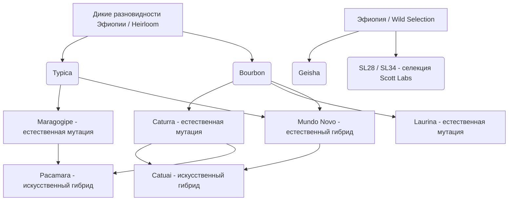

# Разновидности и сорта Арабики

В мире кофе термин **«сорт»** (разновидность / cultivar / variety) имеет критическое значение. Как и в виноделии, разные сорта винограда (Каберне, Шардоне, Пино Нуар) дают совершенно разное вино, так и разновидности кофейного дерева определяют потенциал вкуса чашки.

---

## 🗺️ Карта классификации сортов

Все многообразие арабики можно разделить на несколько основных генетических групп:

### 1. Материнские (традиционные) сорта
* **[[Typica (Типика)|Типика]]**: Базовый сорт, от которого произошла большая часть мировой арабики. Обладает великолепным чистым вкусом, но крайне низкой урожайностью и слабой устойчивостью к болезням.
* **[[Bourbon (Бурбон)|Бурбон]]**: Естественная мутация Типики. Бурбон более урожайный и дает исключительно сладкий, плотный и сбалансированный вкус.

### 2. Естественные мутации
Изменения в генетическом коде растений, произошедшие в природе под влиянием окружающей среды:
* **[[Caturra (Катурра)|Катурра]]** (мутация Бурбона): карликовый сорт с высокой урожайностью.
* **[[Maragogipe (Марагоджип)|Марагоджип]]** (мутация Типики): дает гигантские зерна («слоновьи бобы»).
* **[[Laurina (Лаурина)|Лаурина]]** (мутация Бурбона): сорт с естественным сверхнизким содержанием кофеина.

### 3. Гибриды (скрещивания)
Скрещивания разных сортов для объединения их лучших качеств (вкуса, урожайности, размера зерен):
* **[[Pacamara (Пакамара)|Пакамара]]** (Pacas + Maragogipe): сорт с огромными зернами и уникальным, комплексным вкусовым профилем.
* **Mundo Novo** (Typica + Bourbon): высокоурожайный естественный гибрид.
* **Catuai** (Mundo Novo + Caturra): стойкий к ветрам и дождям искусственный гибрид.

### 4. Селекционные сорта
Сорта, отобранные учеными-исследователями в лабораториях для конкретных регионов:
* **[[SL28 и SL34|SL28 и SL34]]**: Легендарные кенийские сорта с ярким вкусом черной смородины.

### 5. Дикорастущие разновидности (Heirlooms)
* **Эфиопское наследие (Ethiopian Heirlooms)**: Тысячи некаталогизированных диких разновидностей, растущих в лесах Эфиопии.
* **[[Geisha (Гейша)|Гейша]]**: Уникальный дикий сорт родом из Эфиопии, получивший мировую известность благодаря своему парфюмерно-цветочному вкусу в Панаме.

---

## 📊 Сравнительная таблица популярных сортов

| Сорт | Рост куста | Урожайность | Устойчивость к ржавчине | Ключевые вкусовые ноты |
| :--- | :--- | :--- | :--- | :--- |
| **[[Typica (Типика)\|Типика]]** | Высокий | Низкая | Очень низкая | Чистый, сладкий вкус, цитрусы, цветы |
| **[[Bourbon (Бурбон)\|Бурбон]]** | Высокий | Средняя | Низкая | Шоколад, карамель, красные ягоды |
| **[[Caturra (Катурра)\|Катурра]]** | Низкий (карлик) | Высокая | Низкая | Лимонная кислинка, легкое тело |
| **[[Geisha (Гейша)\|Гейша]]** | Высокий | Очень низкая | Средняя | Жасмин, бергамот, персик, чайный профиль |
| **[[Pacamara (Пакамара)\|Пакамара]]** | Средний | Средняя | Низкая | Тропические фрукты, травы, специи |
| **[[Maragogipe (Марагоджип)\|Марагоджип]]** | Очень высокий | Очень низкая | Очень низкая | Орехи, шоколад, мягкая кислотность |
| **[[Laurina (Лаурина)\|Лаурина]]** | Низкий | Низкая | Низкая | Персик, абрикос, белые цветы, мало горечи |
| **[[SL28 и SL34\|SL28 / SL34]]** | Высокий | Средняя | Низкая | Черная смородина, грейпфрут, сочный вкус |

---

## ☕ Почему это важно для потребителя?

Понимание сорта помогает прогнозировать вкус чашки еще до покупки:
* Хотите максимально **сладкий, классический, сбалансированный кофе** с нотами карамели и выпечки? Ищите **[[Bourbon (Бурбон)|Бурбон]]**.
* Хотите **чайное тело, взрывной цветочный аромат жасмина** и тонкую элегантность? Ваш выбор — **[[Geisha (Гейша)|Гейша]]**.
* Нравится **плотный, сочный кофе с яркой ягодной кислотностью** смородины и ежевики? Попробуйте кенийские **[[SL28 и SL34|SL28 / SL34]]**.
* Ищете **необычный, сложный вкус с пикантными, травяными или пряными оттенками**? Поэкспериментируйте с **[[Pacamara (Пакамара)|Пакамарой]]**.
