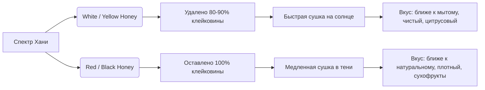

# Обработка Хани и Полумытая (Honey / Pulped Natural / Semi-Washed)

**Обработка Хани** (англ. *Honey Process*) и исторически близкая к ней **Полумытая** (англ. *Pulped Natural*) — это гибридные методы обработки, которые объединяют лучшие черты мытого и натурального процессов. В этих методах с кофейной ягоды удаляется внешняя кожица, но зерно отправляется на сушку **вместе со сладким, липким слоем клейковины (мусиляжа)**. 

Своё название *Honey* (мёд) метод получил не из-за использования настоящего меда, а из-за невероятной липкости подсыхающей клейковины на зернах, которая по консистенции и цвету напоминает мед.

---

## 📜 Эволюция метода: От Pulped Natural к Honey

* **Pulped Natural (Бразилия, 1980-е годы):** Метод был разработан в Бразилии для ускорения процесса сушки (по сравнению с натуральным методом) и экономии воды (по сравнению с мытым). Кожица удалялась депульпатором, и кофе сразу сушился на патио. Это позволило снизить риск дефектов гниения цельных ягод.
* **Honey Process (Коста-Рика, 2000-е годы):** Костариканские фермеры усовершенствовали бразильскую технологию после землетрясения 2008 года, когда возник острый дефицит пресной воды. Они научились регулировать количество клейковины, остающейся на зерне при депульпации, и контролировать теневую сушку, создав целую палитру сортов хани.

---

## 🎨 Спектр Хани: Белый, Желтый, Красный, Черный

Цвет хани зависит от двух факторов: **количества клейковины**, оставленной на зерне, и **скорости сушки** под солнцем/в тени.

### 🤍 Белый Хани (White Honey)
* *Клейковина:* Удаляется почти полностью (остается около 10–20%).
* *Сушка:* Быстрая, на открытом солнце без затенения.
* *Вкус:* Очень чистый, легкий, с выраженной лимонной кислотностью, напоминающий мытый кофе.

### 💛 Желтый Хани (Yellow Honey)
* *Клейковина:* Оставляют около 50% клейковины.
* *Сушка:* Умеренная, на открытом солнце. Зерно приобретает нежно-желтый оттенок.
* *Вкус:* Мягкий, сбалансированный, с нотами абрикоса, меда и молочного шоколада.

### ❤️ Красный Хани (Red Honey)
* *Клейковина:* Сохраняют почти 100% клейковины.
* *Сушка:* Медленная, часто на африканских кроватях под легким теневым навесом или при облачной погоде.
* *Вкус:* Более плотный, сладкий, с дескрипторами красных ягод, джема и тропических фруктов.

### 🖤 Черный Хани (Black Honey)
* *Клейковина:* Сохраняют 100% клейковины.
* *Сушка:* Экстремально медленная, в густой тени или под брезентом. Процесс сушки может занимать до 3 недель. Из-за минимального испарения сахара в клейковине слегка окисляются, и зерно темнеет до почти черного цвета.
* *Вкус:* Самый сложный и насыщенный в спектре. Обладает тяжелым, сиропистым телом, нотами рома, сухофруктов, изюма и темного шоколада, напоминая натуральный кофе.

---

## ☕ Вкусовой профиль Хани

Кофе обработки хани ценится за идеальный компромисс вкусовых качеств:
* **Кислотность:** Более мягкая и сладкая, чем у мытого кофе, но чище, чем у натурального.
* **Тело:** Среднее, округлое, сливочное.
* **Сладость:** Высокая, с характерным медовым, карамельным или тростниковым профилем.
* **Дескрипторы:** Мед, коричневый сахар, карамель, абрикос, персик, молочный шоколад, спелое яблоко.

---

## 💡 Резюме для кофемана
Обработка хани — отличный выбор для тех, кто ищет баланс. Если вам кажется, что мытый кофе слишком кислый и водянистый, а натуральный — слишком тяжелый, «грязный» и алкогольный, кофе хани (особенно из Коста-Рики или Сальвадора) предложит вам чистую сладкую чашку с нежной фруктовой кислинкой и приятным сливочным послевкусием.
